---
## Author
author:
  name: Луангсуваннавонг Сайпхачан
## Title
title: Внешний курс. Блок 1 Безопасность в сети
subtitle: Основы информационной безопасности

date-format: "2026-04-17" # Example: 2025-09-06
---

# Информация

## Докладчик

:::::::::::::: {.columns align=center}
::: {.column width="70%"}

  * Луангсуваннавонг Сайпхачан
  * студент группы НКАбд-01-24
  * Российский университет дружбы народов им. П. Лумумбы
  * <https://github.com/sayprachanh-lsvnv>

:::
::: {.column width="30%"}

:::
::::::::::::::

## Цель работы

Выполнение контрольных заданий первого блока внешнего курса "Основы Кибербезопасности"

# Выполнение заданий блока "Безопасность в сети"

## Как работает интернет: базовые сетевые протоколы

UDP — транспортный, TCP — транспортный, HTTPS — прикладной, IP — сетевой. Правильный ответ — HTTPS.

## Как работает интернет: базовые сетевые протоколы

TCP работает на транспортном уровне.

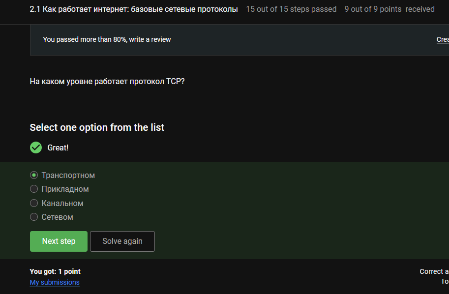

## Как работает интернет: базовые сетевые протоколы

Для корректных IPv4-адресов каждый октет < 255: 90.11.90.22 и 25.198.0.15.

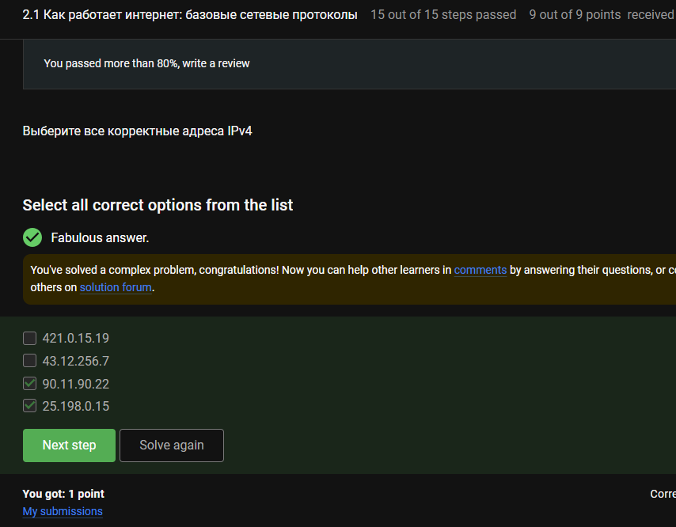

## Как работает интернет: базовые сетевые протоколы

DNS преобразует доменное имя в IP-адрес.

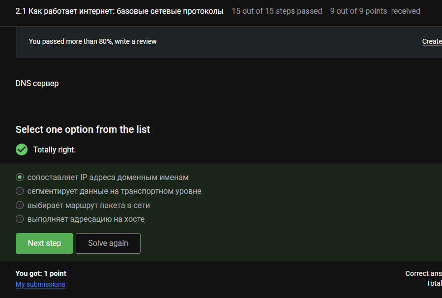

## Как работает интернет: базовые сетевые протоколы

Модель TCP/IP (сверху вниз): Прикладной (HTTP, DNS) → Транспортный (TCP, UDP) → Сетевой (IP) → Канальный (Ethernet, Wi-Fi).

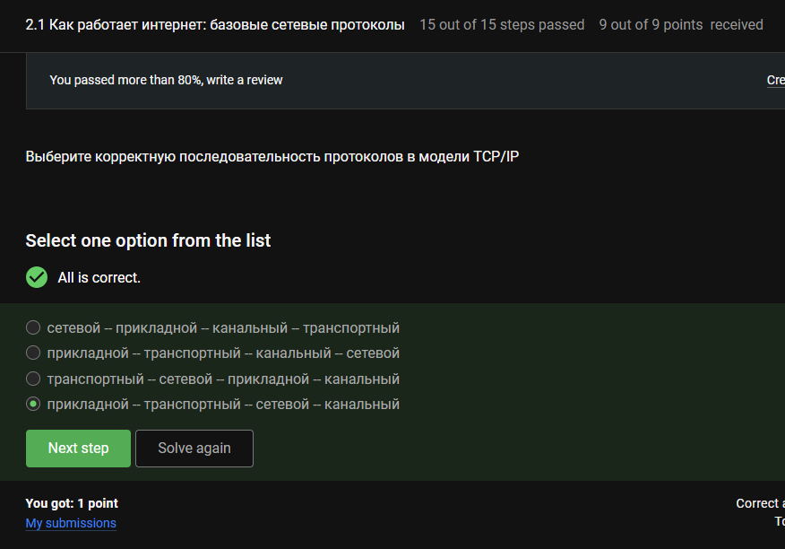

## Как работает интернет: базовые сетевые протоколы

HTTP — открытый текст, HTTPS — зашифрованная версия.

## Как работает интернет: базовые сетевые протоколы

HTTPS: две фазы — рукопожатие (установление шифрования) и передача данных (зашифрованные данные).

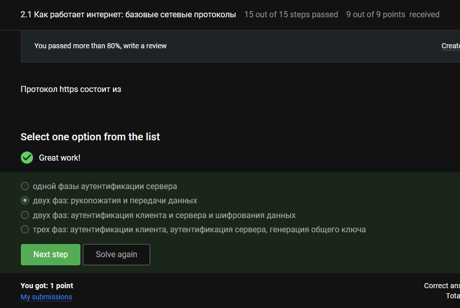

## Как работает интернет: базовые сетевые протоколы

Во время рукопожатия клиент и сервер согласовывают самую высокую поддерживаемую версию TLS.

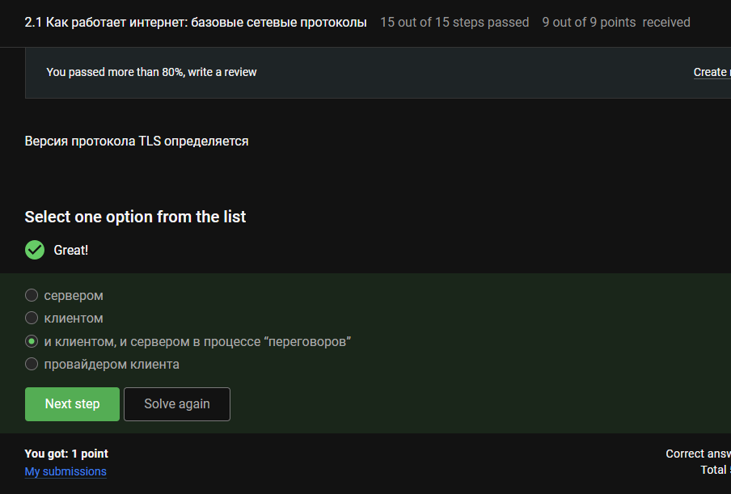

## Как работает интернет: базовые сетевые протоколы

Рукопожатие устанавливает ключи и алгоритмы, но данные шифруются позже — на фазе передачи данных.

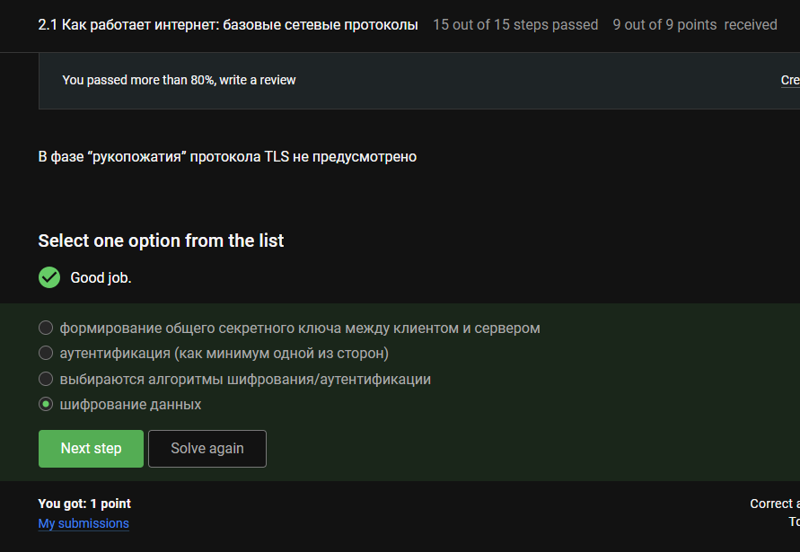

## Персонализация сети

Куки хранят ID сессий и ID пользователей (не пароли, не IP-адреса).

## Персонализация сети

Куки обрабатывают состояние пользователя (аутентификация, персонализация, отслеживание, аналитика).

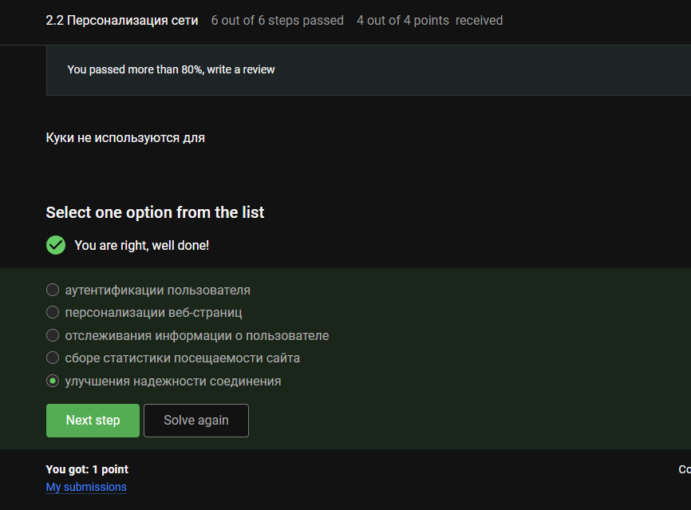

## Персонализация сети

Сервер генерирует куки и отправляет клиенту.

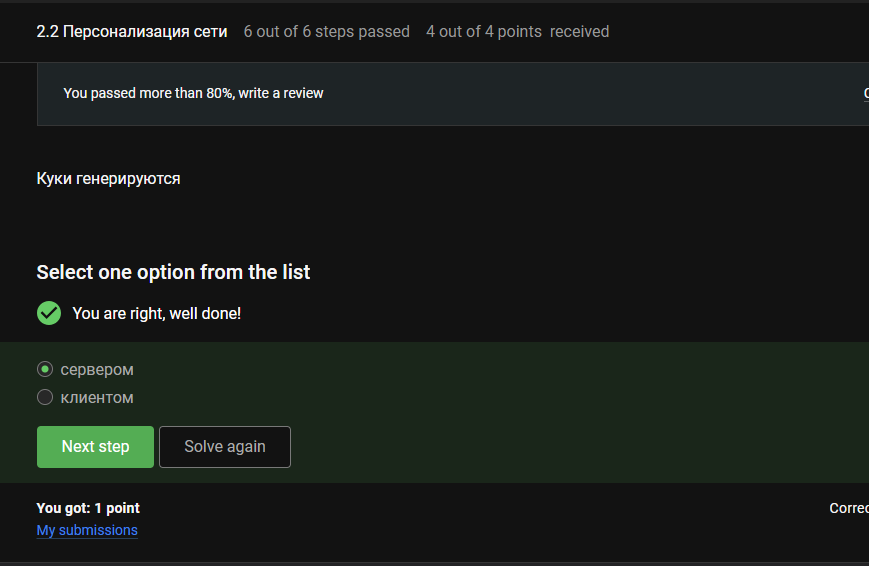

## Персонализация сети

Сессионные куки живут в памяти браузера до закрытия браузера (срок действия не установлен).

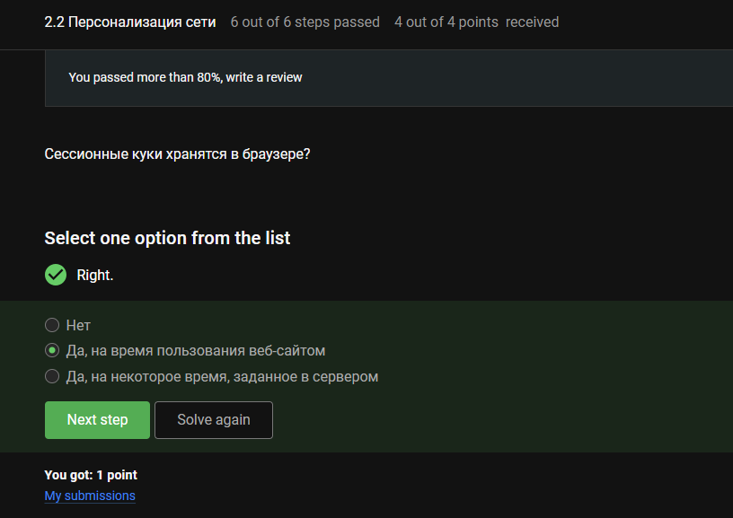

## Браузер TOR. Анонимизация

TOR направляет трафик через три узла: входной (guard), средний (middle), выходной (exit).

## Браузер TOR. Анонимизация

Отправитель знает IP назначения. Выходной узел тоже знает IP получателя. Входной и средний знают только соседние узлы.

## Браузер TOR. Анонимизация

В TOR отправитель устанавливает секретный ключ с каждым узлом при создании цепи.

## Браузер TOR. Анонимизация

Получатель видит обычный HTTPS/HTTP-запрос от выходного узла — браузер TOR не требуется.

## Беспроводные сети Wi-Fi

Wi-Fi — стандарты IEEE 802.11.

## Беспроводные сети Wi-Fi

Wi-Fi (IEEE 802.11) работает на канальном уровне (L2): MAC-адресация и управление доступом к среде.

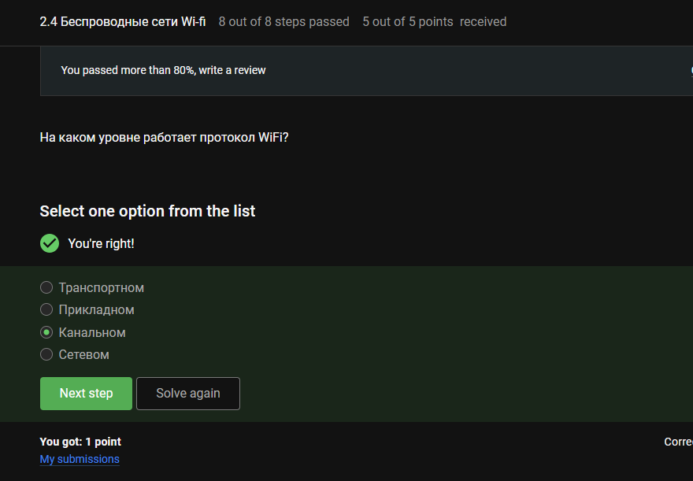

## Беспроводные сети Wi-Fi

WEP — слабое шифрование RC4 и статические ключи (легко взламывается).

## Беспроводные сети Wi-Fi

После аутентификации WPA2/WPA3 данные шифруются (например, AES-CCMP).

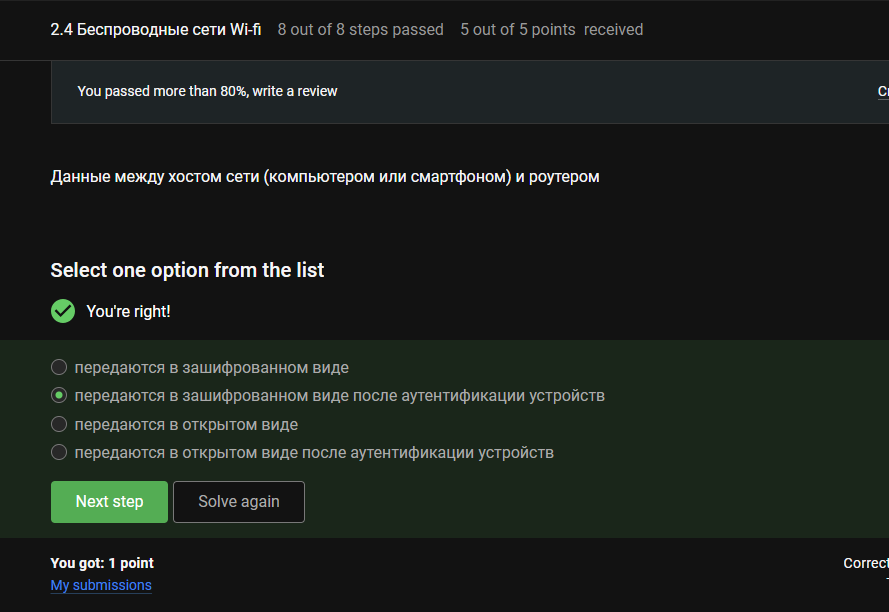

## Беспроводные сети Wi-Fi

В домашних сетях — предварительно согласованный ключ (PSK), не корпоративная аутентификация (RADIUS-сервер).

# Выводы

Во время этого блока я узнал о работе основных сетевых протоколов, файлах cookie сети Wi-Fi и браузере TOR
