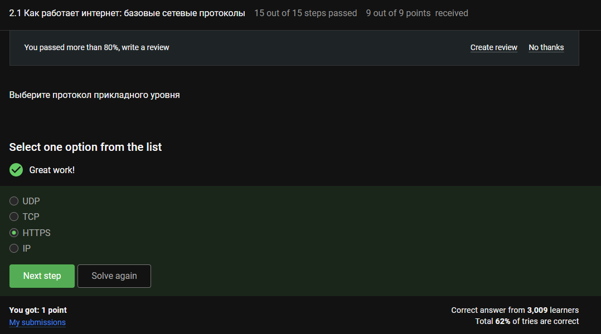
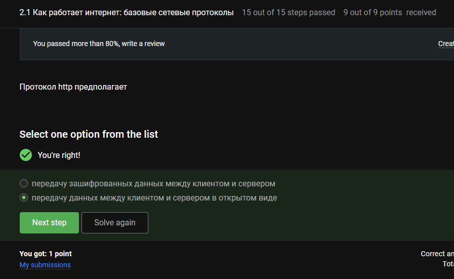
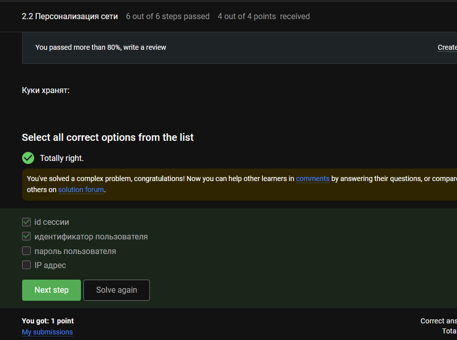
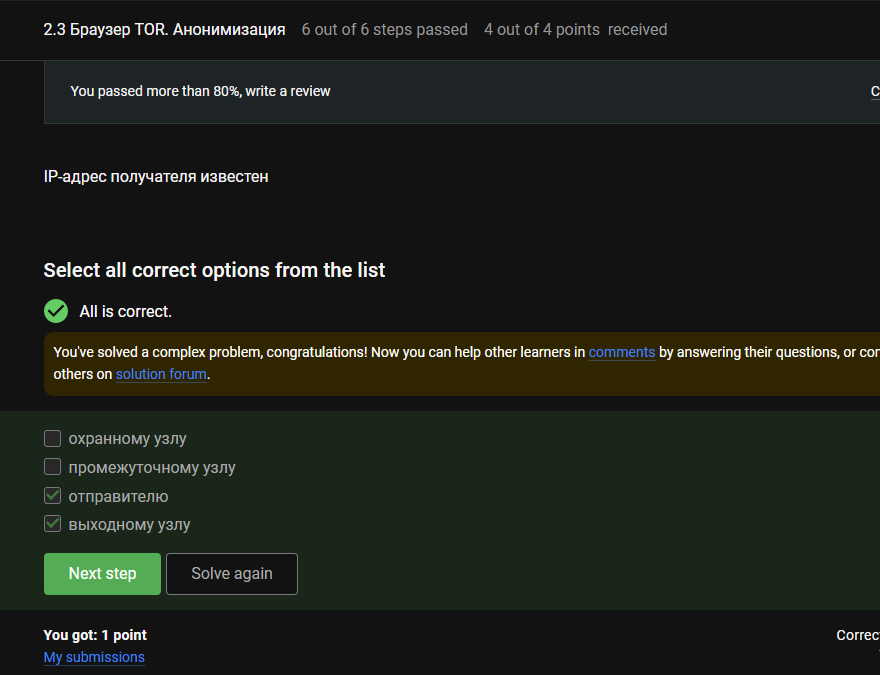
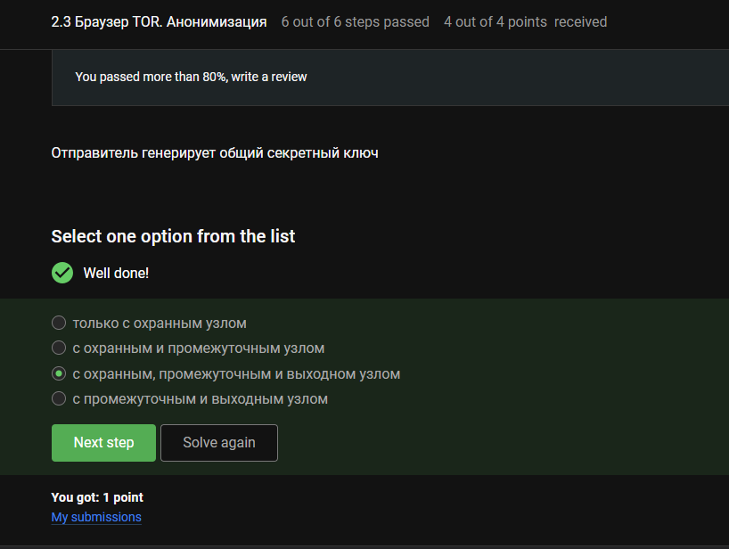
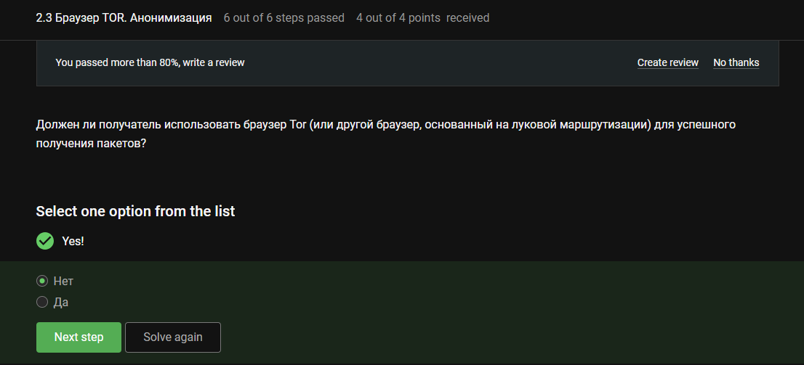
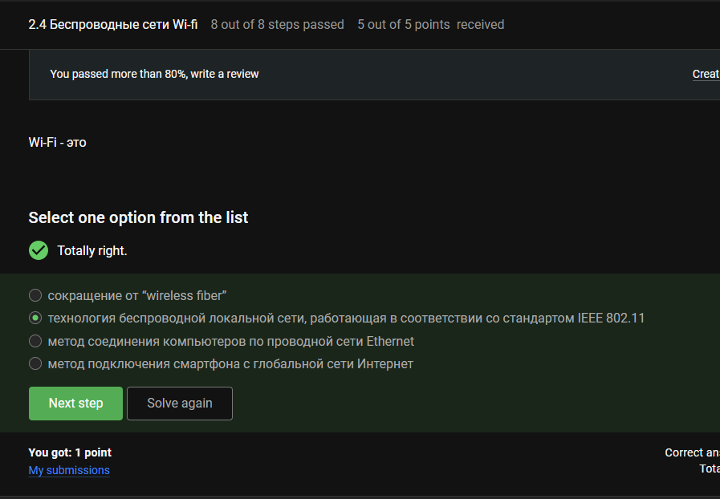
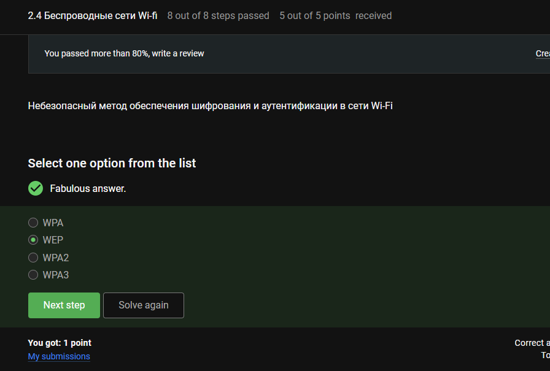
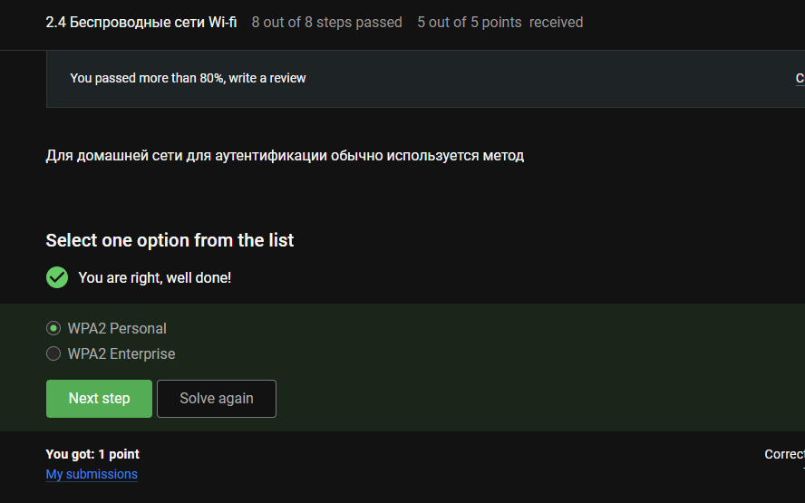

---
## Author
author:
  name: Луангсуваннавонг Сайпхачан, НКАбд-01-24
## Title
title: "Внешний курс. Блок 1: Безопасность в сети"
subtitle: "Основы информационной безопасности"
---

# Цель работы

Выполнение контрольных заданий первого блока внешнего курса "Основы Кибербезопасности"

# Выполнение заданий блока "Безопасность в сети"

## Как работает интернет: базовые сетевые протоколы

UDP — транспортный уровень, TCP — транспортный уровень, HTTPS — прикладной уровень, IP — сетевой уровень, следовательно, правильный ответ — HTTPS.([рис. @fig-001])

{#fig-001 width=70%}

Как упоминалось ранее, TCP (Transmission Control Protocol) работает на транспортном уровне.([рис. @fig-002])

{#fig-002 width=70%}

Поскольку для корректных IPv4-адресов каждый октет должен быть меньше 255, правильными ответами будут 90.11.90.22 и 25.198.0.15.([рис. @fig-003])

{#fig-003 width=70%}

DNS (Domain Name System) преобразует доменное имя в IP-адрес.([рис. @fig-004])

{#fig-004 width=70%}

Согласно модели TCP/IP, данные передаются сверху вниз:
Прикладной уровень (HTTP, DNS) → Транспортный уровень (TCP, UDP) → Сетевой уровень (IP) → Канальный уровень (Ethernet, Wi-Fi).([рис. @fig-005])

{#fig-005 width=70%}

HTTP не шифрует данные, он передаёт их в виде открытого текста, в то время как HTTPS является зашифрованной версией.([рис. @fig-006])

{#fig-006 width=70%}

HTTPS включает рукопожатие (установление шифрования) и передачу данных (зашифрованные данные), всего состоит из двух фаз.([рис. @fig-007])

{#fig-007 width=70%}

Клиент и сервер согласовывают самую высокую поддерживаемую версию TLS во время рукопожатия.([рис. @fig-008])

{#fig-008 width=70%}

Рукопожатие устанавливает ключи и алгоритмы, но пока не шифрует фактические данные — это происходит на фазе передачи данных.([рис. @fig-009])

{#fig-009 width=70%}

## Персонализация сети

Файлы cookie (куки) обычно хранят идентификаторы сессий и идентификаторы пользователей, но не пароли или IP-адреса (IP — это сетевой уровень, пароли являются конфиденциальными и не хранятся в куках).([рис. @fig-010])

{#fig-010 width=70%}

Куки обрабатывают состояние пользователя (аутентификация, персонализация, отслеживание, аналитика), но надёжность обеспечивается более низкими уровнями, такими как TCP, а не куками.([рис. @fig-011])

{#fig-011 width=70%}

Сервер генерирует куки и отправляет их клиенту.([рис. @fig-012])

{#fig-012 width=70%}

Сессионные куки существуют только в памяти браузера до тех пор, пока пользователь не закроет браузер (срок действия не установлен).([рис. @fig-013])

{#fig-013 width=70%}

## Браузер TOR. Анонимизация

TOR направляет трафик через три промежуточных узла: входной (guard), средний (middle) и выходной (exit).([рис. @fig-014])

{#fig-014 width=70%}

Отправитель знает конечный IP-адрес назначения для инициирования соединения.
Выходной узел расшифровывает самый внутренний слой и отправляет запрос получателю, поэтому он также знает IP-адрес получателя, в то время как входной и средний узлы знают только соседние узлы.([рис. @fig-015])

{#fig-015 width=70%}

В TOR отправитель самостоятельно устанавливает секретный ключ с каждым узлом (входным, средним, выходным) во время создания цепи.([рис. @fig-016])

{#fig-016 width=70%}

Получатель получает трафик как обычный HTTPS/HTTP-запрос от выходного узла — браузер TOR не требуется.([рис. @fig-017])

{#fig-017 width=70%}

## Беспроводные сети Wi-Fi

Wi-Fi — это общепринятое название стандартов беспроводных сетей IEEE 802.11.([рис. @fig-018])

{#fig-018 width=70%}

Wi-Fi (IEEE 802.11) работает на канальном уровне (L2), обрабатывая MAC-адресацию и управление доступом к среде.([рис. @fig-019])

{#fig-019 width=70%}

WEP использует слабое шифрование RC4 и статические ключи, что делает его легко взламываемым([рис. @fig-020]).

{#fig-020 width=70%}

После аутентификации WPA2/WPA3 данные между хостом и маршрутизатором шифруются (например, AES-CCMP).([рис. @fig-021])

{#fig-021 width=70%}

В домашних сетях используется предварительно согласованный ключ (PSK), а не корпоративная аутентификация (для которой требуется RADIUS-сервер).([рис. @fig-022])

{#fig-022 width=70%}

# Выводы

Во время этого блока я узнал о работе основных сетевых протоколов, файлах cookie сети Wi-Fi и браузере TOR

