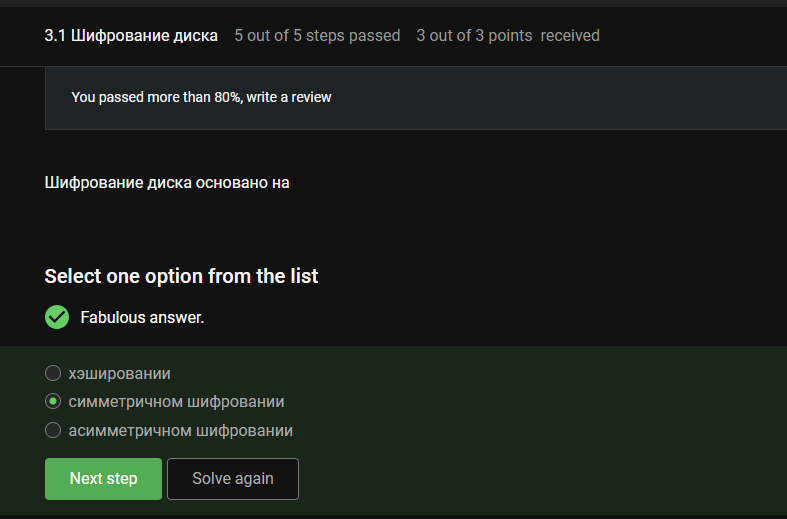
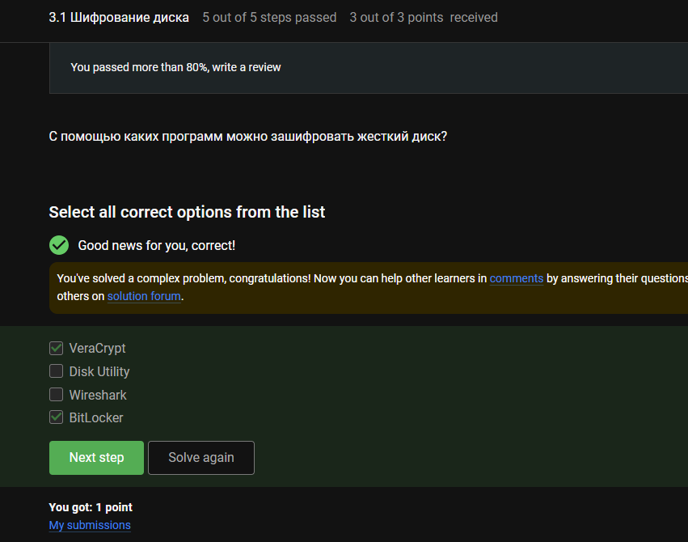
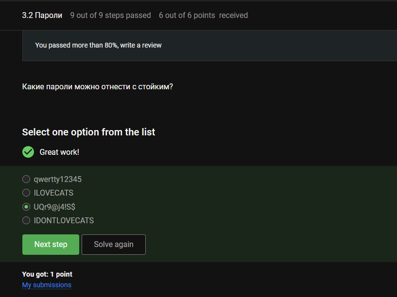
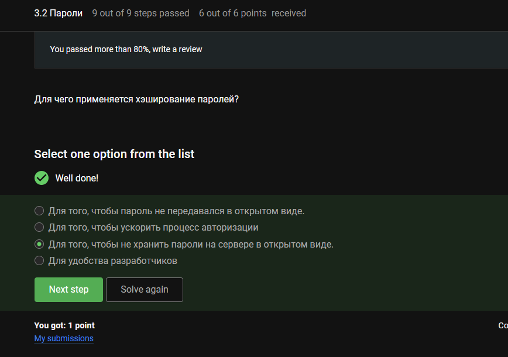
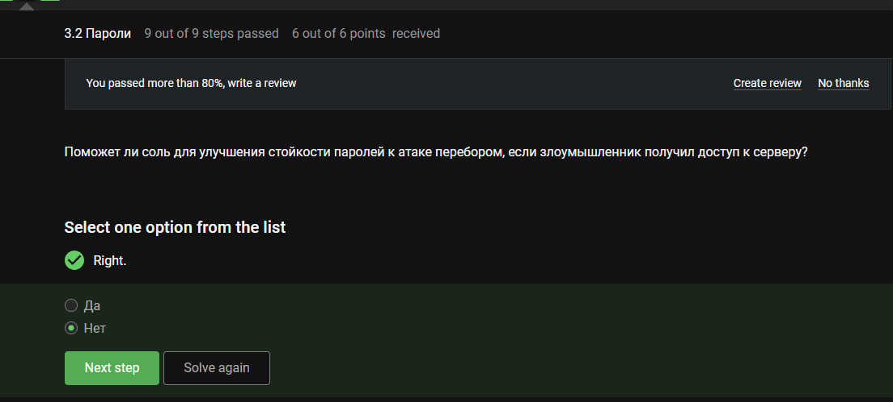
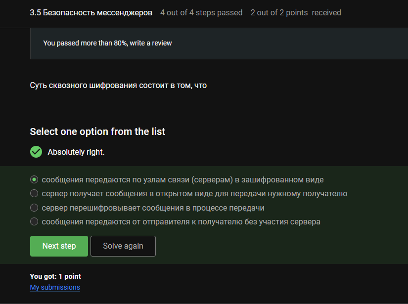

---
## Author
author:
  name: Луангсуваннавонг Сайпхачан
## Title
title: Внешний курс. Блок 2 Защита ПК/телефона
subtitle: Основы информационной безопасности

date-format: "2026-04-17" # Example: 2025-09-06
---

# Информация

## Докладчик

:::::::::::::: {.columns align=center}
::: {.column width="70%"}

  * Луангсуваннавонг Сайпхачан
  * студент группы НКАбд-01-24
  * Российский университет дружбы народов им. П. Лумумбы
  * <https://github.com/sayprachanh-lsvnv>

:::
::: {.column width="30%"}

:::
::::::::::::::

## Цель работы

Выполнение контрольных заданий второго блока внешнего курса "Основы Кибербезопасности"

# Выполнение заданий блока "Защита ПК/телефона"

## Шифрование диска

Полнодисковое шифрование (BitLocker, LUKS) шифрует загрузочный сектор и требует предзагрузочной аутентификации.

## Шифрование диска

Дисковое шифрование использует симметричные шифры (AES) — один ключ для шифрования и дешифрования (быстрее для больших объёмов).

## Шифрование диска

Дисковая утилита (Disk Utility) — управление дисками в macOS, не специализированный инструмент полнодискового шифрования (VeraCrypt, BitLocker). Wireshark не относится к этому.

## Пароли

Ответ: `UQr9@j4!S$` (заглавные/строчные буквы, цифры, символы, достаточно длинный). Другие варианты предсказуемы или словарные.

## Пароли

Менеджеры паролей хранят пароли в зашифрованном виде, требуют один мастер-пароль. Другие варианты небезопасны.

## Пароли

CAPTCHA отличает людей от ботов, предотвращает автоматизированные атаки (перебор паролей, спам).

## Пароли

Хеширование преобразует пароли в хеши фиксированной длины — при утечке БД оригинальные пароли не раскрываются.

## Пароли

Соль (salt) делает каждый хеш пароля уникальным, предотвращает атаки с радужными таблицами.

## Пароли

Разные пароли — ограничивают ущерб от утечки.
Периодическая смена — сокращает окно использования скомпрометированных данных.
Сложные/длинные пароли — делают перебор непрактичным.
CAPTCHA — блокирует автоматизированные атаки.

## Фишинг

wix.ru — не официальный домен Сбербанка (должен быть sberbank.ru).
ucoz.ru — не официальный домен Яндекса (должен быть yandex.ru).
Ссылки на Google и Mail.ru используют официальные домены.

## Фишинг

Злоумышленники могут подделать email-адреса или взломать аккаунт друга для фишинговых писем.

## Вирусы. Примеры

Подделка электронной почты (email spoofing) подделывает адрес «Отправитель», чтобы обмануть получателя.

## Вирусы. Примеры

Троян (Trojan) маскируется под легальное ПО, чтобы обманом заставить пользователя запустить его.

## Безопасность мессенджеров

В протоколе Signal ключ шифрования устанавливается при создании сессии, когда отправитель генерирует первое сообщение (согласование ключей X3DH).

## Безопасность мессенджеров

Сквозное шифрование (end-to-end encryption) — только отправитель и получатель читают сообщения; серверы видят только зашифрованный текст.

# Выводы

Во время этого блока я узнал о правилах хранения паролей, основной информации о вирусах и методе фишинга

