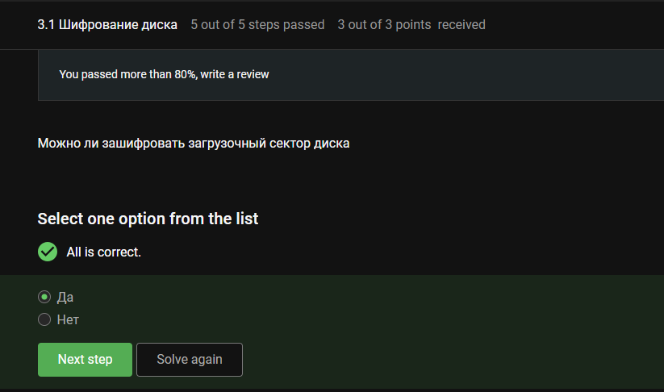
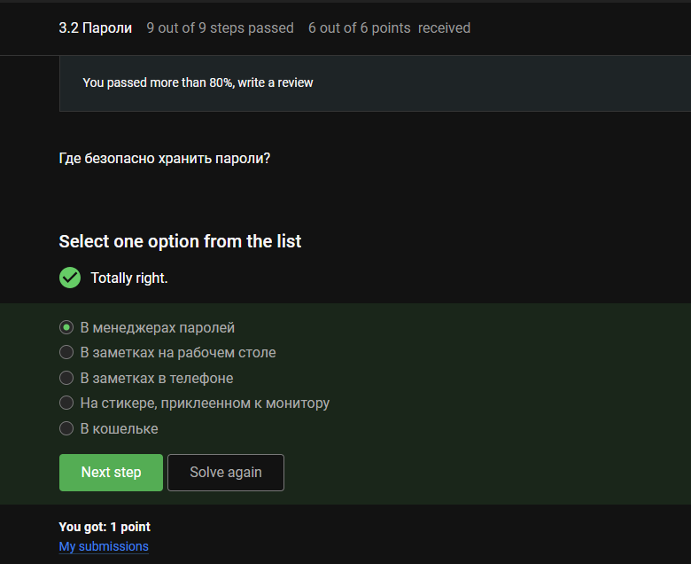
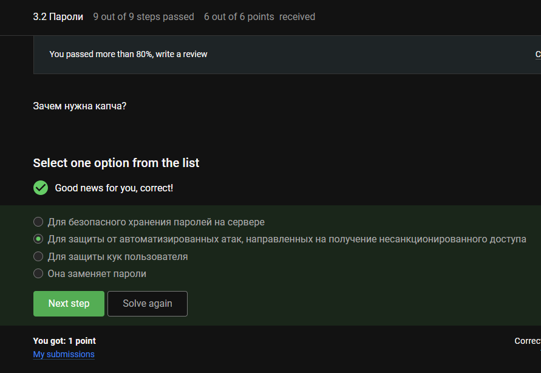
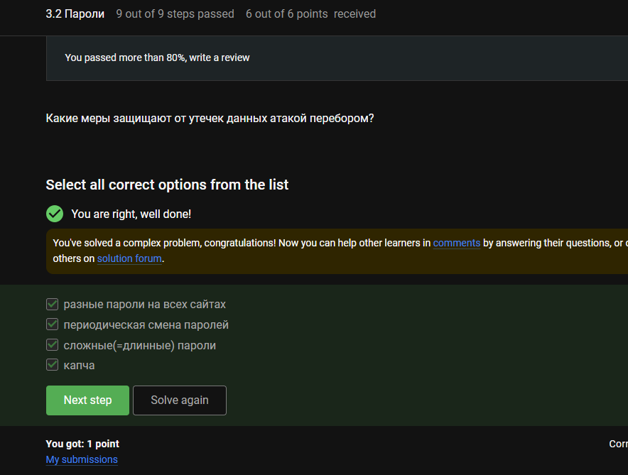
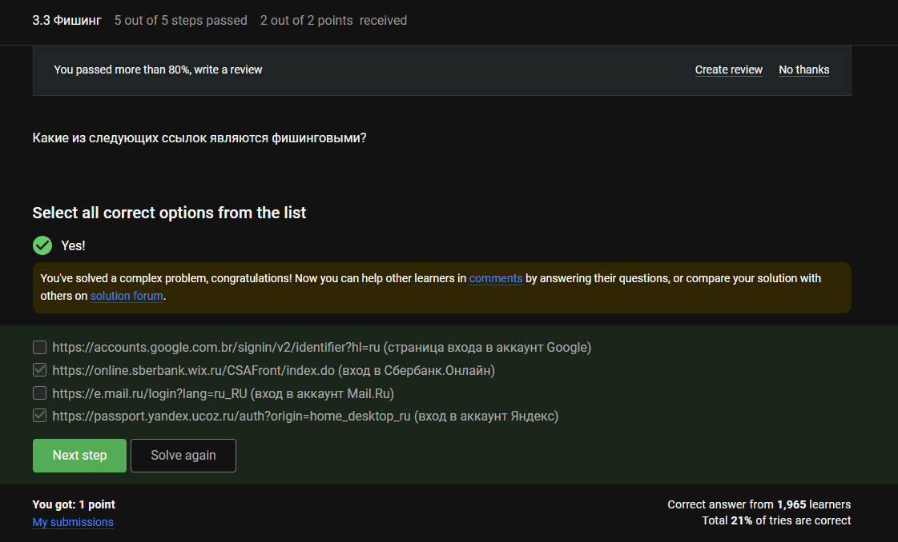
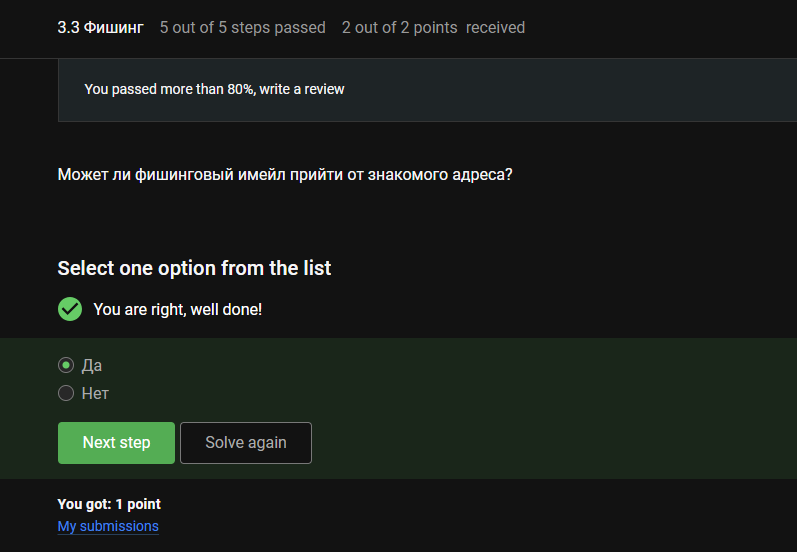
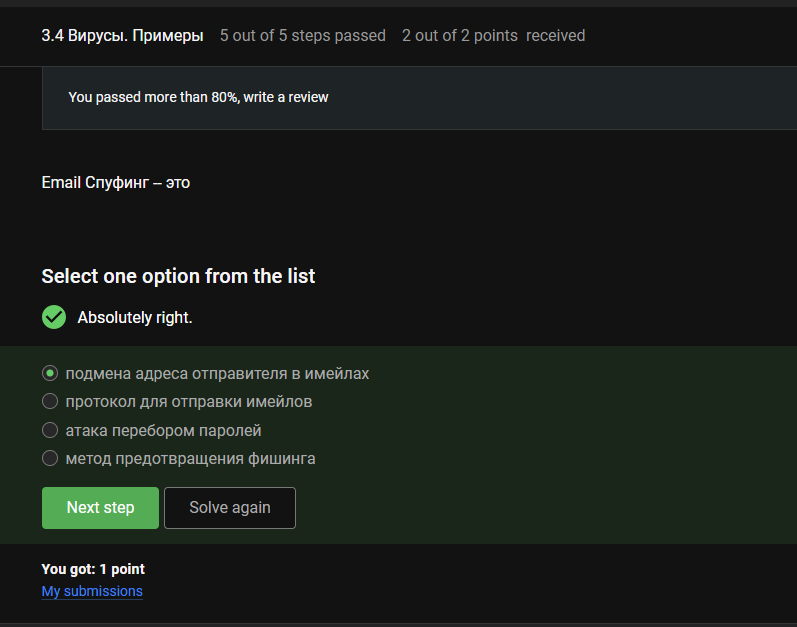
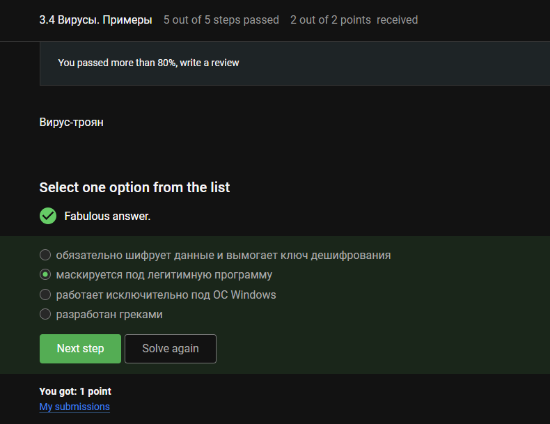
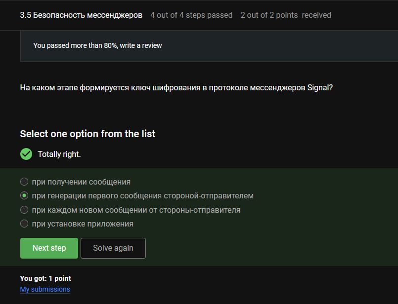

---
## Author
author:
  name: Луангсуваннавонг Сайпхачан, НКАбд-01-24
## Title
title: "Внешний курс. Блок 2: Защита ПК/телефона"
subtitle: "Основы информационной безопасности"
---

# Цель работы

Выполнение контрольных заданий второго блока внешнего курса "Основы Кибербезопасности"

# Выполнение заданий блока "Защита ПК/телефона"

## Шифрование диска

Полнодисковое шифрование (например, BitLocker, LUKS) шифрует загрузочный сектор и требует предзагрузочной аутентификации.([рис. @fig-001])

{#fig-001 width=70%}

Дисковое шифрование использует симметричные шифры (например, AES) с одним ключом как для шифрования, так и для дешифрования, поскольку это быстрее для больших объёмов данных.([рис. @fig-002])

{#fig-002 width=70%}

Дисковая утилита (Disk Utility) предназначена для управления дисками в macOS, но не является специализированным инструментом полнодискового шифрования, таким как VeraCrypt или BitLocker. Wireshark не имеет отношения к этому.([рис. @fig-003])

{#fig-003 width=70%}

## Пароли

Ответ: `UQr9@j4!S$`, поскольку он использует заглавные и строчные буквы, цифры, символы и является достаточно длинным (случайным). Другие варианты являются предсказуемыми или основаны на словарных словах.([рис. @fig-004])

{#fig-004 width=70%}

Менеджеры паролей хранят пароли в зашифрованном виде и требуют один мастер-пароль. Другие варианты физически или цифрово небезопасны.([рис. @fig-005])

{#fig-005 width=70%}

CAPTCHA отличает людей от ботов, предотвращая автоматизированные атаки, такие как перебор паролей или спам.([рис. @fig-006])

{#fig-006 width=70%}

Хеширование преобразует пароли в хеши фиксированной длины, поэтому даже в случае утечки базы данных оригинальные пароли не раскрываются.([рис. @fig-007])

{#fig-007 width=70%}

Соль (salt) делает каждый хеш пароля уникальным, предотвращая атаки с использованием предварительно вычисленных радужных таблиц, даже если злоумышленник имеет хеши паролей.([рис. @fig-008])

{#fig-008 width=70%}

Разные пароли — ограничивают ущерб от одной утечки.
Периодическая смена — сокращает окно возможности использования скомпрометированных учётных данных.
Сложные/длинные пароли — делают перебор непрактичным.
CAPTCHA — блокирует автоматизированные атаки перебора.([рис. @fig-009])

{#fig-009 width=70%}

## Фишинг

wix.ru не является официальным доменом Сбербанка (должно быть sberbank.ru).

ucoz.ru не является официальным доменом Яндекса (должно быть yandex.ru).

Ссылки на Google и Mail.ru используют официальные домены.([рис. @fig-010])

{#fig-010 width=70%}

Злоумышленники могут подделать адреса электронной почты или взломать аккаунт друга, чтобы отправлять фишинговые письма.([рис. @fig-011])

{#fig-011 width=70%}

## Вирусы. Примеры

Подделка электронной почты (email spoofing) подделывает адрес «Отправитель», чтобы обмануть получателя и заставить его доверять источнику.([рис. @fig-012])

{#fig-012 width=70%}

Троян (Trojan) маскируется под легальное программное обеспечение, чтобы обманом заставить пользователя запустить его.([рис. @fig-013])

{#fig-013 width=70%}

## Безопасность мессенджеров

В протоколе Signal ключ шифрования устанавливается во время первоначального создания сессии, когда отправитель генерирует первое сообщение (с использованием согласования ключей X3DH).([рис. @fig-014])

{#fig-014 width=70%}

Сквозное шифрование (end-to-end encryption) гарантирует, что только отправитель и получатель могут читать сообщения; серверы видят только зашифрованный текст.([рис. @fig-015])

{#fig-015 width=70%}

# Выводы

Во время этого блока я узнал о правилах хранения паролей, основной информации о вирусах и методе фишинга
