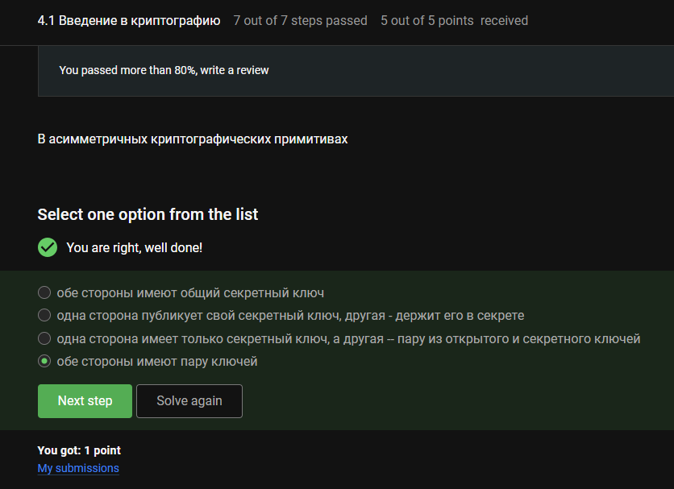
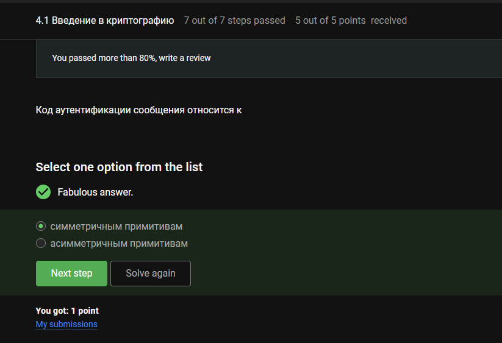
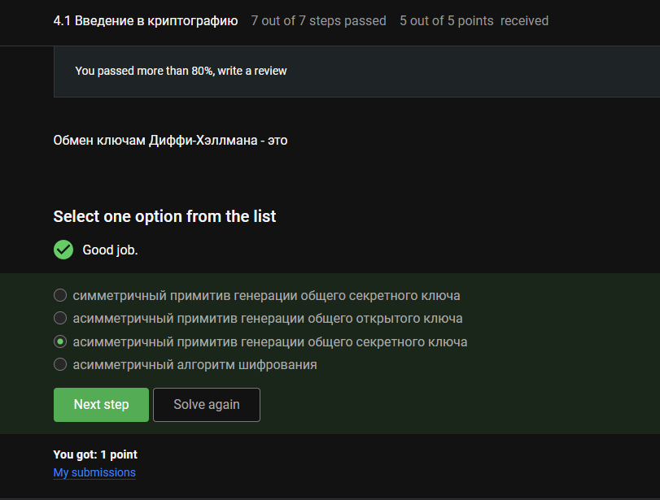
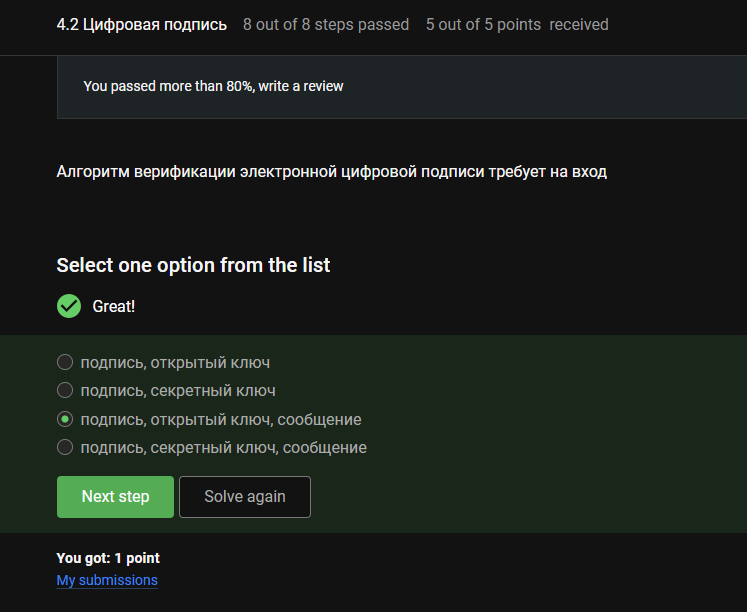
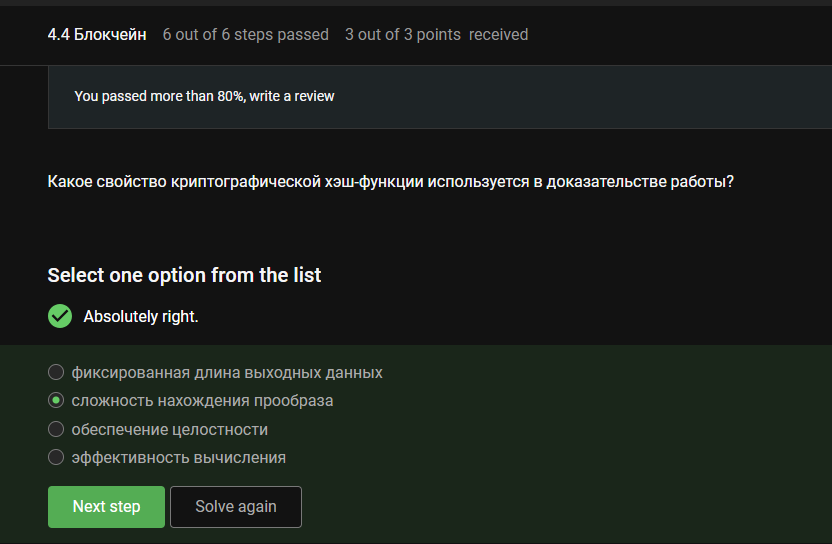
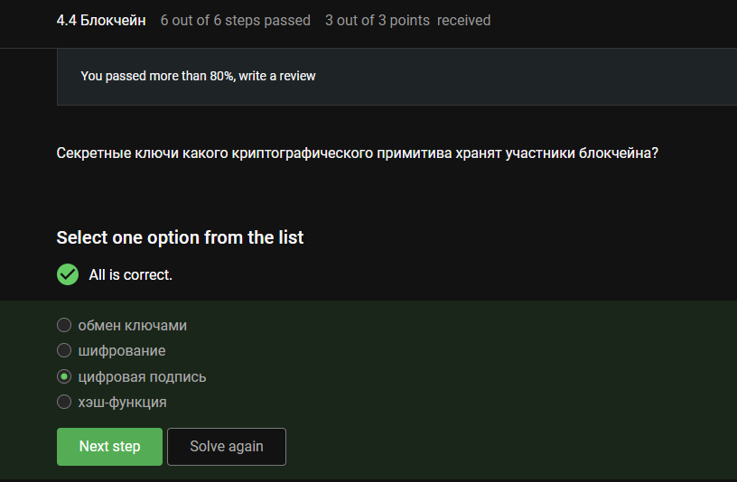

---
## Author
author:
  name: Луангсуваннавонг Сайпхачан
## Title
title: Внешний курс. Блок 3 Криптография на практике
subtitle: Основы информационной безопасности

date-format: "2026-04-17" # Example: 2025-09-06
---

# Информация

## Докладчик

:::::::::::::: {.columns align=center}
::: {.column width="70%"}

  * Луангсуваннавонг Сайпхачан
  * студент группы НКАбд-01-24
  * Российский университет дружбы народов им. П. Лумумбы
  * <https://github.com/sayprachanh-lsvnv>

:::
::: {.column width="30%"}

:::
::::::::::::::

## Цель работы

Выполнение контрольных заданий первого блока внешнего курса "Основы Кибербезопасности"

# Выполнение заданий блока "Криптография на практике"

## Введение в криптографию

Асимметричная криптография – у каждой стороны пара ключей (открытый + закрытый).

## Введение в криптографию

Хеш-функции: фиксированная длина вывода (SHA-256 = 256 бит), быстрое вычисление, устойчивость к коллизиям. Не дают конфиденциальность (односторонняя).

## Введение в криптографию

Цифровые подписи: RSA, ECDSA, ГОСТ Р 34.10-2012.
AES – симметричное шифрование (не подпись).
SHA2 – хеш-функция (не подпись сама по себе).

## Введение в криптографию

MAC – один общий секретный ключ для генерации и проверки (симметричный).

## Введение в криптографию

Диффи-Хеллман (Diffie-Hellman) – безопасная выработка общего ключа по незащищённому каналу (асимметричные принципы).

## Цифровая подпись

Цифровые подписи используют асимметричную криптографию: подпись закрытым ключом, проверка открытым.

## Цифровая подпись

Для проверки нужны: сообщение, подпись, открытый ключ отправителя.

## Цифровая подпись

Цифровые подписи дают целостность, аутентификацию, неотказуемость. Сообщение остаётся видимым (не зашифровано).

## Цифровая подпись

Подача отчётности в ФНС требует квалифицированной цифровой подписи (приравнена к собственноручной).

## Цифровая подпись

Квалифицированные сертификаты – только от аккредитованных удостоверяющих центров.

## Электронные платежи

Платёжные системы: MasterCard (международная), МИР (российская).
BitCoin – криптовалюта. SecurePay – платёжный шлюз. POS-терминал и банкомат – устройства.

## Электронные платежи

Многофакторная аутентификация – два и более разных факторов (знание + владение, или владение + признак).
Пароль + CAPTCHA → оба фактора знания (не независимый фактор).
PIN + пароль → оба фактора знания (один фактор).

## Электронные платежи

Онлайн-платежи обычно используют 3D Secure (пароль/SMS + данные карты) – банк-эмитент проверяет клиента с несколькими факторами.

## Блокчейн

Доказательство работы (например, майнинг Bitcoin) требует нахождения входа, хеш которого находится ниже целевого значения — полагаясь на устойчивость к поиску прообраза (сложность обращения хеша).

## Блокчейн

Свойства блокчейна: живучесть (новые блоки), консенсус (согласие узлов), постоянство (данные не меняются), открытость (любой может присоединиться).

## Блокчейн

Участники блокчейна используют закрытые ключи для подписи транзакций (цифровая подпись). Хеш-функции и обмен ключами не требуют хранения закрытых ключей всеми; шифрование – не основной примитив.

# Выводы

Во время этого блока я узнал о криптографии, цифровых подписях, платежах и блокчейне
