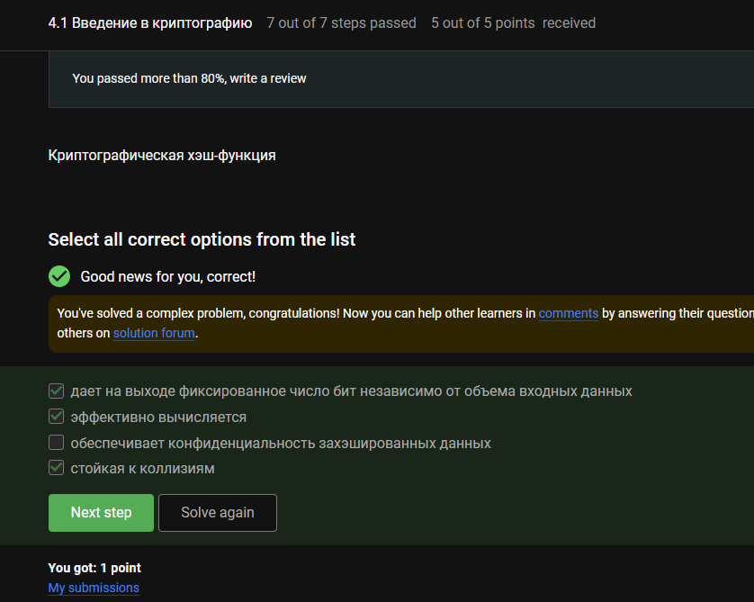
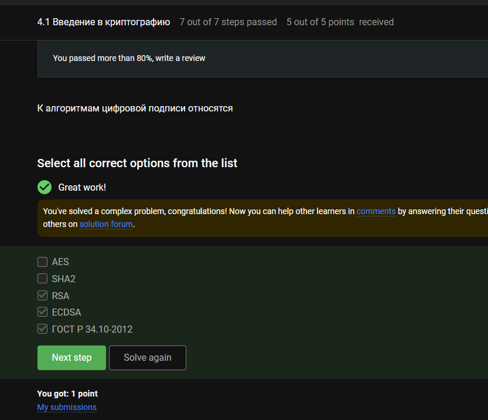
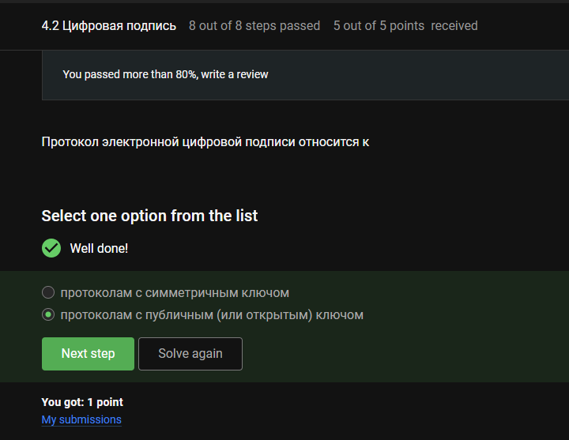
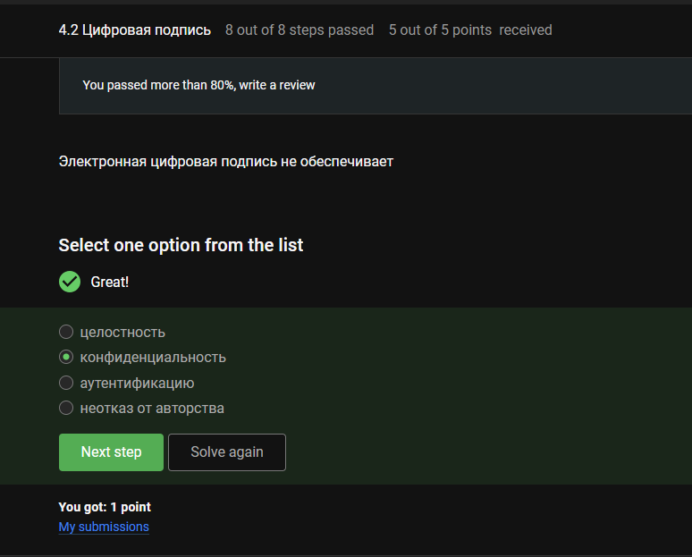
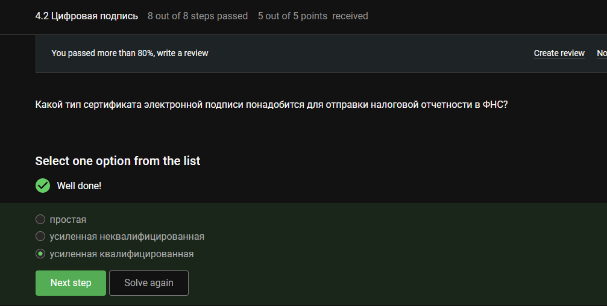
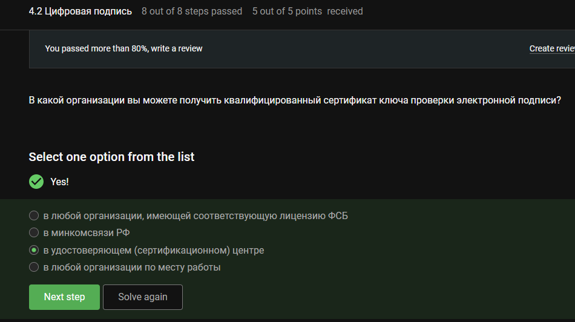
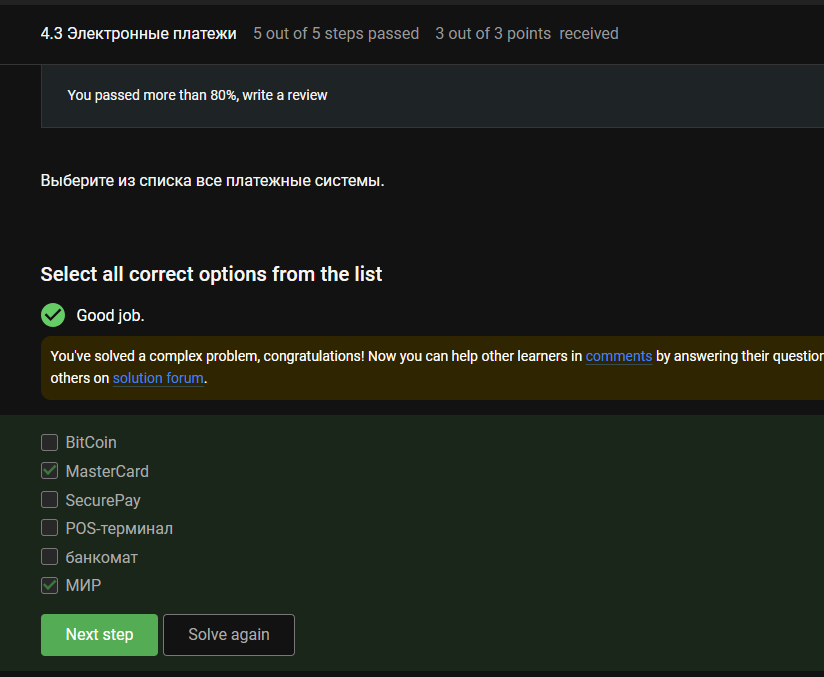
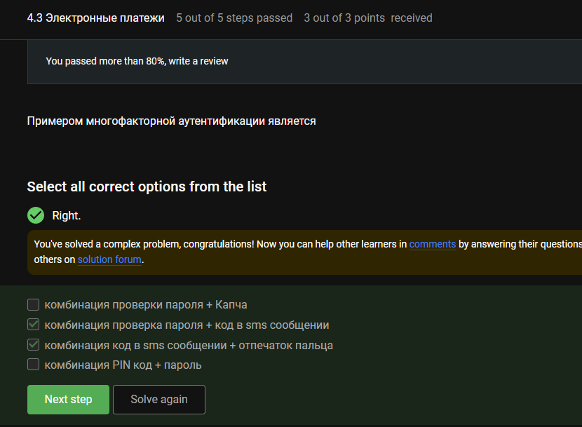
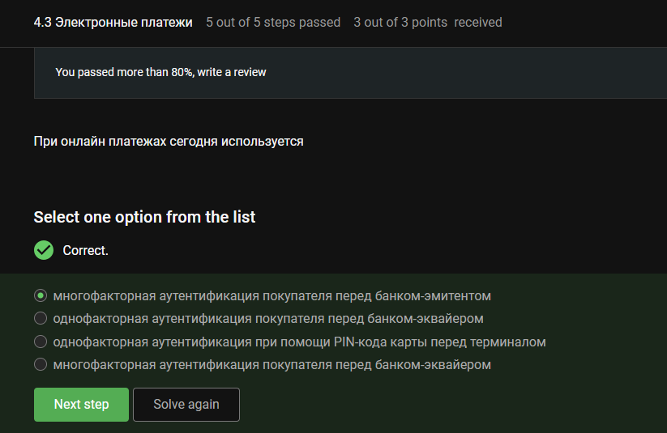
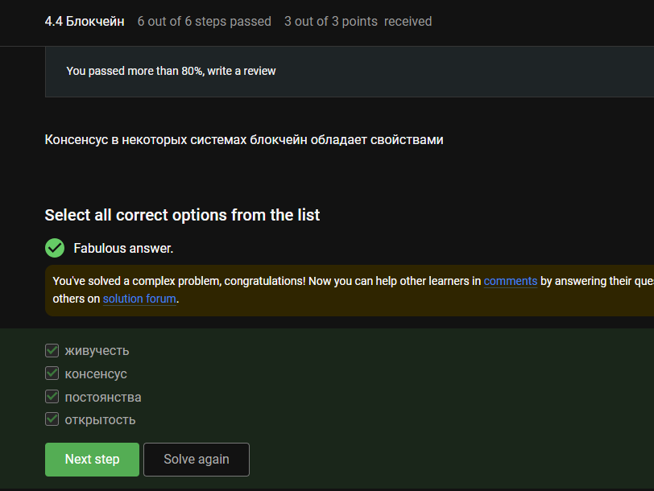

---
## Author
author:
  name: Луангсуваннавонг Сайпхачан, НКАбд-01-24
## Title
title: "Внешний курс. Блок 3: Криптография на практике"
subtitle: "Основы информационной безопасности"
---

# Цель работы

Выполнение контрольных заданий первого блока внешнего курса "Основы Кибербезопасности"

# Выполнение заданий блока "Криптография на практике"

## Введение в криптографию

В асимметричной криптографии каждая сторона имеет пару ключей (открытый + закрытый).([рис. @fig-001])

{#fig-001 width=70%}

Фиксированная длина вывода – например, SHA-256 всегда выводит 256 бит.
Эффективность вычисления – быстро вычисляется для любого входа.
Устойчивость к коллизиям – сложно найти два разных входа с одинаковым хешем.
Не обеспечивает конфиденциальность (хеширование является односторонним, а не шифрованием).([рис. @fig-002])

{#fig-002 width=70%}

RSA – может использоваться для цифровых подписей.
ECDSA – алгоритм цифровой подписи на эллиптических кривых.
ГОСТ Р 34.10-2012 – российский национальный стандарт цифровой подписи.
AES – симметричное шифрование (не подпись).
SHA2 – хеш-функция (используется с подписями, но сама по себе не является алгоритмом подписи).([рис. @fig-003])

{#fig-003 width=70%}

MAC (Message Authentication Code) использует один общий секретный ключ как для генерации, так и для проверки, что делает его симметричным.([рис. @fig-004])

{#fig-004 width=70%}

Диффи-Хеллман позволяет двум сторонам безопасно сгенерировать общий секретный ключ по незащищённому каналу, используя асимметричные принципы (открытые/закрытые значения).([рис. @fig-005])

{#fig-005 width=70%}

## Цифровая подпись

Цифровые подписи используют асимметричную криптографию: подписание закрытым ключом, проверка открытым ключом.([рис. @fig-006])

{#fig-006 width=70%}

Для проверки необходимы сообщение, подпись и открытый ключ отправителя.([рис. @fig-007])

{#fig-007 width=70%}

Цифровые подписи обеспечивают целостность, аутентификацию и неотказуемость — но само сообщение остаётся видимым (не зашифрованным).([рис. @fig-008])

{#fig-008 width=70%}

Подача налоговой отчётности в ФНС требует квалифицированной цифровой подписи (приравнивается к собственноручной подписи по закону).([рис. @fig-009])

{#fig-009 width=70%}

Квалифицированные сертификаты выдаются только аккредитованными удостоверяющими центрами.([рис. @fig-010])

{#fig-010 width=70%}

## Электронные платежи

Оба являются платёжными системами (MasterCard — международная, МИР — российская).
BitCoin — это криптовалюта, а не традиционная платёжная система.
SecurePay — это платёжный шлюз.
POS-терминал и банкомат — это аппаратные устройства.([рис. @fig-011])

{#fig-011 width=70%}

Многофакторная аутентификация использует два или более различных факторов (знание + владение, или владение + присущий признак).
Пароль + CAPTCHA → оба фактора знания (CAPTCHA не является независимым фактором).
PIN + пароль → оба фактора знания (один фактор).([рис. @fig-012])

{#fig-012 width=70%}

Онлайн-платежи обычно используют 3D Secure (пароль/SMS + данные карты), где банк-эмитент проверяет клиента с использованием нескольких факторов.([рис. @fig-013])

{#fig-013 width=70%}

## Блокчейн

Доказательство работы (например, майнинг Bitcoin) требует нахождения входа, хеш которого находится ниже целевого значения — полагаясь на устойчивость к поиску прообраза (сложность обращения хеша).([рис. @fig-014])

{#fig-014 width=70%}

Живучесть – система остаётся работоспособной и может добавлять новые блоки.
Консенсус – согласие между узлами о действительном состоянии/цепочке.
Постоянство – после подтверждения данные не могут быть изменены.
Открытость – любой может присоединиться к сети и проверять её.([рис. @fig-015])

{#fig-015 width=70%}

Участники блокчейна используют закрытые ключи для подписания транзакций (цифровая подпись). Хеш-функции и обмен ключами не требуют хранения закрытых ключей всеми участниками; шифрование не является основным примитивом блокчейна.([рис. @fig-016])

{#fig-016 width=70%}

# Выводы

Во время этого блока я узнал о криптографии, цифровых подписях, платежах и блокчейне
