---
## Author
author:
  name: Луангсуваннавонг Сайпхачан
## Title
title: Презентация по лабораторной работе № 5
subtitle: Основы информационной безопасности

date-format: "2026-02-26" # Example: 2025-09-06
---

# Информация

## Докладчик

:::::::::::::: {.columns align=center}
::: {.column width="70%"}

  * Луангсуваннавонг Сайпхачан
  * студент группы НКАбд-01-24
  * Российский университет дружбы народов им. П. Лумумбы
  * <https://github.com/sayprachanh-lsvnv>

:::
::: {.column width="30%"}

:::
::::::::::::::

## Цель работы

Получение практических навыков работы в консоли с расширенными атрибутами файлов

# Выполнение лабораторной работы

## Выполнение лабораторной работы

Перед началом выполнения лабораторной работы я проверяю, установлены ли компиляторы gcc или g++, а также отключаю дополнительную защиту системы.

## Выполнение лабораторной работы

Я вхожу в учетную запись 'guest', создаю файл 'simpleid.c' и записываю в него код. Затем я компилирую файл с помощью gcc и запускаю программу. Я сравниваю результат работы программы с выводом команды id — оба значения UID и GID совпадают.

## Выполнение лабораторной работы

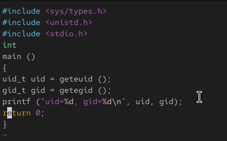

## Выполнение лабораторной работы

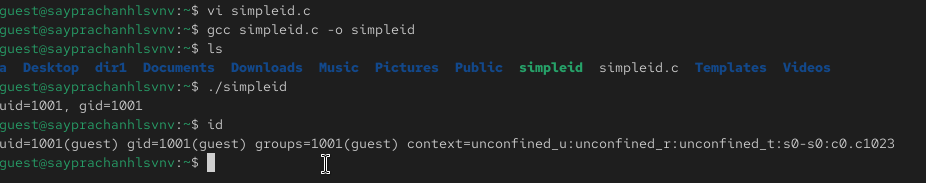

## Выполнение лабораторной работы

Далее я создаю другой файл 'simpleid2.c', записываю в него код и компилирую файл. Затем я запускаю программу.

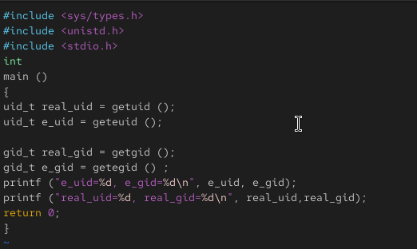

## Выполнение лабораторной работы

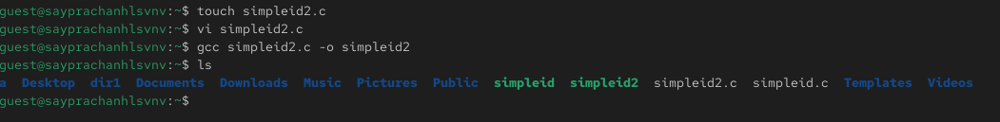

## Выполнение лабораторной работы

## Выполнение лабораторной работы

Используя chown, я изменяю владельца файла simpleid2, а с помощью chmod изменяю права доступа к файлу. Затем я запускаю программу и сравниваю её вывод с выводом команды id.

## Выполнение лабораторной работы

## Выполнение лабораторной работы

Затем я снова изменяю владельца файла, на этот раз изменяя GID файла, и проверяю вывод с помощью команды id.

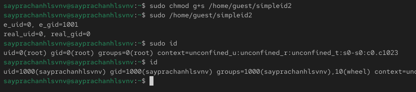

## Выполнение лабораторной работы

Я создаю еще один файл 'readfile.c', записываю в него код и компилирую файл.

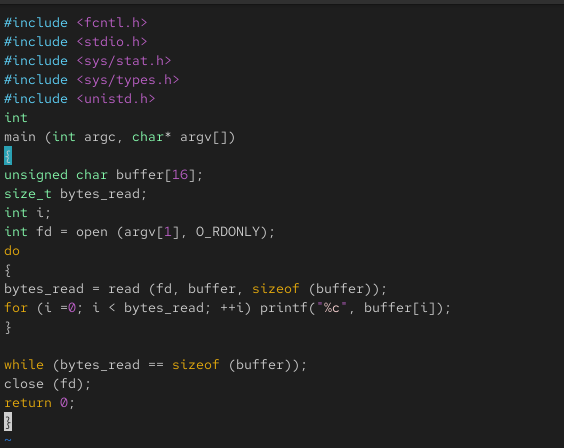

## Выполнение лабораторной работы

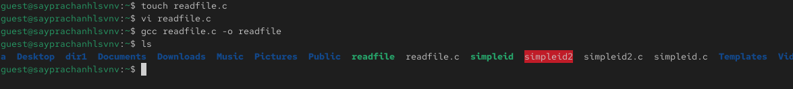

## Выполнение лабораторной работы

Используя chown, я изменяю владельца файла readfile.c, а с помощью chmod изменяю права доступа к файлу так, чтобы только суперпользователь (root) мог его читать, а пользователь guest — нет.

## Выполнение лабораторной работы

Я пытаюсь прочитать файл от имени guest — безуспешно.

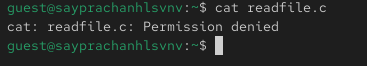

## Выполнение лабораторной работы

Я пытаюсь использовать программу readfile для чтения файла readfile.c, а также файла /etc/shadow от имени guest — безуспешно.

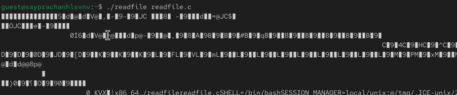

## Выполнение лабораторной работы

## Выполнение лабораторной работы

Я перехожу к суперпользователю (root) и пробую прочитать файл /etc/shadow — на этот раз операция успешна, файл читается.

## Выполнение лабораторной работы

Я проверяю, установлен ли Sticky-бит на каталоге /tmp, с помощью команды ls.

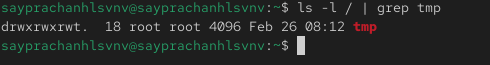

## Выполнение лабораторной работы

Я создаю файл file01.txt в каталоге /tmp, затем проверяю его атрибуты. После этого я изменяю атрибуты файла, разрешая чтение и запись для "всех остальных" (all other).

## Выполнение лабораторной работы

Я вхожу в учетную запись 'guest2'. От имени этого пользователя я могу прочитать файл, но не могу записывать в него новую информацию, а также не могу удалить файл.

## Выполнение лабораторной работы

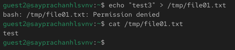

## Выполнение лабораторной работы

## Выполнение лабораторной работы

Затем я вхожу в учетную запись root. С помощью chmod я удаляю sticky-бит (t) с каталога /tmp.

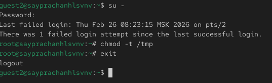

## Выполнение лабораторной работы

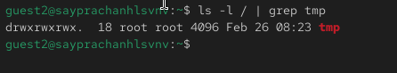

## Выполнение лабораторной работы

Я снова проверяю предыдущее действие. Я всё еще могу прочитать файл и не могу записать в него новую информацию, но удалить файл стало возможно.

## Выполнение лабораторной работы

Я возвращаюсь в учетную запись root и добавляю sticky-бит обратно на каталог /tmp.

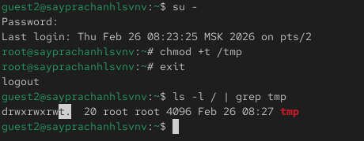

# Выводы

Изучил механизм изменения идентификаторов, применила SetUID- и Sticky-биты. Получила практические навыки работы в кон- соли с дополнительными атрибутами. Рассмотрела работы механизма смены идентификатора процессов пользователей, а также влияние бита Sticky на запись и удаление файлов.

