---
## Author
author:
  name: Луангсуваннавонг Сайпхачан, НКАбд-01-24
## Title
title: "Отчёт по лабораторной работе № 5"
subtitle: "Основы информационной безопасности"
---

# Цель работы

Изучение механизмов изменения идентификаторов, применения SetUID- и Sticky-битов. 
Получение практических навыков работы в консоли с дополнительными атрибутами. 
Рассмотрение работы механизма смены идентификатора процессов пользователей, 
а также влияние бита Sticky на запись и удаление файлов

# Выполнение лабораторной работы

Перед началом выполнения лабораторной работы я проверяю, установлены ли компиляторы gcc или g++, а также отключаю дополнительную защиту системы с помощью команды setenforce 0.([рис. @fig-001])

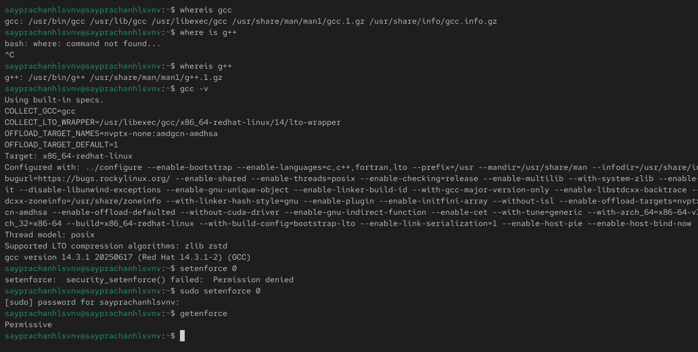{#fig-001 width=70%}

Я вхожу в учетную запись 'guest', перехожу в домашний каталог пользователя, создаю файл 'simpleid.c' и записываю в него код. Затем я компилирую файл с помощью gcc и запускаю программу.
Программа выводит UID и GID пользователя. Я сравниваю результат работы программы с выводом команды id — оба значения UID и GID совпадают.([рис. @fig-002])([рис. @fig-003])([рис. @fig-004])

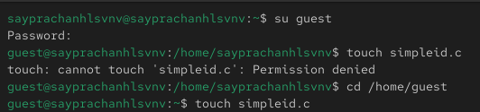{#fig-002 width=70%}

{#fig-003 width=70%}

{#fig-004 width=70%}

Далее я создаю другой файл 'simpleid2.c', записываю в него код и компилирую файл. Затем я запускаю программу.([рис. @fig-005])([рис. @fig-006])([рис. @fig-007])

{#fig-005 width=70%}

{#fig-006 width=70%}

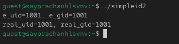{#fig-007 width=70%}

Используя chown, я изменяю владельца файла simpleid2, а с помощью chmod изменяю права доступа к файлу. Затем я запускаю программу и сравниваю её вывод с выводом команды id.Используя chown, я изменяю владельца файла simpleid2, а с помощью chmod изменяю права доступа к файлу. Затем я запускаю программу и сравниваю её вывод с выводом команды id. ([рис. @fig-008])([рис. @fig-009])

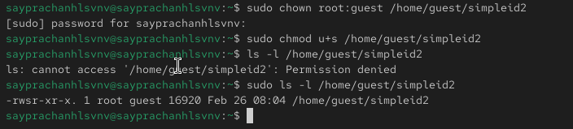{#fig-008 width=70%}

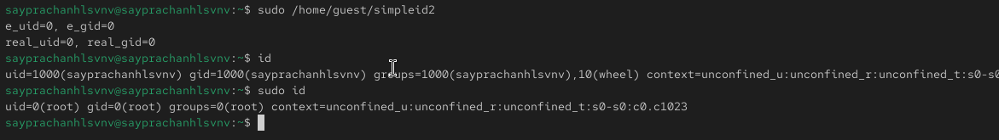{#fig-009 width=70%}

Затем я снова изменяю владельца файла, на этот раз изменяя GID файла, и проверяю вывод с помощью команды id. GID изменился на 1001, что соответствует идентификатору группы 'guest'.([рис. @fig-010])

{#fig-010 width=70%}

Я создаю еще один файл 'readfile.c', записываю в него код и компилирую файл.([рис. @fig-011])([рис. @fig-012])

{#fig-011 width=70%}

{#fig-012 width=70%}

Используя chown, я изменяю владельца файла readfile.c, а с помощью chmod изменяю права доступа к файлу так, чтобы только суперпользователь (root) мог его читать, а пользователь guest — нет.([рис. @fig-013])

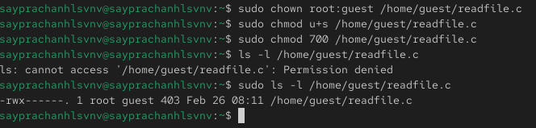{#fig-013 width=70%}

Я пытаюсь прочитать файл от имени guest — безуспешно.([рис. @fig-014])

{#fig-014 width=70%}

Я пытаюсь использовать программу readfile для чтения того же файла readfile.c от имени guest, но это не удается — файл не может быть прочитан. Я пытаюсь сделать то же самое с файлом /etc/shadow — также безуспешно.([рис. @fig-015])([рис. @fig-016])

{#fig-015 width=70%}

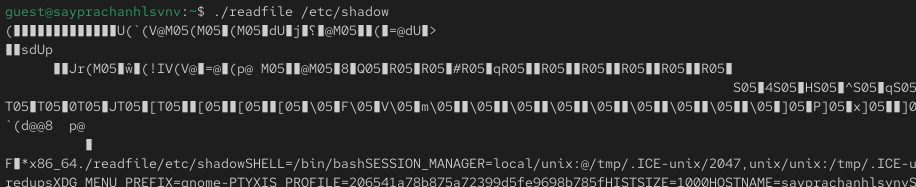{#fig-016 width=70%}

Я перехожу к суперпользователю (root) и пробую прочитать файл /etc/shadow — на этот раз операция успешна, файл читается.([рис. @fig-017])

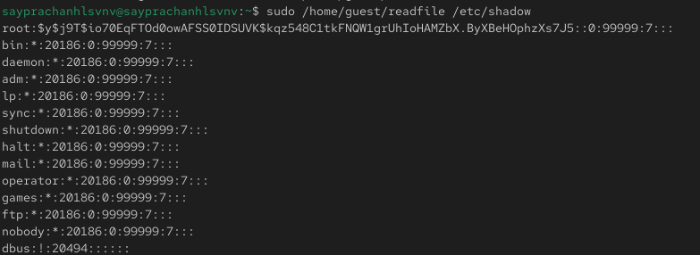{#fig-017 width=70%}

Я проверяю, установлен ли Sticky-бит на каталоге /tmp, с помощью команды ls.([рис. @fig-018])

{#fig-018 width=70%}

Я создаю файл file01.txt в каталоге /tmp, затем проверяю его атрибуты. После этого я изменяю атрибуты файла с помощью команды chmod, разрешая чтение и запись для "всех остальных" (all other).([рис. @fig-019])

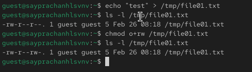{#fig-019 width=70%}

Я вхожу в учетную запись 'guest2'. От имени этого пользователя я могу прочитать файл, но также не могу записывать в него новую информацию и даже удалить файл.([рис. @fig-020])([рис. @fig-021])([рис. @fig-022])

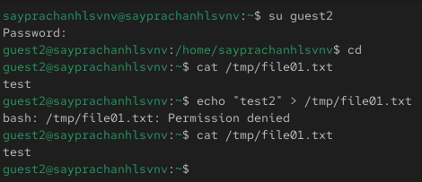{#fig-020 width=70%}

{#fig-021 width=70%}

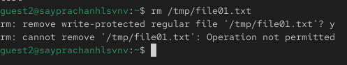{#fig-022 width=70%}

Затем я вхожу в учетную запись root. С помощью chmod я удаляю sticky-бит (t) с каталога /tmp, после чего выхожу из учетной записи root. Я проверяю атрибуты /tmp — теперь они не содержат букву 't' (sticky-бит).([рис. @fig-023])([рис. @fig-024])

{#fig-023 width=70%}

{#fig-024 width=70%}

Я снова проверяю предыдущее действие. Я всё еще могу прочитать файл, но не могу записать в него новую информацию, однако удалить файл стало возможно.([рис. @fig-025])

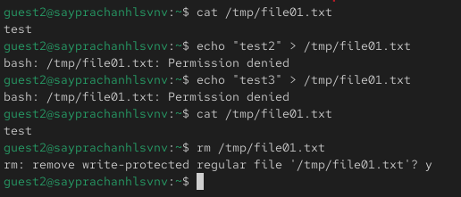{#fig-025 width=70%}

Я возвращаюсь в учетную запись root и добавляю sticky-бит обратно на каталог /tmp.([рис. @fig-026])

{#fig-026 width=70%}

# Выводы

Изучил механизм изменения идентификаторов, применила SetUID- и Sticky-биты. Получила практические навыки работы в кон- соли с дополнительными атрибутами. Рассмотрела работы механизма смены идентификатора процессов пользователей, а также влияние бита Sticky на запись и удаление файлов.

# Список литературы{.unnumbered}

::: {#refs}
:::
