---
## Author
author:
  name: Луангсуваннавонг Сайпхачан
## Title
title: Презентация по лабораторной работе № 6
subtitle: Основы информационной безопасности

date-format: "2026-02-27" # Example: 2025-09-06
---

# Информация

## Докладчик

:::::::::::::: {.columns align=center}
::: {.column width="70%"}

  * Луангсуваннавонг Сайпхачан
  * студент группы НКАбд-01-24
  * Российский университет дружбы народов им. П. Лумумбы
  * <https://github.com/sayprachanh-lsvnv>

:::
::: {.column width="30%"}

:::
::::::::::::::

## Цель работы

Развить навыки администрирования ОС Linux. Получить первое практическое знакомство с технологией SELinux, 
Проверить работу SELinx на практике совместно с веб-сервером Apache

# Выполнение лабораторной работы

## Выполнение лабораторной работы

Сначала я вхожу в свою учетную запись и проверяю, работает ли SELinux в принудительном режиме (enforcement mode) с целевой политикой (targeted policy), используя команды getenforce и sestatus.

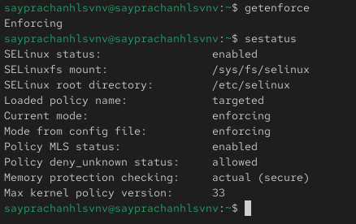

## Выполнение лабораторной работы

Я запускаю сервер Apache, затем использую браузер для доступа к веб-серверу, работающему на компьютере. Мы видим, что он работает; это можно проверить с помощью команды service httpd status.

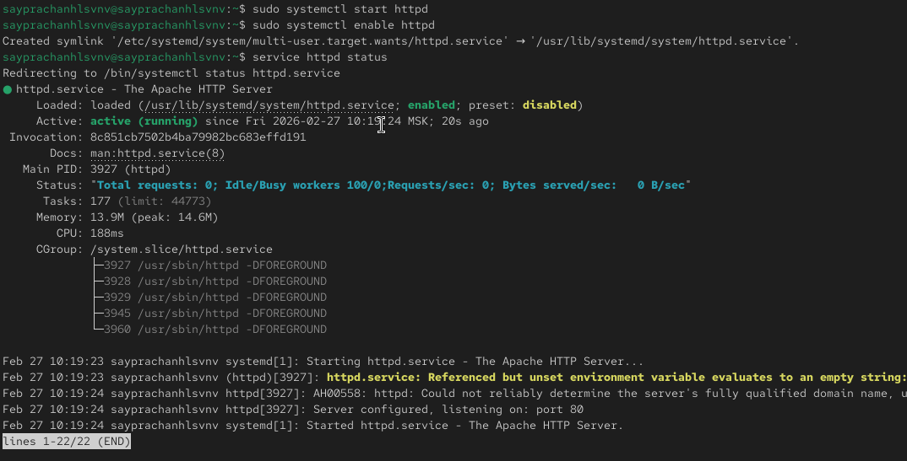

## Выполнение лабораторной работы

Используя команду ps auxZ | grep httpd, я нахожу веб-сервер Apache в списке процессов. Его контекст безопасности — httpd_t.

## Выполнение лабораторной работы

Далее я проверяю текущее состояние переключателей (булевых значений) SELinux для сервера Apache с помощью команды sestatus -b | grep httpd.

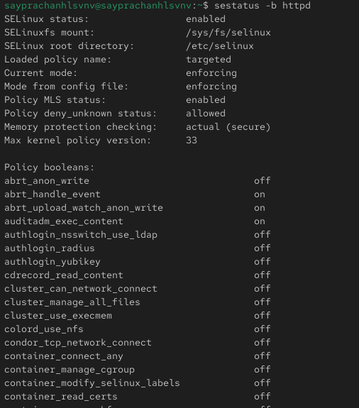

## Выполнение лабораторной работы

Используя команду seinfo, я просматриваю статистику по политике. Мы видим, что количество пользователей — 8, ролей — 15 и типов — 4699.

## Выполнение лабораторной работы

Я определяю тип файлов и подкаталогов, расположенных в каталоге /var/www, с помощью команды ls -lZ /var/www. Затем я проверяю подкаталог /var/www/html — в нем нет никаких файлов, а пользователь, которому разрешено создавать в нем файлы, — это пользователь "root".

## Выполнение лабораторной работы

## Выполнение лабораторной работы

## Выполнение лабораторной работы

Я создаю HTML-файл от имени суперпользователя (root).

## Выполнение лабораторной работы

Затем я ввожу адрес http://127.0.0.1/test.html в браузере, чтобы получить доступ к файлу через веб-сервер. Мы видим, что файл успешно отображается.

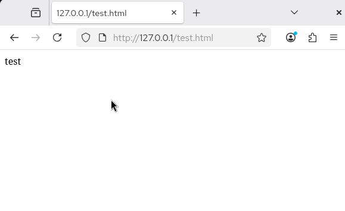

## Выполнение лабораторной работы

Я изучил справочную страницу man httpd_selinux.

## Выполнение лабораторной работы

Используя команду ls -Z /var/www/html/test.html, я проверяю контекст файла.

## Выполнение лабораторной работы

Я изменяю контекст файла /var/www/html/test.html с httpd_sys_content_t на любой другой, к которому процесс httpd не должен иметь доступа, например, samba_share_t.

## Выполнение лабораторной работы

Я снова пытаюсь получить доступ к файлу через веб-сервер и получаю сообщение об ошибке, поскольку было установлено, что права доступа разрешают всем чтение файла, но процесс httpd не должен этого делать.

## Выполнение лабораторной работы

Я просматриваю файлы журналов веб-сервера Apache, а также системный журнал, используя команду tail /var/log/messages, и файл /var/log/audit/audit.log.

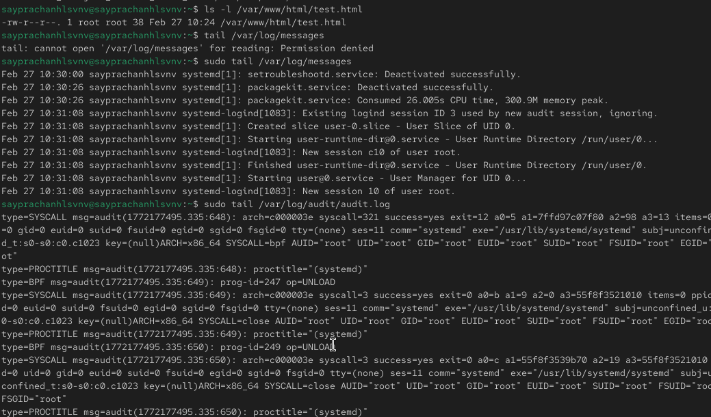

## Выполнение лабораторной работы

Я заменяю строку Listen 80 на Listen 81 в файле /etc/httpd/conf/httpd.conf, чтобы заставить веб-сервер Apache прослушивать TCP-порт 81.

## Выполнение лабораторной работы

Затем я перезапускаю веб-сервер Apache. Теперь он выдает ошибку, так как порт 80 разрешен, а порт 81 — нет.

## Выполнение лабораторной работы

Я просматриваю файлы /var/log/httpd/error_log, /var/log/httpd/access_log и /var/log/audit/audit.log и выясняю, в каких файлах появились записи.

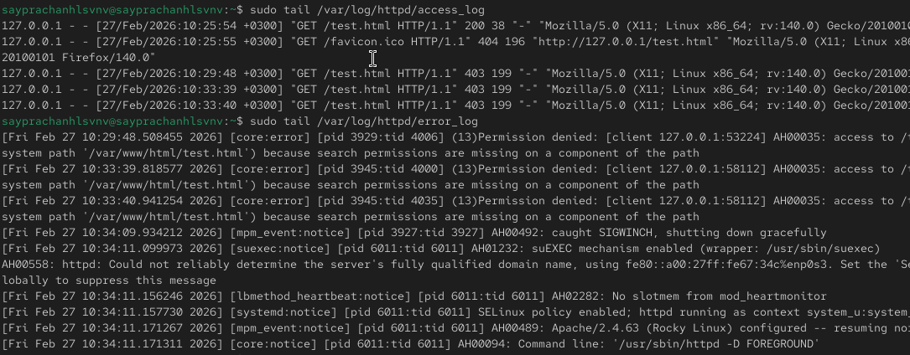

## Выполнение лабораторной работы

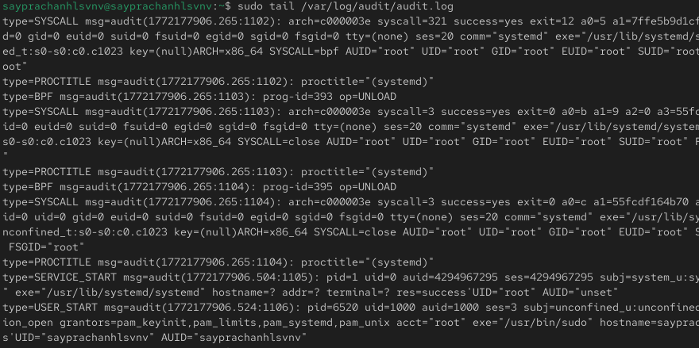

## Выполнение лабораторной работы

Я выполняю команду semanage port -a -t http_port_t -p tcp 81. После этого проверяю список портов с помощью команды semanage port -l | grep http_port_t, и мы видим, что порт 81 появился в списке.

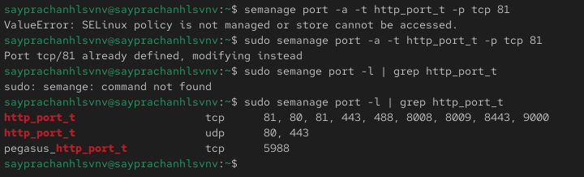

## Выполнение лабораторной работы

Я возвращаю контекст httpd_sys_content_t файлу /var/www/html/test.html, затем снова перезапускаю сервер Apache. Я обращаюсь к файлу через веб-сервер, используя адрес http://127.0.0.1:81/test.html — теперь мы видим содержимое файла.

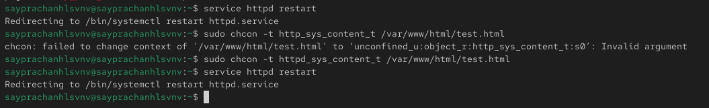

## Выполнение лабораторной работы

## Выполнение лабораторной работы

Я возвращаю строку Listen 81 обратно на Listen 80 в конфигурационном файле Apache.

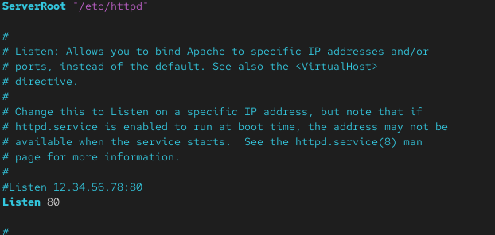

## Выполнение лабораторной работы

Затем я удаляю порт 81 с помощью команды semanage port -d -t http_port_t -p tcp 81 и проверяю, был ли порт 81 удален.

## Выполнение лабораторной работы

После этого я удаляю файл /var/www/html/test.html.

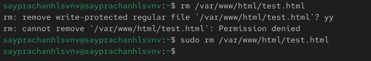

# Выводы

в этой лабораторной работе, я развил навыки администрирования ОС Linux. Получил первое практическое знакомство с технологией SELinux, и работу SELinx на практике совместно с веб-сервером Apache

