---
## Author
author:
  name: Луангсуваннавонг Сайпхачан, НКАбд-01-24
## Title
title: "Отчёт по лабораторной работе № 6"
subtitle: "Основы информационной безопасности"
---

# Цель работы

Развить навыки администрирования ОС Linux. Получить первое практическое знакомство с технологией SELinux, 
Проверить работу SELinx на практике совместно с веб-сервером Apache

# Выполнение лабораторной работы

Сначала я вхожу в свою учетную запись и проверяю, работает ли SELinux в принудительном режиме (enforcement mode) с целевой политикой (targeted policy), используя команды getenforce и sestatus.([рис. @fig-001])

{#fig-001 width=70%}

Я запускаю сервер Apache, затем использую браузер для доступа к веб-серверу, работающему на компьютере. Мы видим, что он работает; это можно проверить с помощью команды service httpd status.([рис. @fig-002])

{#fig-002 width=70%}


Используя команду ps auxZ | grep httpd, я нахожу веб-сервер Apache в списке процессов. Его контекст безопасности — httpd_t.([рис. @fig-003])

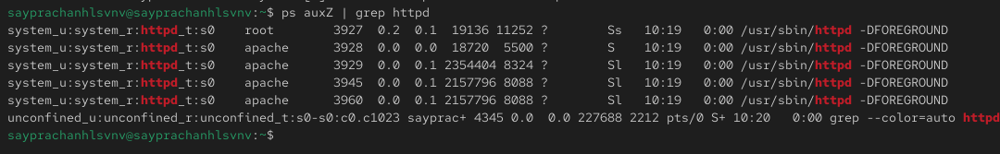{#fig-003 width=70%}


Далее я проверяю текущее состояние переключателей SELinux для сервера Apache с помощью команды sestatus -b | grep httpd.([рис. @fig-004])

{#fig-004 width=70%}

Используя команду seinfo, я просматриваю статистику по политике. Мы видим, что количество пользователей — 8, ролей — 15 и типов — 4699.([рис. @fig-005])

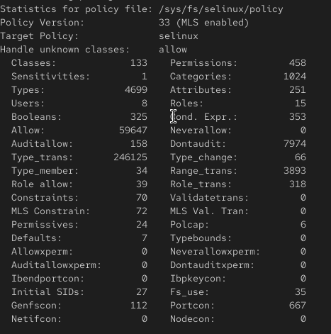{#fig-005 width=70%}


Я определяю тип файлов и подкаталогов, расположенных в каталоге /var/www, с помощью команды ls -lZ /var/www. Затем я проверяю подкаталог /var/www/html — в нем нет никаких файлов, а пользователь, которому разрешено создавать в нем файлы, — это пользователь "root".([рис. @fig-006])([рис. @fig-007])([рис. @fig-008])

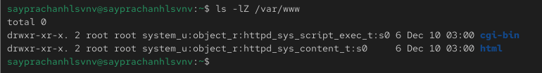{#fig-006 width=70%}

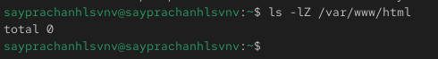{#fig-007 width=70%}

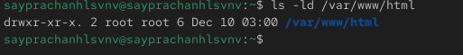{#fig-008 width=70%}

Я создаю HTML-файл от имени суперпользователя (root) со следующим содержимым:([рис. @fig-009])

```
<html> 
<body>test</body> 
</html> 

```

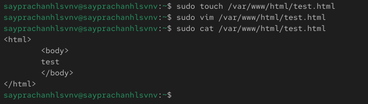{#fig-009 width=70%}

Затем я ввожу адрес http://127.0.0.1/test.html в браузере, чтобы получить доступ к файлу через веб-сервер. Мы видим, что файл успешно отображается.([рис. @fig-010])

{#fig-010 width=70%}

Я изучил справочную страницу man httpd_selinux.
Рассмотрим полученный контекст детально. Обратите внимание, что так как по умолчанию пользователи CentOS являются свободными от типа (unconfined — означает свободный), созданному нами файлу test.html был сопоставлен пользователь SELinux unconfined_u. Это первая часть контекста.
Далее, политика ролевого разделения доступа (RBAC) используется процессами, но не файлами, поэтому роли не имеют никакого значения для файлов. Роль object_r используется по умолчанию для файлов на «постоянных» носителях и на сетевых файловых системах. (В директории /proc файлы, относящиеся к процессам, могут иметь роль system_r. Если активна политика MLS, то могут использоваться и другие роли, например, secadm_r. Данный случай мы рассматривать не будем, как и предназначение :s0).
Тип httpd_sys_content_t позволяет процессу httpd получить доступ к файлу. Благодаря наличию последнего типа мы получили доступ к файлу при обращении к нему через браузер.([рис. @fig-011])

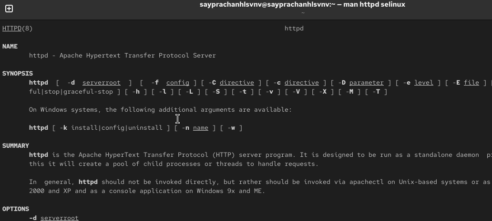{#fig-011 width=70%}


Используя команду ls -Z /var/www/html/test.html, я проверяю контекст файла.([рис. @fig-012])

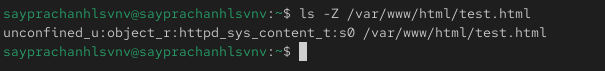{#fig-012 width=70%}


Я изменяю контекст файла /var/www/html/test.html с httpd_sys_content_t на любой другой, к которому процесс httpd не должен иметь доступа, например, samba_share_t, используя команду chcon от имени суперпользователя (root). Затем я проверяю, изменилось ли содержимое контекста.([рис. @fig-013])

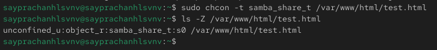{#fig-013 width=70%}


Я снова пытаюсь получить доступ к файлу через веб-сервер. В результате я получаю сообщение об ошибке, поскольку было установлено, что права доступа разрешают всем чтение файла, но процесс httpd не должен этого делать.([рис. @fig-014])

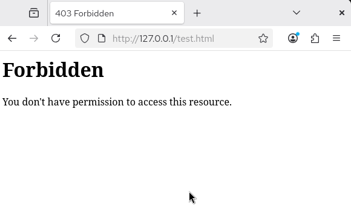{#fig-014 width=70%}


Я просматриваю файлы журналов веб-сервера Apache, а также системный журнал, используя команду tail /var/log/messages. Если в системе окажутся запущенными процессы setroubleshootd и audtd, то вы также сможете увидеть ошибки, аналогичные указанным выше, в файле /var/log/audit/audit.log.([рис. @fig-015])

{#fig-015 width=70%}


Я заменяю строку Listen 80 на Listen 81 в файле /etc/httpd/conf/httpd.conf, чтобы заставить веб-сервер Apache прослушивать TCP-порт 81.([рис. @fig-016])

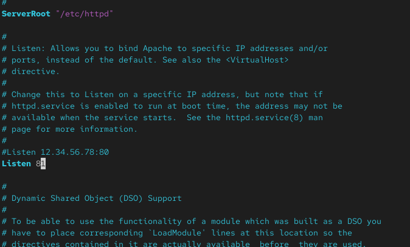{#fig-016 width=70%}


Затем я перезапускаю веб-сервер Apache. Теперь он выдает ошибку, так как порт 80 разрешен для веб-сервера, а порт 81 — нет.([рис. @fig-017])

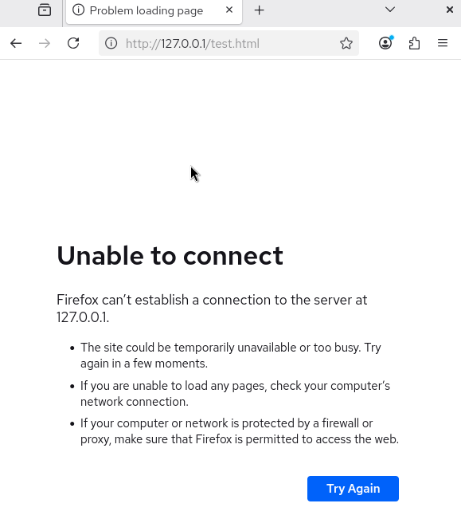{#fig-017 width=70%}

Я просматриваю файлы /var/log/httpd/error_log, /var/log/httpd/access_log и /var/log/audit/audit.log и выясняю, в каких файлах появились записи. Запись об ошибке появилась в файле error_log.([рис. @fig-018])([рис. @fig-019])

{#fig-018 width=70%}

{#fig-019 width=70%}

Я выполняю команду semanage port -a -t http_port_t -p tcp 81. После этого проверяю список портов с помощью команды semanage port -l | grep http_port_t, и мы видим, что порт 81 появился в списке.([рис. @fig-020])

{#fig-020 width=70%}


Я возвращаю контекст httpd_sys_content_t файлу /var/www/html/test.html, затем снова перезапускаю сервер Apache. Я обращаюсь к файлу через веб-сервер, используя адрес http://127.0.0.1:81/test.html — теперь мы видим содержимое файла.([рис. @fig-021])([рис. @fig-022])

{#fig-021 width=70%}

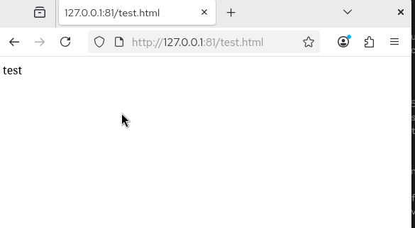{#fig-022 width=70%}

Я возвращаю строку Listen 81 обратно на Listen 80 в конфигурационном файле Apache.([рис. @fig-023])

{#fig-023 width=70%}

Затем я удаляю порт 81 с помощью команды semanage port -d -t http_port_t -p tcp 81 и проверяю, был ли порт 81 удален.([рис. @fig-024])

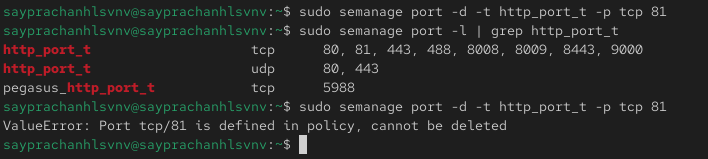{#fig-024 width=70%}

После этого я удаляю файл /var/www/html/test.html.([рис. @fig-025])

{#fig-025 width=70%}

# Выводы

в этой лабораторной работе, я развил навыки администрирования ОС Linux. Получил первое практическое знакомство с технологией SELinux, и работу SELinx на практике совместно с веб-сервером Apache


# Список литературы{.unnumbered}

::: {#refs}
:::
