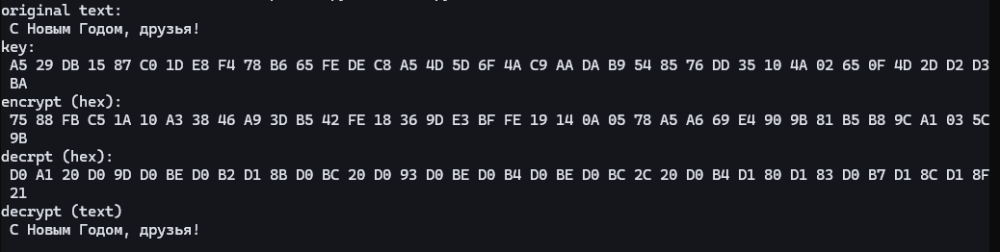
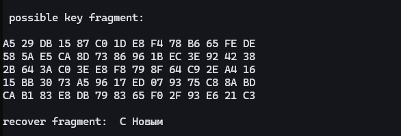

---
## Author
author:
  name: Луангсуваннавонг Сайпхачан
## Title
title: Презентация по лабораторной работе № 7
subtitle: Основы информационной безопасности

date-format: "2026-03-01" # Example: 2025-09-06
---

# Информация

## Докладчик

:::::::::::::: {.columns align=center}
::: {.column width="70%"}

  * Луангсуваннавонг Сайпхачан
  * студент группы НКАбд-01-24
  * Российский университет дружбы народов им. П. Лумумбы
  * <https://github.com/sayprachanh-lsvnv>

:::
::: {.column width="30%"}

:::
::::::::::::::

## Цель работы

Освоить на практике применение режима однократного гаммирования

## Задание

Нужно подобрать ключ, чтобы получить сообщение «С Новым Годом,
друзья!». Требуется разработать приложение, позволяющее шифровать и
дешифровать данные в режиме однократного гаммирования. Приложение
должно:

1. Определить вид шифротекста при известном ключе и известном откры-
том тексте.

2. Определить ключ, с помощью которого шифротекст может быть преоб-
разован в некоторый фрагмент текста, представляющий собой один из
возможных вариантов прочтения открытого текста.

# Выполнение лабораторной работы

## Выполнение лабораторной работы

Я буду выполнять лабораторную работу на языке программирования Python. Для этой лабораторной работы требуется разработать программу, позволяющую шифровать и дешифровать данные в режиме однократного использования (гаммирования).

Сначала я создаю функцию для генерации случайного ключа с использованием системного генератора случайных чисел.

## Выполнение лабораторной работы

Согласно примеру в лабораторной работе, необходимо, чтобы все данные отображались в шестнадцатеричном формате, поэтому я создаю функцию, которая преобразует открытый текст в шестнадцатеричный формат.

## Выполнение лабораторной работы

Создание функции, которая выполняет одновременное шифрование и дешифрование с использованием операции "исключающее ИЛИ" (XOR). Поскольку сама операция обратима, я создаю только одну функцию как для шифрования, так и для дешифрования текста.

## Выполнение лабораторной работы

Необходимо определить ключ, с помощью которого шифротекст можно преобразовать во фрагмент текста, представляющий один из возможных способов прочтения открытого текста. Поэтому я создаю функцию, которая будет находить возможные ключи для различных позиций фрагмента в шифротексте.

## Выполнение лабораторной работы

Я запускаю функцию и проверяю результат. Шифрование и дешифрование работают корректно, выдавая результат текста до и после шифрования, а также в шестнадцатеричном формате.

## Выполнение лабораторной работы

А также поиск возможных ключей, которые можно использовать для дешифровки только части текста (фрагмента).

# Выводы

в этой лабораторной работе, я освоил на практике применение режима однократного гаммирования
