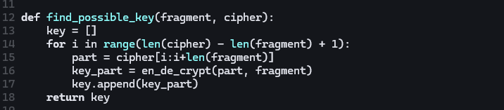

---
## Author
author:
  name: Луангсуваннавонг Сайпхачан, НКАбд-01-24
## Title
title: "Отчёт по лабораторной работе № 7"
subtitle: "Основы информационной безопасности"
---

# Цель работы

Освоить на практике применение режима однократного гаммирования

# Задание

Нужно подобрать ключ, чтобы получить сообщение «С Новым Годом,
друзья!». Требуется разработать приложение, позволяющее шифровать и
дешифровать данные в режиме однократного гаммирования. Приложение
должно:

1. Определить вид шифротекста при известном ключе и известном открытом тексте.
2. Определить ключ, с помощью которого шифротекст может быть преобразован в некоторый фрагмент текста, представляющий собой один из возможных вариантов прочтения открытого текста.

# Теоретическое введение

Предложенная Г. С. Вернамом так называемая «схема однократного использования (гаммирования)»  является простой, но надёжной схемой шифрования данных.

Гаммирование представляет собой наложение (снятие) на открытые (зашифрованные) данные последовательности элементов других данных, полученной с помощью некоторого криптографического алгоритма, для получения зашифрованных (открытых) данных. Иными словами, наложение
гаммы — это сложение её элементов с элементами открытого (закрытого)
текста по некоторому фиксированному модулю, значение которого представляет собой известную часть алгоритма шифрования.

В соответствии с теорией криптоанализа, если в методе шифрования используется однократная вероятностная гамма (однократное гаммирование)
той же длины, что и подлежащий сокрытию текст, то текст нельзя раскрыть.
Даже при раскрытии части последовательности гаммы нельзя получить информацию о всём скрываемом тексте.

Наложение гаммы по сути представляет собой выполнение операции
сложения по модулю 2 (XOR) (обозначаемая знаком ⊕) между элементами
гаммы и элементами подлежащего сокрытию текста. Напомним, как работает операция XOR над битами: 0 ⊕ 0 = 0, 0 ⊕ 1 = 1, 1 ⊕ 0 = 1, 1 ⊕ 1 = 0.

Такой метод шифрования является симметричным, так как двойное прибавление одной и той же величины по модулю 2 восстанавливает исходное значение, а шифрование и расшифрование выполняется одной и той же программой.

Если известны ключ и открытый текст, то задача нахождения шифротекста заключается в применении к каждому символу открытого текста следующего правила:

$$ C_i = P_i ⊕ K_i, (7.1)$$

где $C_i$ — i-й символ получившегося зашифрованного послания, $P_i$ — i-й
символ открытого текста, $K_i$ — i-й символ ключа, i = 1, m. Размерности
открытого текста и ключа должны совпадать, и полученный шифротекст
будет такой же длины.

Если известны шифротекст и открытый текст, то задача нахождения
ключа решается также в соответствии с (7.1), а именно, обе части равенства необходимо сложить по модулю 2 с $P_i$:

$$Ci ⊕ Pi = Pi ⊕ Ki ⊕ Pi = Ki$$

$$Ki = Ci ⊕ Pi$$


Открытый текст имеет символьный вид, а ключ — шестнадцатеричное
представление. Ключ также можно представить в символьном виде, воспользовавшись таблицей ASCII-кодов.

К. Шеннон доказал абсолютную стойкость шифра в случае, когда однократно используемый ключ, длиной, равной длине исходного сообщения,
является фрагментом истинно случайной двоичной последовательности с
равномерным законом распределения. Криптоалгоритм не даёт никакой информации об открытом тексте: при известном зашифрованном сообщении
C все различные ключевые последовательности K возможны и равновероятны, а значит, возможны и любые сообщения P.

Необходимые и достаточные условия абсолютной стойкости шифра:
– полная случайность ключа;
– равенство длин ключа и открытого текста;
– однократное использование ключа.
Рассмотрим пример.
Ключ Центра:

`05 0C 17 7F 0E 4E 37 D2 94 10 09 2E 22 57 FF C8 0B B2 70 54`

Сообщение Центра:

Штирлиц – Вы Герой!!

`D8 F2 E8 F0 EB E8 F6 20 2D 20 C2 FB 20 C3 E5 F0 EE E9 21 21`

Зашифрованный текст, находящийся у Мюллера:

`DD FE FF 8F E5 A6 C1 F2 B9 30 CB D5 02 94 1A 38 E5 5B 51 75`

Дешифровальщики попробовали ключ:

`05 0C 17 7F 0E 4E 37 D2 94 10 09 2E 22 55 F4 D3 07 BB BC 54`

и получили текст:

`D8 F2 E8 F0 EB E8 F6 20 2D 20 C2 FB 20 C1 EE EB E2 E0 ED 21`

Штирлиц - Вы Болван!

Другие ключи дадут лишь новые фразы, пословицы, стихотворные
строфы, словом, всевозможные тексты заданной длины.

# Выполнение лабораторной работы

Я буду выполнять лабораторную работу на языке программирования Python. Для этой лабораторной работы требуется разработать программу, позволяющую шифровать и дешифровать данные в режиме однократного использования (гаммирования).
Сначала я создаю функцию для генерации случайного ключа с использованием системного генератора случайных чисел.([рис. @fig-001])

{#fig-001 width=70%}

Согласно примеру в лабораторной работе, необходимо, чтобы все данные отображались в шестнадцатеричном формате, поэтому я создаю функцию, которая преобразует открытый текст в шестнадцатеричный формат.
Для каждого символа/байта она форматирует его в шестнадцатеричный код с двумя символами (02X).([рис. @fig-002])

{#fig-002 width=70%}

Создание функции, которая выполняет одновременное шифрование и дешифрование с использованием операции "исключающее ИЛИ" (XOR). Поскольку сама операция обратима, я создаю только одну функцию как для шифрования, так и для дешифрования текста.
Функция принимает два байтовых массива: текст (открытый текст или шифротекст) и ключ, затем с помощью функции zip() объединяет байты в пары и выполняет для каждой пары операцию "исключающее ИЛИ" (b ^ k).([рис. @fig-003])

{#fig-003 width=70%}

Необходимо определить ключ, с помощью которого шифротекст можно преобразовать во фрагмент текста, представляющий один из возможных способов прочтения открытого текста. Поэтому я создаю функцию, которая будет находить возможные ключи для различных позиций фрагмента в шифротексте.

Функция перебирает все возможные позиции фрагмента в шифротексте, извлекает соответствующий участок шифротекста для каждой позиции и вычисляет ключ (key = cipher_part ⊕ fragment).([рис. @fig-004])

{#fig-004 width=70%}

Я запускаю функцию и проверяю результат. Шифрование и дешифрование работают корректно, выдавая результат текста до и после шифрования, а также в шестнадцатеричном формате.([рис. @fig-005])

{#fig-005 width=70%}

А также поиск возможных ключей, которые можно использовать для дешифровки только части текста (фрагмента).([рис. @fig-006])

{#fig-006 width=70%}


Код программы:

```{.python}
import os


def generate_key(text):
    return os.urandom(len(text))


def text_to_hex(text):
    return ' '.join(f'{c:02X}' for c in text)


def en_de_crypt(text, key):
    return bytes([b ^ k for b,k in zip(text, key)])


def find_possible_key(fragment, cipher):
    key = []
    for i in range(len(cipher) - len(fragment) + 1):
        part = cipher[i:i+len(fragment)]
        key_part = en_de_crypt(part, fragment)
        key.append(key_part)
    return key

t = "С Новым Годом, друзья!"

t_bytes = t.encode('utf-8')

k = generate_key(t_bytes)
cipher = en_de_crypt(t_bytes, k)
decrypted = en_de_crypt(cipher,k).decode('utf-8')

#case 1

print("original text:", t)
print("key (hex):" ,text_to_hex(k))
print("encrypt: " ,text_to_hex(cipher))
print("decrypt: " ,decrypted)

#case 2

fragment = 'С Новым'.encode('utf-8')

possible_k = find_possible_key(fragment, cipher)

print("\nPossible key fragments (hex):")
for kf in possible_k[:3]:
    print(text_to_hex(kf))


recover_fragment = en_de_crypt(cipher[:len(fragment)], 
possible_k[0])
print(recover_fragment.decode('utf-8'))

```

# Ответы на контрольные вопросы

1. Поясните смысл однократного гаммирования.

	Смысл однократного гаммирования заключается в наложении на открытые данные случайной ключевой последовательности (гаммы) той же длины с помощью операции XOR, причём ключ используется только один раз.

2. Перечислите недостатки однократного гаммирования.

- Ключ должен быть той же длины, что и сообщение

- Ключ можно использовать только один раз

- Проблема распространения и хранения длинных ключей

- Требуется истинно случайная генерация ключа

3. Перечислите преимущества однократного гаммирования.

Абсолютная криптографическая стойкость (доказано Шенноном)

Простота реализации (только операция XOR)

При правильном использовании не даёт никакой информации об открытом тексте

4. Почему длина открытого текста должна совпадать с длиной ключа?

Чтобы каждый символ открытого текста гаммировался с уникальным символом ключа. Если ключ короче, он повторяется, что нарушает условие абсолютной стойкости и позволяет криптоанализ.

5. Какая операция используется в режиме однократного гаммирования, назовите её особенности?

Операция XOR (исключающее ИЛИ). Особенности:

Коммутативна: $A ⊕ B = B ⊕ A$

Обратима: $(A ⊕ B) ⊕ B = A$

Таблица истинности: $0⊕0=0, 0⊕1=1, 1⊕0=1, 1⊕1=0$

6. Как по открытому тексту и ключу получить шифротекст?

Шифротекст получается путём применения операции XOR к каждому символу открытого текста и соответствующему символу ключа: $C_i = P_i ⊕ K_i$

7. Как по открытому тексту и шифротексту получить ключ?

Ключ получается путём применения операции XOR к открытому тексту и шифротексту: $K_i = C_i ⊕ P_i$

8. В чем заключаются необходимые и достаточные условия абсолютной стойкости шифра?

- Полная случайность ключа (истинно случайная последовательность)

- Равенство длин ключа и открытого текста

- Однократное использование ключа


# Выводы

в этой лабораторной работе, я освоил на практике применение режима однократного гаммирования

# Список литературы{.unnumbered}

::: {#refs}
:::
