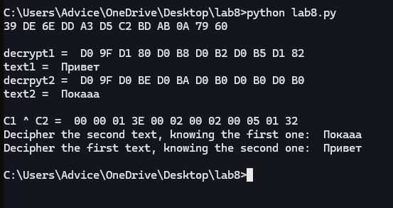

---
## Author
author:
  name: Луангсуваннавонг Сайпхачан
## Title
title: Презентация по лабораторной работе № 8
subtitle: Основы информационной безопасности

date-format: "2026-03-01" # Example: 2025-09-06
---

# Информация

## Докладчик

:::::::::::::: {.columns align=center}
::: {.column width="70%"}

  * Луангсуваннавонг Сайпхачан
  * студент группы НКАбд-01-24
  * Российский университет дружбы народов им. П. Лумумбы
  * <https://github.com/sayprachanh-lsvnv>

:::
::: {.column width="30%"}

:::
::::::::::::::

## Цель работы

Освоить на практике применение режима однократного гаммирования
на примере кодирования различных исходных текстов одним ключом

## задание

Два текста кодируются одним ключом (однократное гаммирование).
Требуется не зная ключа и не стремясь его определить, прочитать оба тек-
ста. Необходимо разработать приложение, позволяющее шифровать и де-
шифровать тексты P1 и P2 в режиме однократного гаммирования. Прило-
жение должно определить вид шифротекстов C1 и C2 обоих текстов P1 и
P2 при известном ключе ; Необходимо определить и выразить аналитиче-
ски способ, при котором злоумышленник может прочитать оба текста, не
зная ключа и не стремясь его определить

# Выполнение лабораторной работы

## Выполнение лабораторной работы

Я буду выполнять лабораторную работу на языке программирования Python, используя функцию, которая была реализована в лабораторной работе №7.

Используя функцию генерации ключа, я генерирую ключ, шифрую два разных текста одним и тем же ключом, затем расшифровываю оба текста с помощью того же ключа.

## Выполнение лабораторной работы

Предположим, что мне неизвестен ключ, но известен один из текстов и оба шифротекста. Используя свойство XOR, я могу выполнить вычисления, чтобы получить второй текст.

# Выводы

в этой лабораторной работе, я освоил на практике применение режима однократного гаммирования
на примере кодирования различных исходных текстов одним ключом
