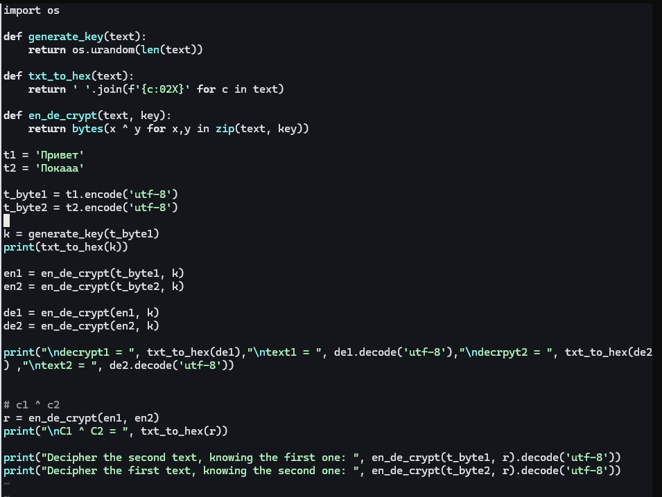

---
## Author
author:
  name: Луангсуваннавонг Сайпхачан, НКАбд-01-24
## Title
title: "Отчёт по лабораторной работе № 8"
subtitle: "Основы информационной безопасности"
---

# Цель работы

Освоить на практике применение режима однократного гаммирования
на примере кодирования различных исходных текстов одним ключом

# Задание

Два текста кодируются одним ключом (однократное гаммирование).
Требуется не зная ключа и не стремясь его определить, прочитать оба текста. Необходимо разработать приложение, позволяющее шифровать и дешифровать тексты P1 и P2 в режиме однократного гаммирования. Приложение должно определить вид шифротекстов C1 и C2 обоих текстов P1 и
P2 при известном ключе ; Необходимо определить и выразить аналитически способ, при котором злоумышленник может прочитать оба текста, не
зная ключа и не стремясь его определить.

# Теоретическое введение

Исходные данные.

Две телеграммы Центра:

$P_1$ = НаВашисходящийот1204

$P_2$ = ВСеверныйфилиалБанка

Ключ Центра длиной 20 байт:
K = 05 0C 17 7F 0E 4E 37 D2 94 10 09 2E 22 57 FF C8 OB B2 70 54

Шифротексты обеих телеграмм можно получить по формулам режима
однократного гаммирования:

$C_1 = P_1 ⊕ K$,

$C_2$ = P_2 ⊕ K$. (8.1)

Открытый текст можно найти, зная шифротекст двух телеграмм, зашифрованных одним ключом. Для это оба равенства (8.1) складываются по модулю 2. Тогда с учётом свойства операции XOR

$$1 ⊕ 1 = 0, 1 ⊕ 0 = 1 (8.2)$$

получаем:

$$C_1 ⊕ C_2 = P_1 ⊕ K ⊕ P_2 ⊕ K = P1 ⊕ P_2.$$

Предположим, что одна из телеграмм является шаблоном — т.е. имеет текст фиксированный формат, в который вписываются значения полей.
Допустим, что злоумышленнику этот формат известен. Тогда он получает
достаточно много пар $C_1 ⊕ C_2$ (известен вид обеих шифровок). Тогда зная
$P_1$ и учитывая (8.2), имеем:

$C_1 ⊕ C_2 ⊕ P_1 = P_1 ⊕ P_2 ⊕ P_1 = P_2. (8.3)$

Таким образом, злоумышленник получает возможность определить те
символы сообщения $P_2$, которые находятся на позициях известного шаблона сообщения $P_1$. В соответствии с логикой сообщения $P_2$, злоумышленник имеет реальный шанс узнать ещё некоторое количество символов сообщения $P_2$. Затем вновь используется (8.3) с подстановкой вместо P1 полученных на предыдущем шаге новых символов сообщения $P_2$. И так далее.
Действуя подобным образом, злоумышленник даже если не прочитает оба
сообщения, то значительно уменьшит пространство их поиска.

# Выполнение лабораторной работы

Сначала я вхожу в свою учетную запись и проверяю, работает ли SELinux в принудительном режиме (enforcement mode) с целевой политикой (targeted policy), используя команды getenforce и sestatus.([рис. @fig-001])

{#fig-001 width=70%}

Я буду выполнять лабораторную работу на языке программирования Python, используя функцию, которая была реализована в лабораторной работе №7.

Используя функцию генерации ключа, я генерирую ключ, шифрую два разных текста одним и тем же ключом, затем расшифровываю оба текста с помощью того же ключа.
1

Предположим, что мне неизвестен ключ, но известен один из текстов и оба шифротекста. Используя свойство XOR, я могу выполнить вычисления, чтобы получить второй текст.
2

Код программы:

```

import os

def generate_key(text):
    return os.urandom(len(text))

def txt_to_hex(text):
    return ' '.join(f'{c:02X}' for c in text)

def en_de_crypt(text, key):
    return bytes(x ^ y for x,y in zip(text, key))

t1 = 'Привет'
t2 = 'Покааа'

t_byte1 = t1.encode('utf-8')
t_byte2 = t2.encode('utf-8')

k = generate_key(t_byte1)
print(txt_to_hex(k))

en1 = en_de_crypt(t_byte1, k)
en2 = en_de_crypt(t_byte2, k)

de1 = en_de_crypt(en1, k)
de2 = en_de_crypt(en2, k)

print("\ndecrypt1 = ", txt_to_hex(de1),"\ntext1 = ", de1.decode('utf-8'),"\ndecrpyt2 = ", txt_to_hex(de2) ,"\ntext2 = ", de2.decode('utf-8'))


# c1 ^ c2
r = en_de_crypt(en1, en2)
print("\nC1 ^ C2 = ", txt_to_hex(r))

print("Decipher the second text, knowing the first one: ", en_de_crypt(t_byte1, r).decode('utf-8'))
print("Decipher the first text, knowing the second one: ", en_de_crypt(t_byte2, r).decode('utf-8'))


```

# Ответы на контрольные вопросы

1. Как, зная один из текстов (P₁ или P₂), определить другой, не зная при этом ключа?

Если известен один из открытых текстов (например, P₁) и оба шифротекста (C₁ и C₂), полученные на одном ключе, то:

C₁ = P₁ ⊕ K

C₂ = P₂ ⊕ K

Тогда C₁ ⊕ C₂ = (P₁ ⊕ K) ⊕ (P₂ ⊕ K) = P₁ ⊕ P₂

Следовательно, P₂ = C₁ ⊕ C₂ ⊕ P₁

Таким образом, другой текст находится без знания ключа.

2. Что будет при повторном использовании ключа при шифровании текста?

При повторном использовании ключа нарушается условие абсолютной стойкости шифра. Шифр перестаёт быть абсолютно стойким и становится уязвимым для криптоанализа. В частности, если перехвачены два шифротекста на одном ключе, то C₁ ⊕ C₂ = P₁ ⊕ P₂, что даёт информацию об открытых текстах.

3. Как реализуется режим шифрования однократного гаммирования одним ключом двух открытых текстов?

Режим шифрования одним ключом двух открытых текстов реализуется применением операции XOR к каждому биту первого текста с соответствующим битом ключа, и аналогично для второго текста с тем же ключом:

C₁ = P₁ ⊕ K

C₂ = P₂ ⊕ K

4. Перечислите недостатки шифрования одним ключом двух открытых текстов.

Потеря абсолютной стойкости (теорема Шеннона нарушается)

Если известен один открытый текст, второй вычисляется без знания ключа

Возможность частотного анализа и других криптографических атак

Ключ может быть восстановлен при известных текстах

5. Перечислите преимущества шифрования одним ключом двух открытых текстов.

Экономия памяти и ресурсов (не нужно хранить несколько ключей)

Упрощение управления ключами

Удобство при передаче (достаточно передать один ключ)

Не требуется генерация нового ключа для каждого сообщения

# Выводы

в этой лабораторной работе, я освоил на практике применение режима однократного гаммирования
на примере кодирования различных исходных текстов одним ключом

# Список литературы{.unnumbered}

::: {#refs}
:::
