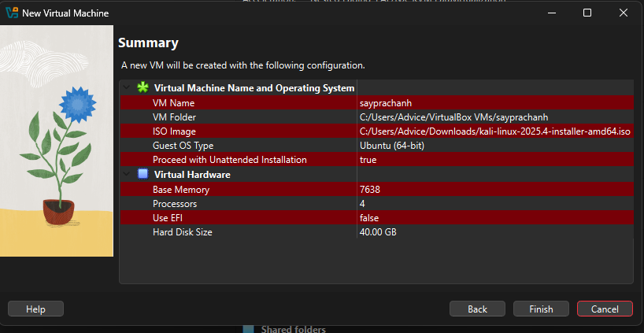
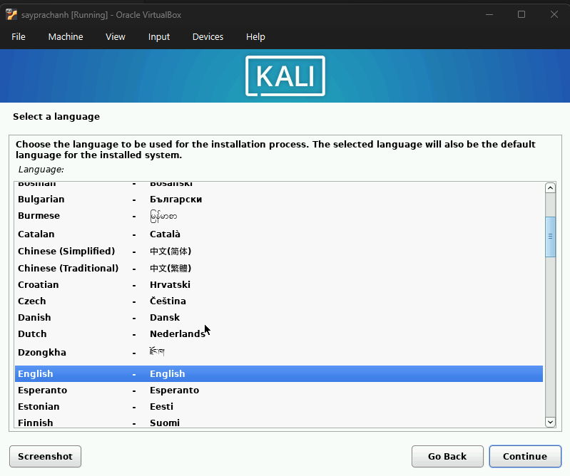
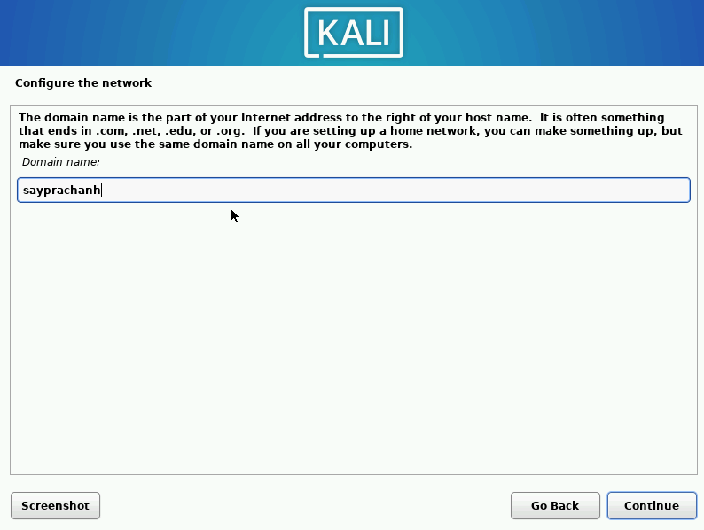
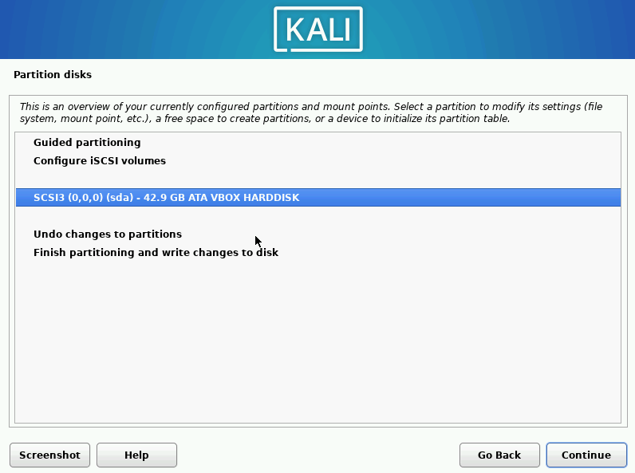
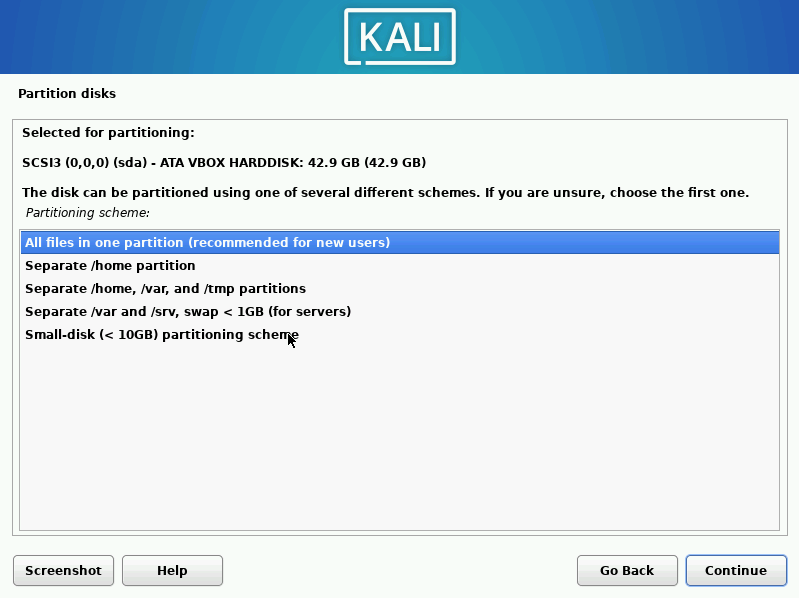
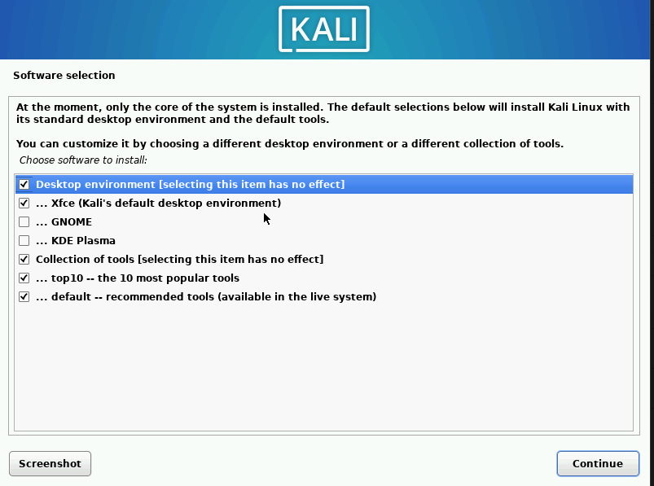
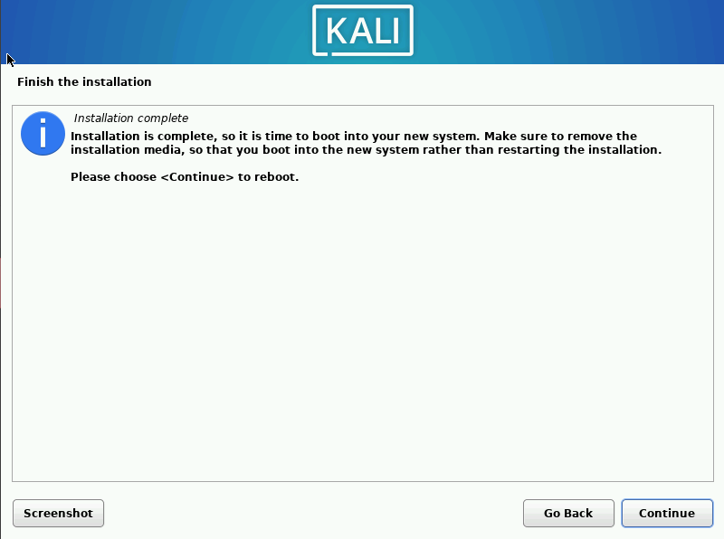
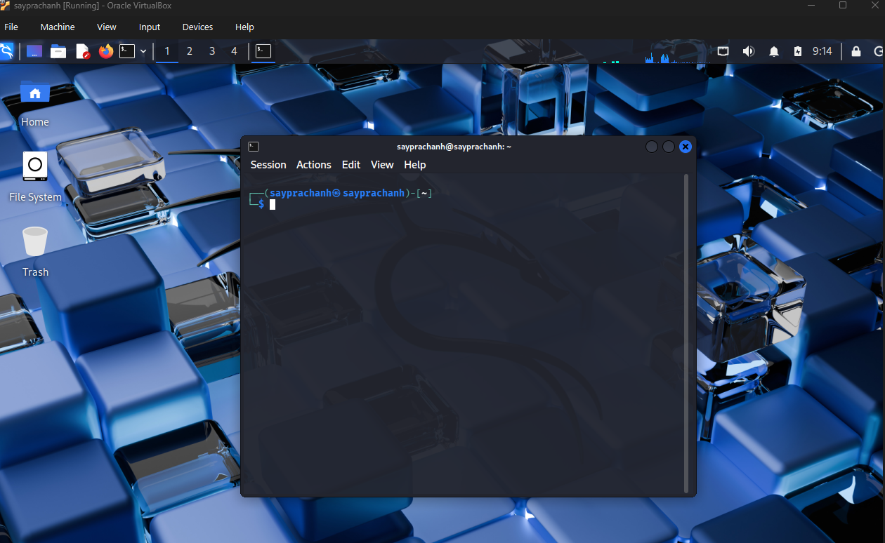

---
## Author
author:
  name: Луангсуваннавонг Сайпхачан
## Title
title: Презентация по индивидуальному проекту № 1
subtitle: Основы информационной безопасности

date-format: "2026-02-24" # Example: 2025-09-06
---

# Информация

## Докладчик

:::::::::::::: {.columns align=center}
::: {.column width="70%"}

  * Луангсуваннавонг Сайпхачан
  * студент группы НКАбд-01-24
  * Российский университет дружбы народов им. П. Лумумбы
  * <https://github.com/sayprachanh-lsvnv>

:::
::: {.column width="30%"}

:::
::::::::::::::

## Цель работы

Приобретение практических навыков по установке операционной системы Linux на виртуальную машину.

## Задание

Установка дистрибутива Kali Linux в VirtualBox

# Выполнение лабораторной работы

## Выполнение лабораторной работы

Я настраиваю аппаратную конфигурацию для установки дистрибутива Kali Linux.

## Выполнение лабораторной работы

Я выбираю язык, местоположение, а также раскладку клавиатуры для операционной системы.

## Выполнение лабораторной работы

## Выполнение лабораторной работы

## Выполнение лабораторной работы

Я устанавливаю имя хоста и доменное имя для сети.

## Выполнение лабораторной работы

## Выполнение лабораторной работы

Я создаю пользователя, а также задаю пароль для пользователя в операционной системе.

## Выполнение лабораторной работы

## Выполнение лабораторной работы

Я настраиваю часовой пояс системы.

## Выполнение лабораторной работы

Я выполняю разметку диска. Я использую автоматическую разметку (guided partitioning), чтобы автоматически разбить диск на разделы, а также настроить стандартное форматирование.

## Выполнение лабораторной работы

## Выполнение лабораторной работы

## Выполнение лабораторной работы

## Выполнение лабораторной работы

## Выполнение лабораторной работы

Я выбираю программное обеспечение для Kali Linux. Я использую настройки по умолчанию для установки.

## Выполнение лабораторной работы

После завершения установки я перезагружаю операционную систему, затем снова вхожу в операционную систему — всё работает нормально.

## Выполнение лабораторной работы

## Выводы

Я приобрел практические навыки по установке операционной системы Linux на виртуальную машину.

