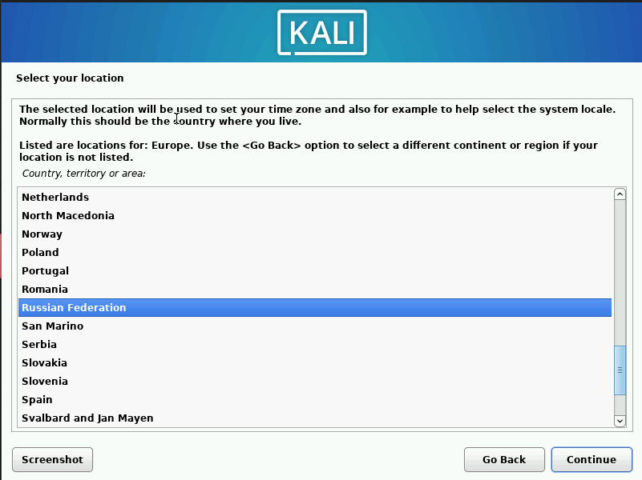
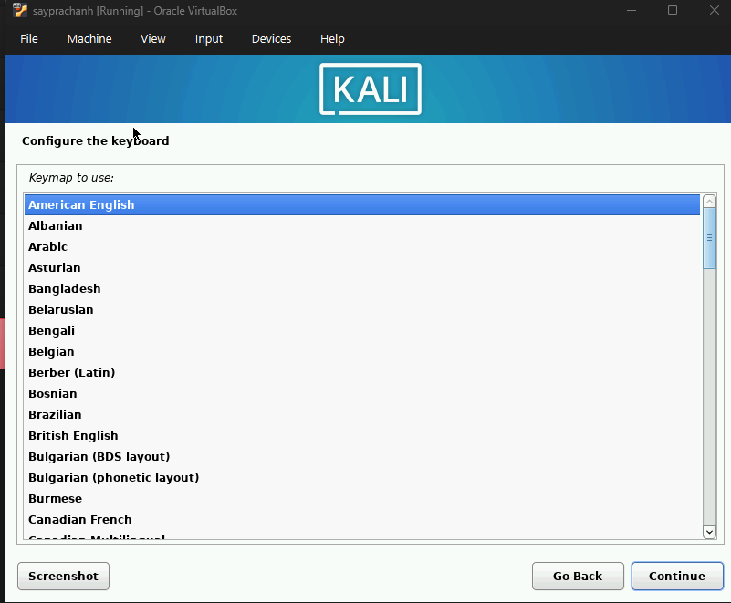
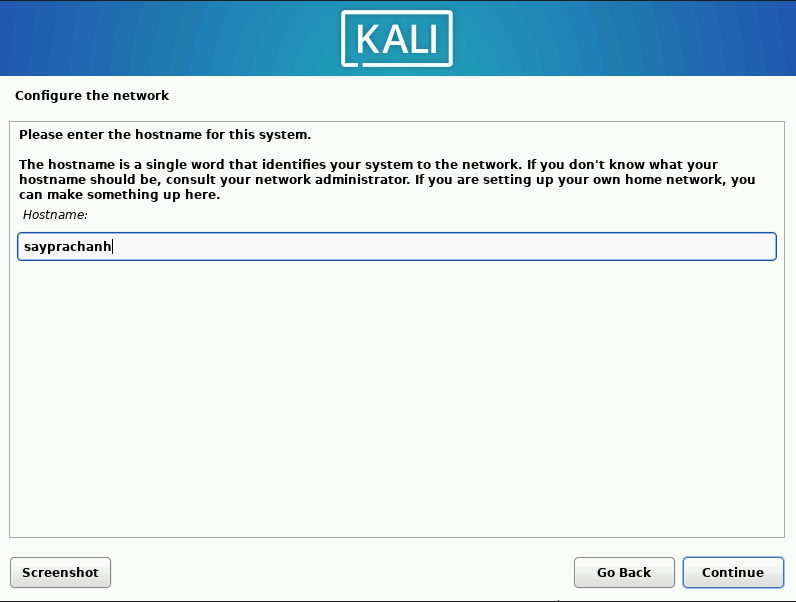
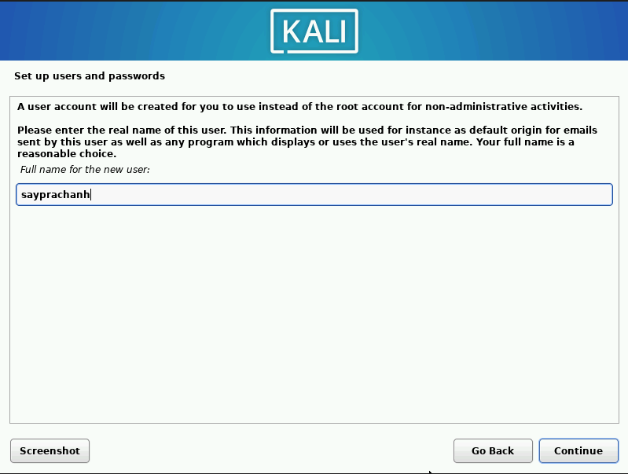
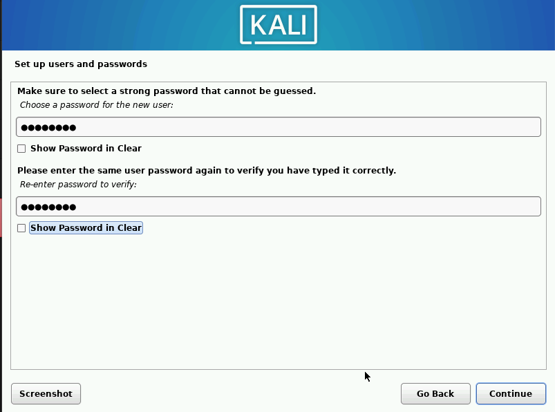
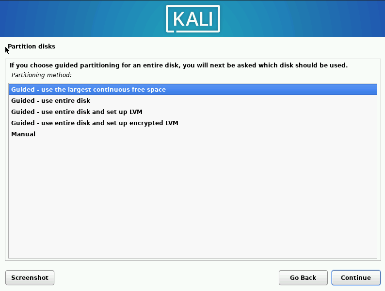
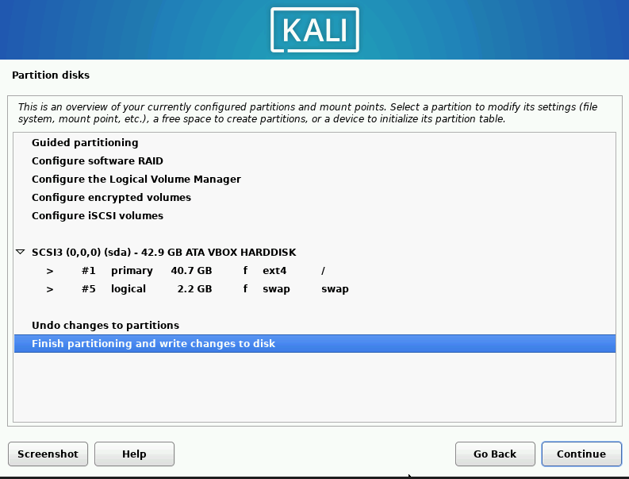
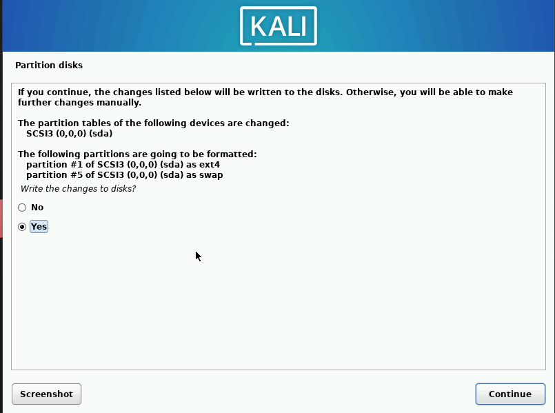

---
## Author
author:
  name: Луангсуваннавонг Сайпхачан, НКАбд-01-24
## Title
title: "Отчёт по индивидуальному проекту № 1"
subtitle: "Основы информационной безопасности"
---

# Цель работы

Приобретение практических навыков по установке операционной системы Linux на виртуальную машину.

# Задание

Установка дистрибутива Kali Linux в VirtualBox

# Выполнение лабораторной работы

Сначала я создаю новую виртуальную машину в Virtualbox, настраиваю аппаратное обеспечение виртуальной машины, папку для файлов, размер жесткого диска, необходимые для установки дистрибутива.([рис. @fig-001])

{#fig-001 width=70%}

Я выбираю язык, местоположение, а также раскладку клавиатуры для операционной системы.([рис. @fig-002])([рис. @fig-003])([рис. @fig-004])

{#fig-002 width=70%}

{#fig-003 width=70%}

{#fig-004 width=70%}

Я устанавливаю имя хоста и доменное имя для сети.([рис. @fig-005])([рис. @fig-006])

{#fig-005 width=70%}

{#fig-006 width=70%}

Далее я создаю пользователя, а также задаю пароль для пользователя в операционной системе.([рис. @fig-007])([рис. @fig-008])

{#fig-007 width=70%}

{#fig-008 width=70%}

Я настраиваю часовой пояс системы.([рис. @fig-009])

{#fig-009 width=70%}

Затем я выполняю разметку диска. Я использую автоматическую разметку (guided partitioning), чтобы автоматически разбить диск на разделы, а также настроить стандартное форматирование. Я проверяю описание и информацию о разделах диска, затем завершаю разметку.([рис. @fig-010])([рис. @fig-011])([рис. @fig-012])([рис. @fig-013])([рис. @fig-014])

{#fig-010 width=70%}

{#fig-011 width=70%}

{#fig-012 width=70%}

{#fig-013 width=70%}

{#fig-014 width=70%}

Я выбираю программное обеспечение для Kali Linux. Я использую настройки по умолчанию для установки, так как это стандартное окружение для операционной системы, затем ожидаю завершения установки.([рис. @fig-015])

{#fig-015 width=70%}

После завершения установки я перезагружаю операционную систему, затем снова вхожу в операционную систему — всё работает нормально.([рис. @fig-016])([рис. @fig-017])

{#fig-016 width=70%}

{#fig-017 width=70%}

# Выводы

Я приобрел практические навыки по установке операционной системы Linux на виртуальную машину.
