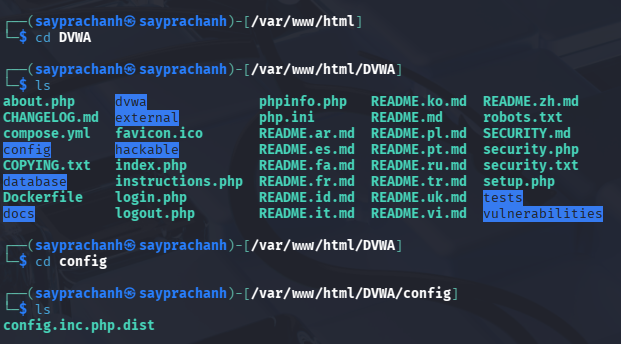
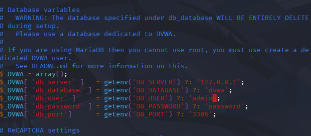
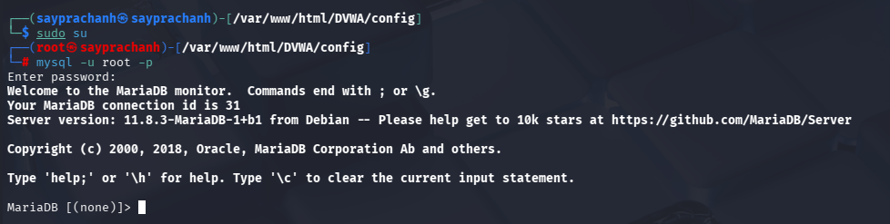
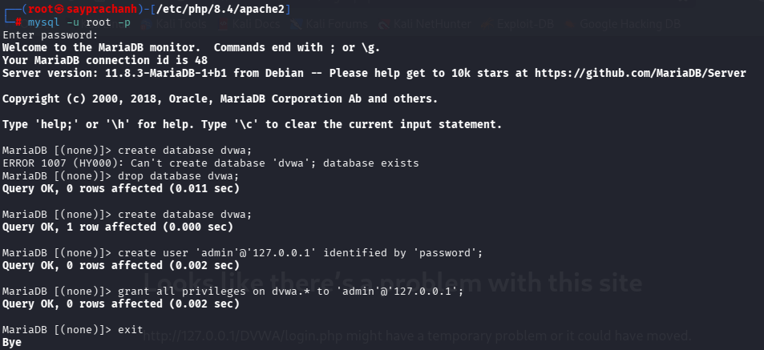
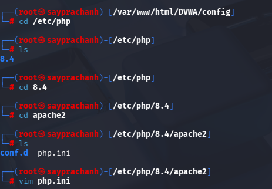
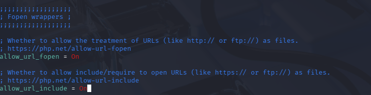
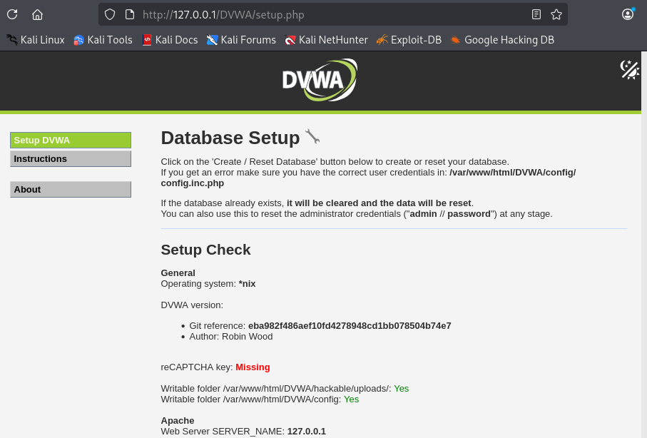
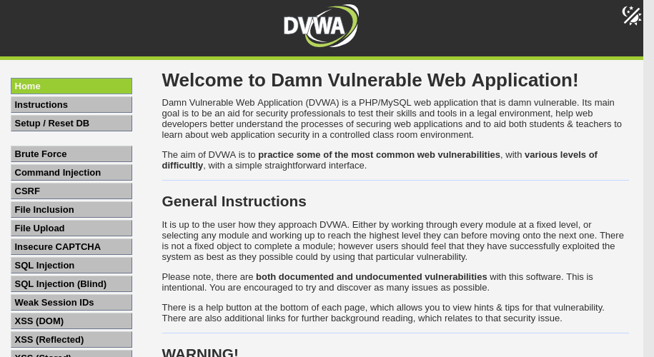

---
## Author
author:
  name: Луангсуваннавонг Сайпхачан
## Title
title: Презентация по индивидуальному проекту № 2
subtitle: Основы информационной безопасности

date-format: "2026-03-13" # Example: 2025-09-06
---

# Информация

## Докладчик

:::::::::::::: {.columns align=center}
::: {.column width="70%"}

  * Луангсуваннавонг Сайпхачан
  * студент группы НКАбд-01-24
  * Российский университет дружбы народов им. П. Лумумбы
  * <https://github.com/sayprachanh-lsvnv>

:::
::: {.column width="30%"}

:::
::::::::::::::

## Цель работы

Приобретение практических навыков по установке DVWA.

## Задание

Установка DVWA в Kali Linux

# Выполнение работы

## Выполнение работы

Сначала я перехожу в папку веб-сервера в корневом каталоге и загружаю DVWA через Github.

## Выполнение работы

Я изменяю права доступа к папке на 777.

## Выполнение работы

Затем я перехожу в папку DVWA, проверяю содержимое папки, нахожу и проверяю папку 'config'.

## Выполнение работы

Я переименовываю файл config.inc.php.dist в config.inc.php, затем открываю файл для редактирования с помощью текстового редактора.
В файле config.inc.php я изменяю информацию о базе данных, меняю пароль на 'password' и пользователя на 'admin', затем сохраняю и выхожу из файла.

## Выполнение работы

## Выполнение работы

## Выполнение работы

Затем с помощью команды systemctl я запускаю службу MySQL, чтобы создать новую базу данных. Поскольку MySQL уже установлен по умолчанию, я могу запустить его сразу, затем проверяю статус процесса.

## Выполнение работы

Я вхожу в MySQL как root, сервис использует приглашение 'MariaDB', затем начинаю создавать базу данных для нового пользователя в нем.

## Выполнение работы

Я начинаю с создания новой базы данных 'dvwa', с именем и паролем в соответствии с файлом config.inc.php, а также предоставляю пользователю привилегии для работы с этой базой данных.

## Выполнение работы

После этого я выхожу из службы MySQL и запускаю веб-сервер Apache, а затем проверяю статус веб-сервера.

## Выполнение работы

Далее необходимо выполнить некоторые настройки файла php.ini в папке Apache2, поэтому я перехожу в эту папку и открываю его в текстовом редакторе.

## Выполнение работы

В файле я ищу конкретное ключевое слово 'fopen', затем изменяю настройку allow_url_include с 'Off' на 'On', так как оба параметра файла allow_url_fopen и allow_url_include должны быть изменены на 'On'.
После этого я сохраняю и выхожу из файла, и снова перезапускаю веб-сервер.

## Выполнение работы

Я открываю браузер и ввожу 127.0.0.1/DVWA. Так как у нас уже есть база данных, а также настроен веб-сервер, мы можем войти в веб-приложение через этот URL.

Затем я просто ввожу имя и пароль, которые установил ранее, и попадаю на страницу настройки.

## Выполнение работы

## Выполнение работы

## Выполнение работы

Я прокручиваю страницу вниз и нажимаю кнопку 'Create / Reset Database', которая снова запросит имя и пароль.

## Выполнение работы

## Выполнение работы

Затем я попадаю на домашнюю страницу веб-приложения и завершаю установку.

## Выводы

Я приобрел практические навыки по установке DVWA

