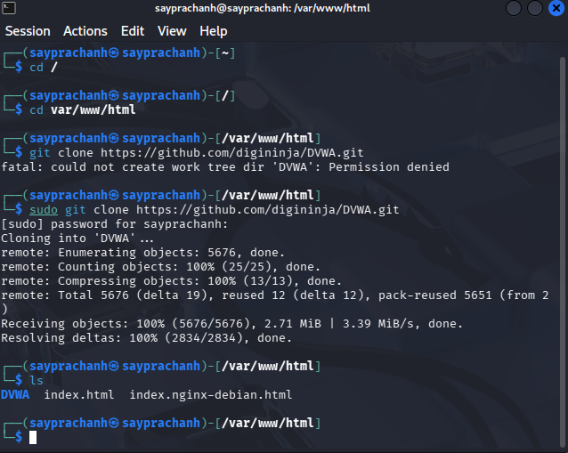
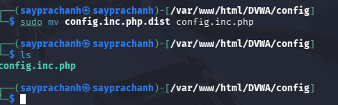
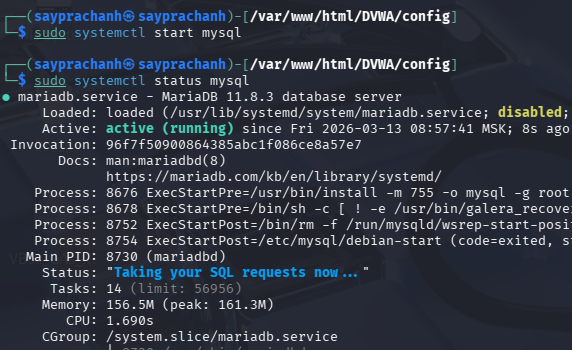
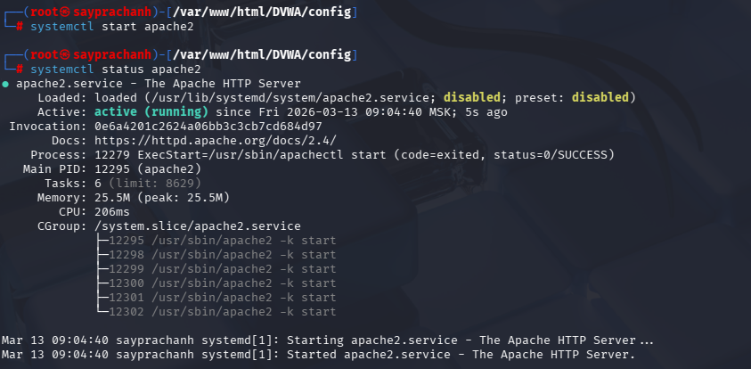
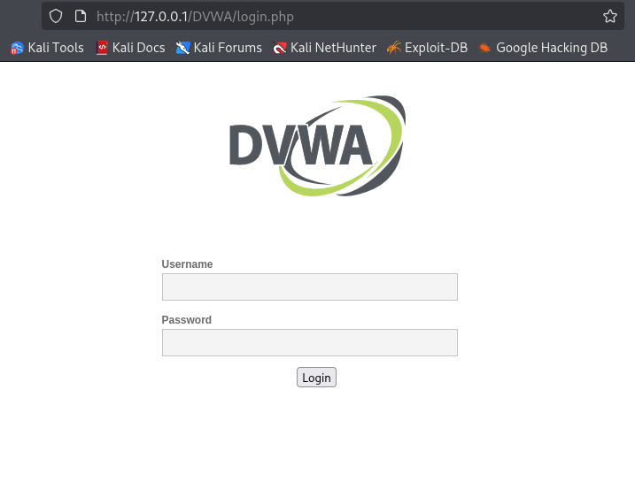
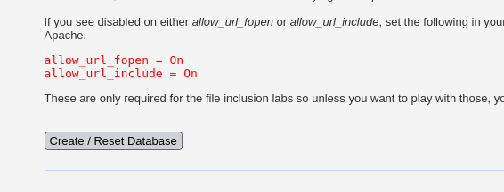
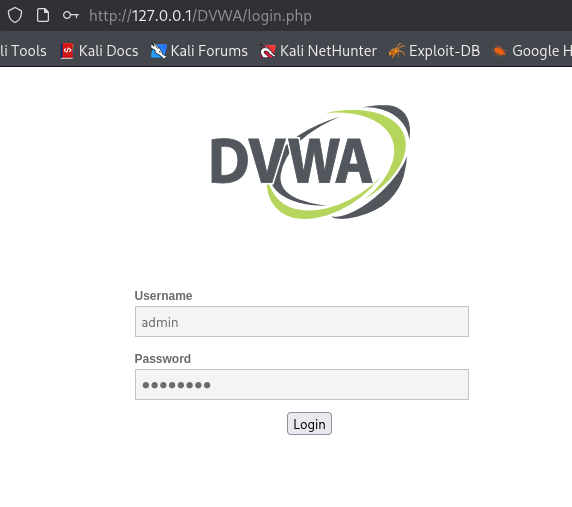

---
## Author
author:
  name: Луангсуваннавонг Сайпхачан, НКАбд-01-24
## Title
title: "Отчёт по индивидуальному проекту № 2"
subtitle: "Основы информационной безопасности"
---

# Цель работы

Приобретение практических навыков по установке DVWA.

# Задание

Установка DVWA в Kali Linux

# Теоретическое введение

DVWA (Damn Vulnerable Web Application) — это уязвимое веб-приложение, разработанное на PHP и MySQL. Будучи намеренно небезопасным, оно служит учебной площадкой для отработки распространенных веб-уязвимостей и тестирования инструментов безопасности.

Некоторые из уязвимостей веб приложений, который содержит DVWA:

- Брутфорс: Брутфорс HTTP формы страницы входа - используется для тестирования инструментов по атаке на пароль методом грубой силы и показывает небезопасность слабых паролей.
- Исполнение (внедрение) команд: Выполнение команд уровня операционной системы.
- Межсайтовая подделка запроса (CSRF): Позволяет «атакующему» изменить пароль администратора приложений.
- Внедрение (инклуд) файлов: Позволяет «атакующему» присоединить удалённые/локальные файлы в веб приложение.
- SQL внедрение: Позволяет «атакующему» внедрить SQL выражения в HTTP из поля ввода, DVWA включает слепое и основанное на ошибке SQL внедрение.
- Небезопасная выгрузка файлов: Позволяет «атакующему» выгрузить вредоносные файлы на веб сервер.
- Межсайтовый скриптинг (XSS): «Атакующий» может внедрить свои скрипты в веб приложение/базу данных. DVWA включает отражённую и хранимую XSS.
- Пасхальные яйца: раскрытие полных путей, обход аутентификации и некоторые другие.

DVWA имеет четыре уровня безопасности, они меняют уровень безопасности каждого веб приложения в DVWA:

- Невозможный — этот уровень должен быть безопасным от всех уязвимостей. Он используется для сравнения уязвимого исходного кода с безопасным исходным кодом.
- Высокий — это расширение среднего уровня сложности, со смесью более сложных или альтернативных плохих практик в попытке обезопасить код. Уязвимости не позволяют такой простор эксплуатации как на других уровнях.
- Средний — этот уровень безопасности предназначен главным образом для того, чтобы дать пользователю пример плохих практик безопасности, где разработчик попытался сделать приложение безопасным, но потерпел неудачу.
- Низкий — этот уровень безопасности совершенно уязвим и совсем не имеет защиты. Его предназначение быть примером среди уязвимых веб приложений, примером плохих практик программирования и служить платформой обучения базовым техникам эксплуатации.

# Выполнение лабораторной работы

Сначала я перехожу в папку веб-сервера в корневом каталоге и загружаю DVWA через Github. ([рис. @fig-001])

{#fig-001 width=70%}

Я изменяю права доступа к папке на 777.([рис. @fig-002])

{#fig-002 width=70%}

Затем я перехожу в папку DVWA, проверяю содержимое папки, нахожу и проверяю папку 'config'.([рис. @fig-003])

{#fig-003 width=70%}

Я переименовываю файл config.inc.php.dist в config.inc.php, затем открываю файл для редактирования с помощью текстового редактора.
В файле config.inc.php я изменяю информацию о базе данных, меняю пароль на 'password' и пользователя на 'admin', затем сохраняю и выхожу из файла.([рис. @fig-004])([рис. @fig-005])([рис. @fig-006])

{#fig-004 width=70%}

{#fig-005 width=70%}

{#fig-006 width=70%}

Затем с помощью команды systemctl я запускаю службу MySQL, чтобы создать новую базу данных. Поскольку MySQL уже установлен по умолчанию, я могу запустить его сразу, затем проверяю статус процесса.([рис. @fig-007])

{#fig-007 width=70%}

Я вхожу в MySQL как root, сервис использует приглашение 'MariaDB', затем начинаю создавать базу данных для нового пользователя в нем.([рис. @fig-008])

{#fig-008 width=70%}

Я начинаю с создания новой базы данных 'dvwa', с именем и паролем в соответствии с файлом config.inc.php, а также предоставляю пользователю привилегии для работы с этой базой данных.
(Примечание: имя базы данных, пользователя и пароль должны быть идентичны информации в файле config.inc.php)([рис. @fig-009])

{#fig-009 width=70%}

После этого я выхожу из службы MySQL и запускаю веб-сервер Apache, а затем проверяю статус веб-сервера.([рис. @fig-010])

{#fig-010 width=70%}

Далее необходимо выполнить некоторые настройки файла php.ini в папке Apache2, поэтому я перехожу в эту папку и открываю его в текстовом редакторе.([рис. @fig-011])

{#fig-011 width=70%}

В файле я ищу конкретное ключевое слово 'fopen', затем изменяю настройку allow_url_include с 'Off' на 'On', так как оба параметра файла allow_url_fopen и allow_url_include должны быть изменены на 'On'.
После этого я сохраняю и выхожу из файла, и снова перезапускаю веб-сервер.([рис. @fig-012])

{#fig-012 width=70%}

Я открываю браузер и ввожу 127.0.0.1/DVWA. Так как у нас уже есть база данных, а также настроен веб-сервер, мы можем войти в веб-приложение через этот URL.
Затем я просто ввожу имя и пароль, которые установил ранее, и попадаю на страницу настройки([рис. @fig-013])([рис. @fig-014])([рис. @fig-015]).

{#fig-013 width=70%}

{#fig-014 width=70%}

{#fig-015 width=70%}

Я прокручиваю страницу вниз и нажимаю кнопку 'Create / Reset Database', которая снова запросит имя и пароль.([рис. @fig-016])([рис. @fig-017])

{#fig-016 width=70%}

{#fig-017 width=70%}

Затем я попадаю на домашнюю страницу веб-приложения и завершаю установку.([рис. @fig-018])

{#fig-018 width=70%}

# Выводы

Я приобрел практические навыки по установке DVWA
