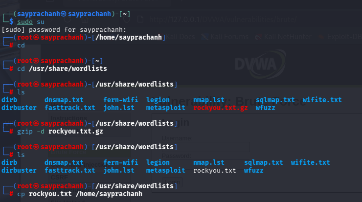
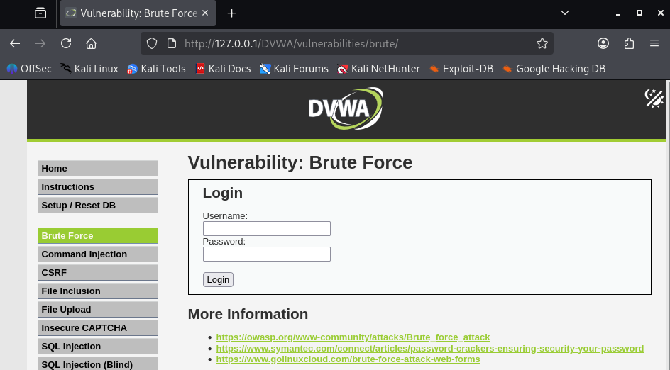
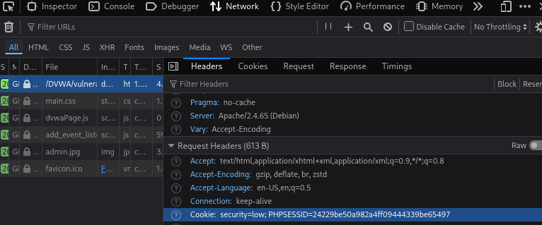

---
## Author
author:
  name: Луангсуваннавонг Сайпхачан
## Title
title: Презентация по индивидуальному проекту № 3
subtitle: Основы информационной безопасности

date-format: "2026-03-24" # Example: 2025-09-06
---

# Информация

## Докладчик

:::::::::::::: {.columns align=center}
::: {.column width="70%"}

  * Луангсуваннавонг Сайпхачан
  * студент группы НКАбд-01-24
  * Российский университет дружбы народов им. П. Лумумбы
  * <https://github.com/sayprachanh-lsvnv>

:::
::: {.column width="30%"}

:::
::::::::::::::

## Цель работы

Приобретение практических навыков использования Hydra для перебора пароля.

## Задание

Реализовать эксплуатацию уязвимости с помощью брутфорса паролей.

# Выполнение работы

## Выполнение работы

Для подбора пароля методом перебора нам нужен список часто используемых паролей. К счастью, в Kali Linux есть файл rockyou.txt, который содержит большой список часто используемых паролей.

## Выполнение работы

Я запускаю и вхожу на сайт DVWA, затем перехожу на вкладку Brute Force, чтобы начать подбор пароля методом перебора в указанном месте.

## Выполнение работы

Нам нужен параметр cookie с этого сайта, чтобы запустить Hydra. Чтобы получить информацию о параметре cookie, я использую инструменты разработчика в браузере, чтобы найти параметры cookie сайта.

## Выполнение работы

После получения параметров cookie я вставляю их в команду Hydra с указанным именем пользователя. Я выполняю несколько попыток, пока не нахожу правильный пароль.

## Выполнение работы

Я вхожу на сайт с найденным паролем для Hydra и успешно вхожу на сайт, завершая процесс подбора пароля методом перебора.

## Выводы

Я приобрел практических навыков использования Hydra для перебора пароля
