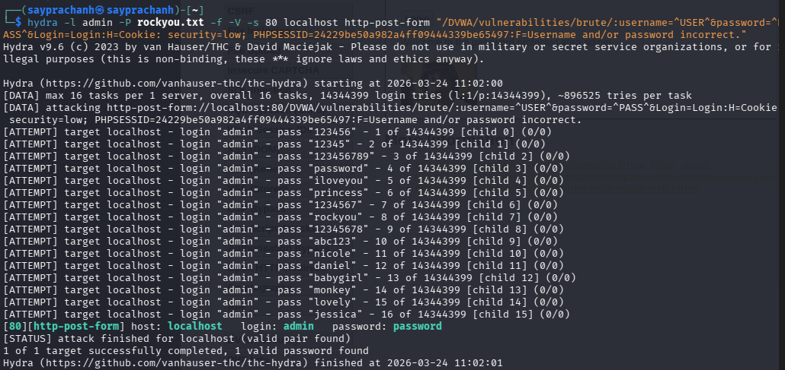
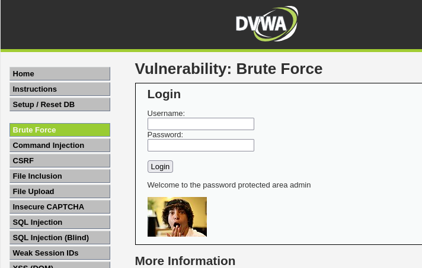

---
## Author
author:
  name: Луангсуваннавонг Сайпхачан, НКАбд-01-24
## Title
title: "Отчёт по индивидуальному проекту № 3"
subtitle: "Основы информационной безопасности"
---

# Цель работы

Приобретение практических навыков использования Hydra для перебора пароля.

# Задание

Реализовать эксплуатацию уязвимости с помощью брутфорса паролей.

# Теоретическое введение

Hydra используется для подбора или взлома имени пользователя и пароля.

Поддерживает подбор для большого набора приложений.

Пример работы:

Исходные данные:

IP сервера 178.72.90.181;

Сервис http на стандартном 80 порту;

Для авторизации используется html форма, которая отправляет по адресу http://178.72.90.181/cgi-bin/luci методом POST запрос вида username=root&password=test_password;

В случае не удачной аутентификации пользователь наблюдает сообщение Invalid username and/or password! Please try again.

Запрос к Hydra будет выглядеть примерно так:

````
hydra -l root -P ~/pass_lists/dedik_passes.txt -o ./hydra_result.log -f -V -s 80 178.72.90.181 http-post-form "/cgi-bin/luci:username=^USER^&password=^PASS^:Invalid username"
````

Используется http-post-form потому, что авторизация происходит по http методом post.

После указания этого модуля идёт строка /cgi-bin/luci:username=^USER^&password=^PASS^:Invalid username, у которой через двоеточие (:) указывается:

 - путь до скрипта, который обрабатывает процесс аутентификации (/cgi-bin/luci);

- строка, которая передаётся методом POST, в которой логин и пароль заменены на ^USER^ и ^PASS^ соответственно (username=^USER^&password=^PASS^);

- строка, которая присутствует на странице при неудачной аутентификации; при её отсутствии Hydra поймёт, что мы успешно вошли (Invalid username).

# Выполнение лабораторной работы

Во-первых, для подбора пароля методом перебора нам нужен список часто используемых паролей. К счастью, в Kali Linux есть файл rockyou.txt, который содержит большой список часто используемых паролей, поэтому я просто копирую этот файл в домашний каталог.([рис. @fig-001])

{#fig-001 width=70%}

Далее я запускаю и вхожу на сайт DVWA, затем перехожу на вкладку Brute Force, чтобы начать подбор пароля методом перебора в указанном месте.([рис. @fig-002])

{#fig-002 width=70%}

Мне нужен параметр cookie с этого сайта, чтобы запустить Hydra для подбора пароля. Чтобы получить информацию о параметрах cookie, я использую инструменты разработчика в браузере, чтобы найти параметры cookie сайта (это возможно, поскольку сайт DVWA был создан с низким уровнем защиты параметров cookie или вообще без нее).([рис. @fig-003])

{#fig-003 width=70%}

После получения параметров cookie я вставляю их в команду Hydra с указанным именем пользователя, чтобы найти правильный пароль для входа на сайт. Я выполняю несколько попыток, пока не нахожу правильный пароль.([рис. @fig-004])

{#fig-004 width=70%}

После того как я нашел пароль, я вхожу на сайт с найденным паролем для Hydra, завершая процесс подбора пароля методом перебора.([рис. @fig-005])

{#fig-005 width=70%}

# Выводы

Я приобрел практических навыков использования Hydra для перебора пароля
