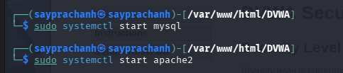

---
## Author
author:
  name: Луангсуваннавонг Сайпхачан
## Title
title: Презентация по индивидуальному проекту № 4
subtitle: Основы информационной безопасности

date-format: "2026-04-02" # Example: 2025-09-06
---

# Информация

## Докладчик

:::::::::::::: {.columns align=center}
::: {.column width="70%"}

  * Луангсуваннавонг Сайпхачан
  * студент группы НКАбд-01-24
  * Российский университет дружбы народов им. П. Лумумбы
  * <https://github.com/sayprachanh-lsvnv>

:::
::: {.column width="30%"}

:::
::::::::::::::

## Цель работы

Научиться использованию сканера безопасности веб-сервера nitko для тестирования веб-приложений

## Задание

Использование nikto.

# Выполнение работы

## Выполнение работы

Во-первых, я запускаю сервер Apache2, который создал ранее, так как для работы с nikto нам нужно веб-приложение для сканирования, а именно DVWA.

## Выполнение работы

Затем я вхожу в DVWA и меняю уровень безопасности на «low» (необязательно, потому что на низком уровне безопасности убираются все фильтрация ввода и средства контроля безопасности, что позволяет nikto обнаружить максимальное количество уязвимостей).

## Выполнение работы

Я запускаю nikto, указав URL-ссылку на наш локальный хост с DVWA. В результате он отображает информацию о различных уязвимостях приложения.

## Выполнение работы

Затем я снова пытаюсь запустить nikto, но на этот раз указываю порт, добавив -p 80, а также меняю хост: вместо URL я использую адрес localhost. Результат отличается.

## Выводы

Я научился использовать сканер безопасности веб-сервера nitko для тестирования веб-приложений
