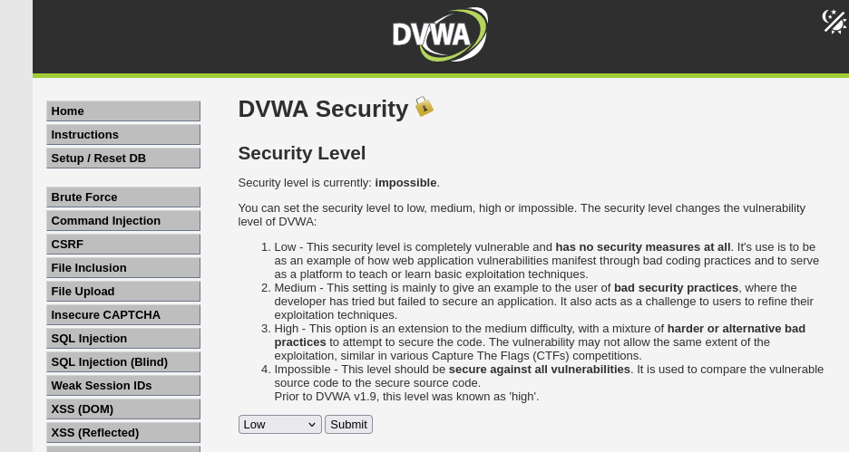
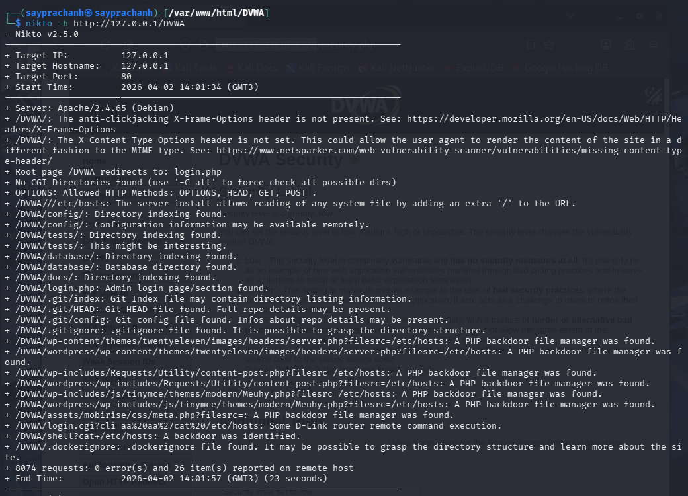
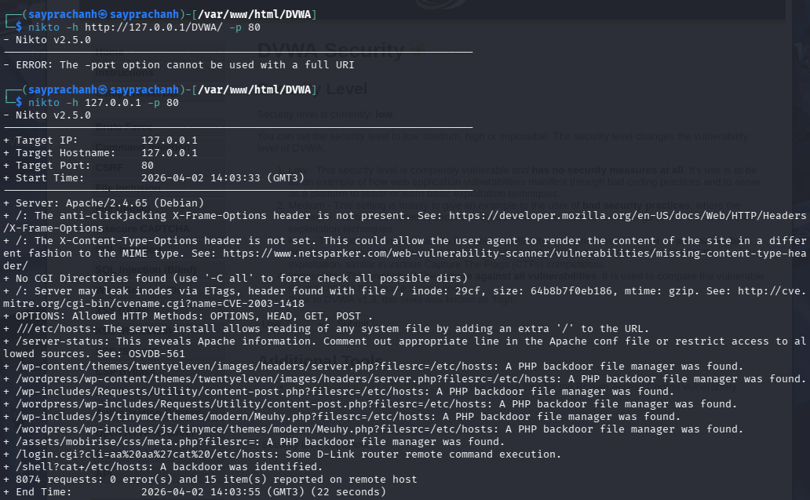

---
## Author
author:
  name: Луангсуваннавонг Сайпхачан, НКАбд-01-24
## Title
title: "Отчёт по индивидуальному проекту № 4"
subtitle: "Основы информационной безопасности"
---

# Цель работы

Научиться использованию сканера безопасности веб-сервера nitko для тестирования веб-приложений

# Задание

Использование nikto

# Теоретическое введение

nikto — базовый сканер безопасности веб-сервера. Он сканирует и обнаруживает уязвимости в веб-приложениях, обычно вызванные неправильной конфигурацией на самом сервере, файлами, установленными по умолчанию, и небезопасными файлами, а также устаревшими серверными приложениями.

# Выполнение лабораторной работы

Во-первых, я запускаю сервер Apache2, который создал ранее, так как для работы с nikto нам нужно веб-приложение для сканирования, а именно DVWA.([рис. @fig-001])

{#fig-001 width=70%}

Затем я вхожу в DVWA и меняю уровень безопасности на «low» (необязательно, потому что на низком уровне безопасности убираются все фильтрация ввода и средства контроля безопасности, что позволяет nikto обнаружить максимальное количество уязвимостей).([рис. @fig-002])

{#fig-002 width=70%}

Я запускаю nikto, указав URL-ссылку на наш локальный хост с DVWA. В результате он отображает информацию о различных уязвимостях приложения.([рис. @fig-003])

{#fig-003 width=70%}

Затем я снова пытаюсь запустить nikto, но на этот раз указываю порт, добавив -p 80, а также меняю хост: вместо URL я использую адрес localhost. Результат отличается.([рис. @fig-004])

{#fig-004 width=70%}

Результат после сканирования: оба сканирования — через URL и через адрес порта — дают разные результаты, но оба показывают различные уязвимости приложения, которые включают множество «бэкдоров» (backdoor), позволяющих удаленно управлять веб-приложением или получать несанкционированный доступ к данным.

Результат сканирования:

Сервер: Apache/2.4.65 (Debian)

- DVWA:/ Отсутствует заголовок X-Frame-Options для защиты от кликджекинга. См.: https://developer.mozilla.org/en-US/docs/Web/HTTP/Headers/X-Frame-Options
- DVWA:/ Не установлен заголовок X-Content-Type-Options. Это может позволить пользовательскому агенту интерпретировать содержимое сайта иначе, чем указано в MIME-типе. См.: https://www.netsparker.com/web-vulnerability-scanner/vulnerabilities/missing-content-type-header/
- Корневая страница /DVWA перенаправляет на: login.php
- CGI-директории не найдены (используйте '-C all' для принудительной проверки всех возможных директорий)
- OPTIONS: Разрешённые HTTP-методы: OPTIONS, HEAD, GET, POST.
- DVWA:/etc/hosts: Установка сервера позволяет читать любые системные файлы, добавляя лишний '/' в URL.
- DVWA/config/: Найдено индексирование директории.
- DVWA/config/: Конфигурационная информация может быть доступна удалённо.
- DVWA/tests/: Найдено индексирование директории.
- DVWA/tests/: Это может быть интересно.
- DVWA/database/: Найдено индексирование директории.
- DVWA/database/: Найдена директория с базой данных.
- DVWA/docs/: Найдено индексирование директории.
- DVWA/login.php: Найдена страница входа администратора / раздел входа.
- DVWA/.git/index: Git-файл index может содержать информацию о листинге директорий.
- DVWA/.git/HEAD: Найден Git-файл HEAD. Может присутствовать полная информация о репозитории.
- DVWA/.git/conf/git: Найден Git-файл config. Может содержать информацию о деталях репозитория.
- DVWA/.gitignore: Найден файл .gitignore. Можно понять структуру директорий.
- DVWA/wp-content/themes/twentyeleven/images/headers/server.php?filesrc=/etc/hosts: Найден PHP-бэкдор — файловый менеджер.
- DVWA/wp-admin/uploads/Requests/Utility/content-post.php?filesrc=/etc/hosts: Найден PHP-бэкдор — файловый менеджер.
- DWVA/wp-includes/Requests/Utility/content-post.php?filesrc=/etc/hosts: Найден PHP-бэкдор — файловый менеджер.
- DVWA/wp-includes/js/tinymce/themes/modern/Meuhey.php?filesrc=/etc/hosts: Найден PHP-бэкдор — файловый менеджер.
- DVWA/wp-includes/js/tinymce/themes/modern/Meuhey.php?filesrc=/etc/hosts: Найден PHP-бэкдор — файловый менеджер.
- DVWA/assets/mobirise/css/meta.php?filesrc=/etc/hosts: Найден PHP-бэкдор — файловый менеджер.
- DVVAA/login.cgi?cli=aa%20aa%27cat%20/etc/hosts: Обнаружено удалённое выполнение команд на некоторых маршрутизаторах D-Link.
- DVWA/shell?cat=/etc/hosts: Идентифицирован бэкдор.
- DVWA/.dockerignore: Найден файл .dockerignore. Возможно, удастся понять структуру директорий и узнать больше о сайте.

# Выводы

Я научился использовать сканер безопасности веб-сервера nitko для тестирования веб-приложений
