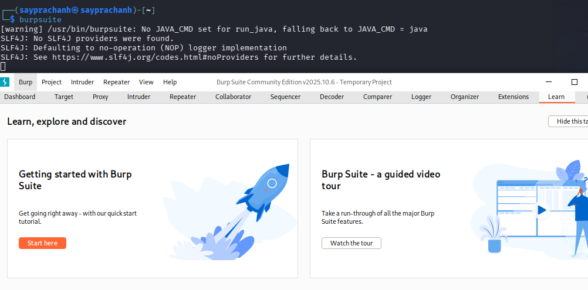
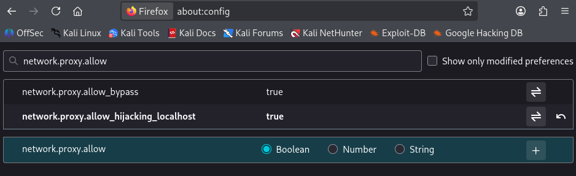
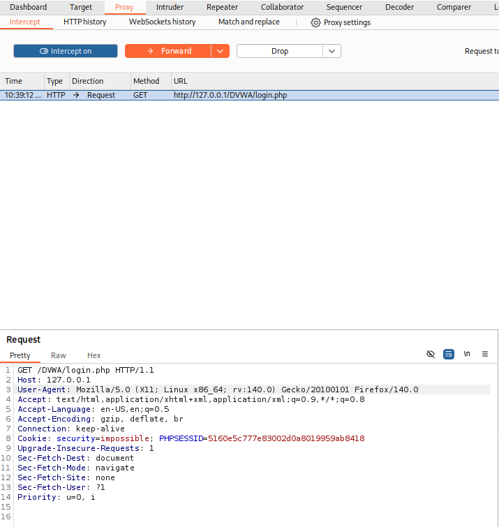
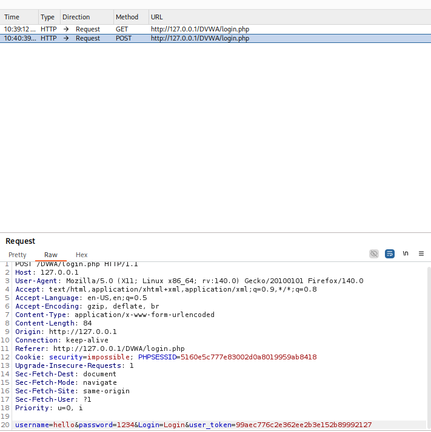
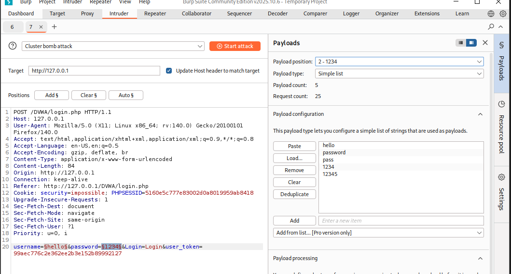
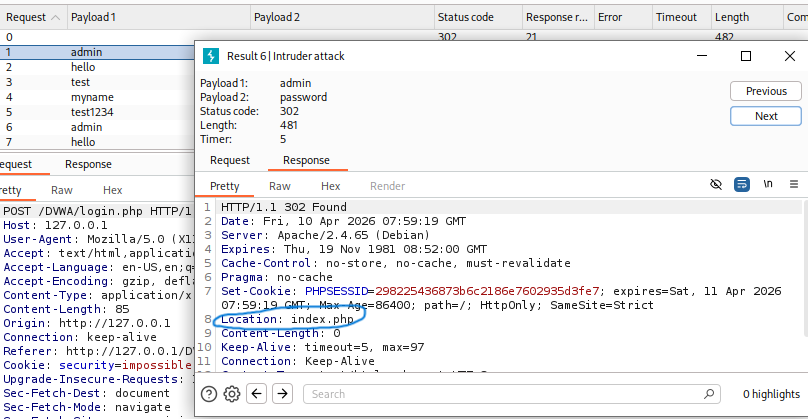

---
## Author
author:
  name: Луангсуваннавонг Сайпхачан
## Title
title: Презентация по индивидуальному проекту № 5
subtitle: Основы информационной безопасности

date-format: "2026-04-10" # Example: 2025-09-06
---

# Информация

## Докладчик

:::::::::::::: {.columns align=center}
::: {.column width="70%"}

  * Луангсуваннавонг Сайпхачан
  * студент группы НКАбд-01-24
  * Российский университет дружбы народов им. П. Лумумбы
  * <https://github.com/sayprachanh-lsvnv>

:::
::: {.column width="30%"}

:::
::::::::::::::

## Цель работы

Научиться использовать Burp Suite.

## Задание

Использование Burp Suite

# Выполнение работы

## Выполнение работы

Во-первых, я запускаю локальный сервер DVWA для тестирования Burp Suite.

## Выполнение работы

Затем я перехожу в настройки сети браузера и настраиваю прокси так, чтобы браузер использовал тот же HTTP-прокси, что и Burp Suite.

## Выполнение работы

## Выполнение работы

Поскольку программа Burp Suite уже предустановлена в Kali Linux, я запускаю Burp Suite сразу. Я проверяю настройки прокси, убеждаясь, что мы используем тот же прокси.

## Выполнение работы

## Выполнение работы

В конфигурации браузера я устанавливаю параметр network.allow_hijacking_localhost в значение true, чтобы Burp Suite правильно работал с локальным сервером.

## Выполнение работы

Далее в Burp Suite я включаю кнопку Intercept, переключая её с off на on, и возвращаюсь к DVWA в браузере. В результате вкладка в Burp Suite меняется.

## Выполнение работы

## Выполнение работы

Затем я пытаюсь ввести неправильные учётные данные для входа в DVWA и возвращаюсь в Burp Suite. Теперь он отображает вкладку, содержащую информацию о моей попытке входа с неверным логином и паролем.

## Выполнение работы

## Выполнение работы

Я отправляю информацию о моей попытке входа на вкладку Intruder. Я выделяю имя пользователя и пароль и выбираю позицию Add для добавления полезной нагрузки (payload) атаки, затем меняю тип атаки на Cluster bomb attack для выбора типа атаки на сайт.

## Выполнение работы

## Выполнение работы

Поскольку мы выбрали 2 параметра полезной нагрузки (имя пользователя и пароль), я должен создать обе полезные нагрузки: сначала для имени пользователя. Я придумываю несколько имён, чтобы протестировать все варианты полезной нагрузки.

## Выполнение работы

Затем я делаю то же самое для второго параметра, добавляя полезную нагрузку.

## Выполнение работы

После завершения добавления полезных нагрузок я нажимаю Start attack и начинаю атаку. Burp Suite перебирает все полезные нагрузки, тестируя все возможные варианты для входа на сайт.

## Выполнение работы

После завершения процесса я выбираю результат. Во вкладке Response мы видим, куда произошло перенаправление после ввода пары логин-пароль. В данном случае пара test-hello перенаправила нас на login.php, то есть обратно на страницу входа — значит, эта пара не подходит.

## Выполнение работы

Однако в случае пары admin-password произошло перенаправление на location index.php, который является домашней страницей DVWA — значит, эта пара подходит для входа.

## Выполнение работы

Затем я выбираю эту пару и отправляю её в Repeater. На вкладке Repeater я нажимаю Send, чтобы отправить запрос. В результате мы перенаправляемся на index.php.

## Выполнение работы

Я нажимаю Follow redirection и получаю HTML-код в окне Response.

## Выполнение работы

Чтобы увидеть структуру сайта, я перехожу в подокно Render и вижу результирующую страницу.

## Выводы

Я научился использовать Burp Suite
