---
## Author
author:
  name: Луангсуваннавонг Сайпхачан, НКАбд-01-24
## Title
title: "Отчёт по индивидуальному проекту № 5"
subtitle: "Основы информационной безопасности"
---

# Цель работы

Научиться использовать Burp Suite.

# Задание

Использование Burp Suite

# Теоретическое введение

Burp Suite представляет собой набор мощных инструментов безопасности веб-приложений, которые демонстрируют реальные возможности злоумышленника, проникающего в веб-приложения.

# Выполнение лабораторной работы

Во-первых, я запускаю локальный сервер DVWA для тестирования Burp Suite.([рис. @fig-001])

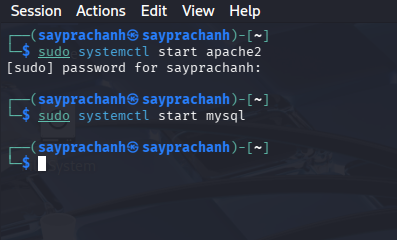{#fig-001 width=70%}

Затем я перехожу в настройки сети браузера и настраиваю прокси так, чтобы браузер использовал тот же HTTP-прокси, что и Burp Suite([рис. @fig-002]([рис. @fig-003])).

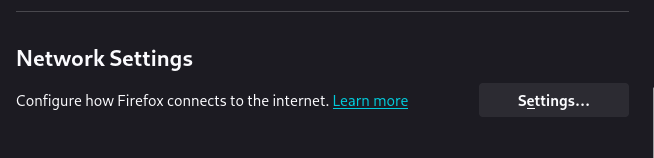{#fig-002 width=70%}

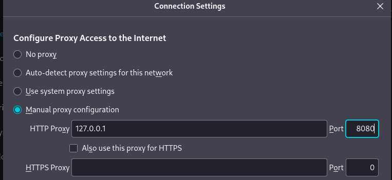{#fig-003 width=70%}

Поскольку программа Burp Suite уже предустановлена в Kali Linux, я запускаю Burp Suite сразу. Затем я перехожу на вкладку Proxy в Burp Suite и проверяю настройки прокси, убеждаясь, что мы используем тот же прокси([рис. @fig-004]([рис. @fig-005])).

{#fig-004 width=70%}

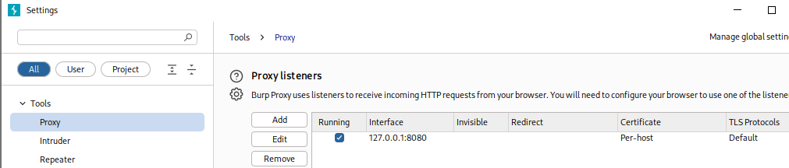{#fig-005 width=70%}

В конфигурации браузера я устанавливаю параметр network.allow_hijacking_localhost в значение true, чтобы Burp Suite правильно работал с локальным сервером([рис. @fig-006]).

{#fig-006 width=70%}

Далее в Burp Suite я включаю кнопку Intercept, переключая её с off на on, и возвращаюсь к DVWA в браузере. В результате вкладка в Burp Suite меняется([рис. @fig-007]([рис. @fig-008])).

{#fig-007 width=70%}

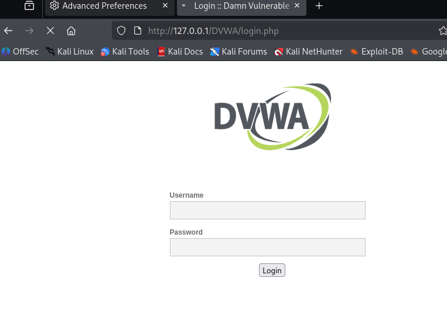{#fig-008 width=70%}

Затем я пытаюсь ввести неправильные учётные данные для входа в DVWA и возвращаюсь в Burp Suite. Теперь он отображает вкладку, содержащую информацию о моей попытке входа с неверным логином и паролем([рис. @fig-009]([рис. @fig-010])).

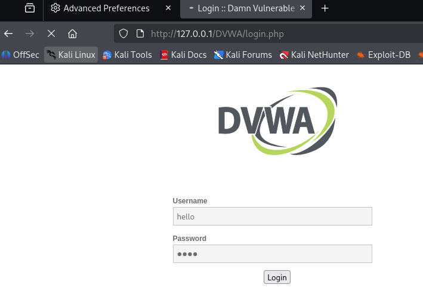{#fig-009 width=70%}

{#fig-010 width=70%}

Я отправляю информацию о моей попытке входа на вкладку Intruder. На этой вкладке я выделяю имя пользователя и пароль и выбираю позицию Add для добавления полезной нагрузки (payload) атаки, затем меняю тип атаки на Cluster bomb attack для выбора типа атаки на сайт([рис. @fig-011]([рис. @fig-012])).

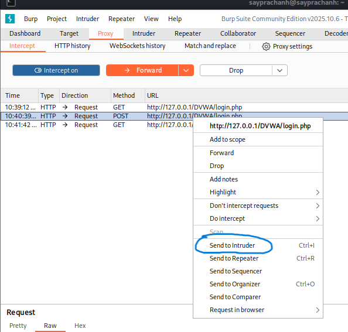{#fig-011 width=70%}

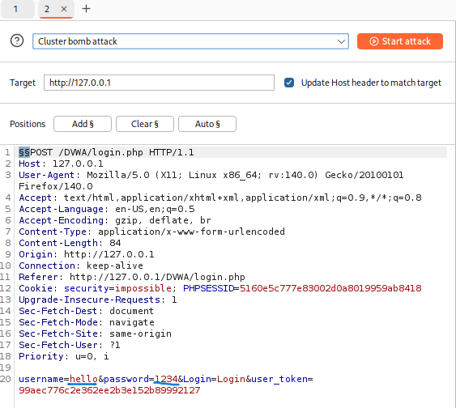{#fig-012 width=70%}

На вкладке Payloads, поскольку мы выбрали два параметра полезной нагрузки (имя пользователя и пароль), я должен создать обе полезные нагрузки: сначала для имени пользователя. Я придумываю несколько имён, чтобы протестировать все варианты полезной нагрузки([рис. @fig-013]).

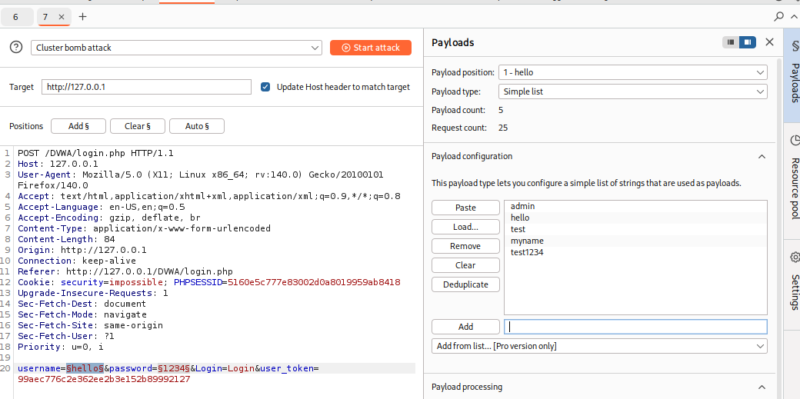{#fig-013 width=70%}

Затем я делаю то же самое для второго параметра, добавляя полезную нагрузку([рис. @fig-014]).

{#fig-014 width=70%}

После завершения добавления полезных нагрузок я нажимаю Start attack и начинаю атаку. Burp Suite перебирает все полезные нагрузки, тестируя все возможные варианты для входа на сайт([рис. @fig-015]).

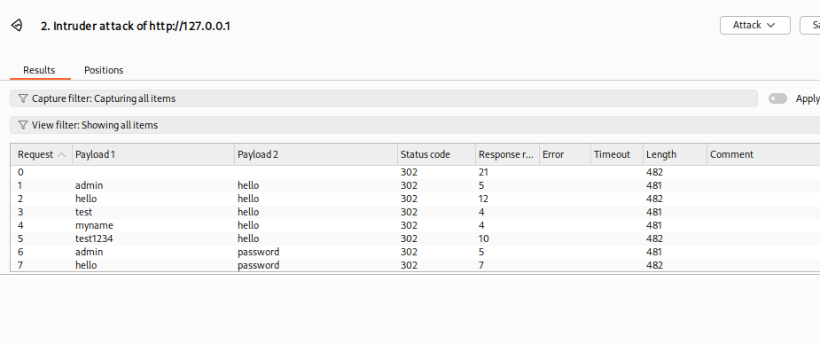{#fig-015 width=70%}

После завершения процесса я выбираю результат. Во вкладке Response мы видим, куда произошло перенаправление после ввода пары логин-пароль. В данном случае пара test-hello перенаправила нас на login.php, то есть обратно на страницу входа — значит, эта пара не подходит([рис. @fig-016]).

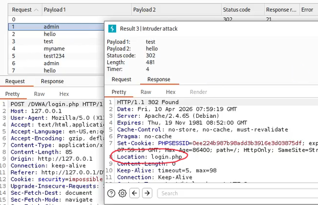{#fig-016 width=70%}

Однако в случае пары admin-password произошло перенаправление на location index.php, который является домашней страницей DVWA — значит, эта пара подходит для входа([рис. @fig-017]).

{#fig-017 width=70%}

Затем я выбираю эту пару и отправляю её в Repeater. На вкладке Repeater я нажимаю Send, чтобы отправить запрос. В результате мы перенаправляемся на index.php([рис. @fig-018]).

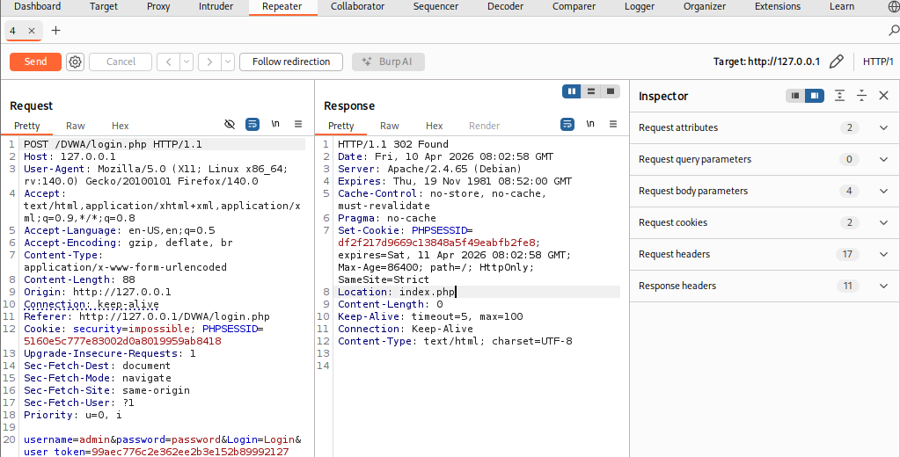{#fig-018 width=70%}

Я нажимаю Follow redirection и получаю HTML-код в окне Response([рис. @fig-019]).

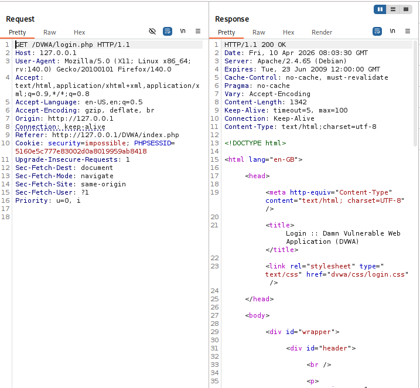{#fig-019 width=70%}

Чтобы увидеть структуру сайта, я перехожу в подокно Render и вижу результирующую страницу([рис. @fig-020]).

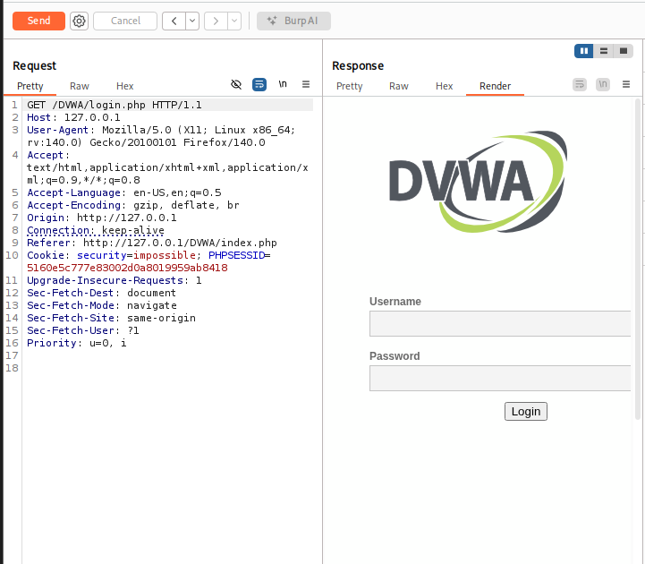{#fig-020 width=70%}

# Выводы

Я научился использовать Burp Suite
